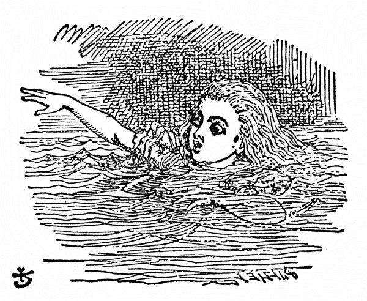

„Úžasnoucnější a úžasnoucnější!“ zvolala Alenka (tu chvíli zapomněla samým překvapením správně mluvit); „teď se zas vytahuji jako ten nejdelší dalekohled na světě. Sbohem, nožičky!“ (Když se totiž podívala na nohy, skoro na ně nedohlédla, tak byly daleko.) „Ach mé nožičky, kdo vám teď, chudinky, bude obouvat boty a punčochy? Já jistě ne! Budu od vás tuze daleko, kdepak bych se o vás mohla starat: musíte si poradit samy – ale musím na ně být hodná,“ řekla si Alenka, „nebo nepůjdou, kam budu chtít! Třeba jim dám vždycky nové boty pod stromeček.“

  

A tak si dále vymýšlela, jak to zařídí. „Budu jim je musit dát doručit,“ řekla si, „to bude legrace, posílat dárky vlastním nohám. A jak divně se bude vyjímat adresa!

> _Vážená_

> _Pravá Noha Alenčina_

> _Rohožka před Krbem_

> _u Mřížky_

> _(s pozdravem od Alenky)_

Jeje, co to mluvím za nesmysly!“

Vtom vrazila hlavou do stropu síně: měřila totiž přes devět stop; popadla zlatý klíček a alou do zahrady.

Nešťastná Alenka! Lehla si na bok a jedním okem hleděla do zahrady, na víc se nezmohla; projít dvířky teď už teprve nemohla; posadila se a znovu se dala do pláče.

„Styď se,“ řekla si Alenka, „taková velká holka…,“ (a taky že byla), „… a takhle plakat! Hned přestaň, to ti povídám!“ Ale plakala dál a tolik slz prolila, až měla kolem sebe louži na čtyři palce hlubokou, rozlévající se do poloviny síně.

Za chvíli zaslechla zdálky drobné cupitání; honem si utřela oči a podívala se, kdo to jde. To se vracel Bílý Králík, celý vyparáděný, v jedné ruce bílé kozinkové rukavice, v druhé velký vějíř; přihopkal, samý spěch, a přitom si broukal: „Ach, ta vévodkyně, ta vévodkyně! Ta mi dá, jestli přijdu pozdě!“ Alenka byla tak nešťastná, že by byla kohokoli poprosila o pomoc; a tak když se k ní Králík přiblížil, spustila tiše a bázlivě: „Prosím vás, pane –“ Králík se zarazil, upustil bílé kozinkové rukavice a vějíř a pádil do tmy, co mu nohy stačily.

Alenka zvedla rukavice a vějíř, a protože bylo v síni horko, ovívala se a takto si povídala: „Ach jo! Dnes je všechno naruby. A ještě včera to bylo jako jindy. Copak se se mnou v noci stala nějaká změna? Počkat: byla jsem to já, když jsem ráno vstávala? Tak se mi zdá, že mi bylo nějak divně. Ale jestli to nejsem já, ptám se dál, kdo tedy jsem? To je ta záhada!“ A probírala všechny známé děti, stejně staré jako ona, jestli se snad v některé z nich neproměnila.

„Určitě nejsem Ada,“ řekla si Alenka, „ona má takové dlouhé lokýnky a já nemám žádné; a Mabel přece taky nejsem, já toho tolik umím a ona, ach, ta neumí skoro nic! A ostatně ona je ona a já jsem já – a vůbec, je to záhada! Zkusím, jestli ještě umím, co jsem dřív uměla. Tak tedy: čtyřikrát pět je dvanáct, čtyřikrát šest je třináct, čtyřikrát sedm je – ach, jéje! Takhle se do dvaceti vůbec nedopočítám! Ale na násobilce tolik nezáleží, zkusíme to se zeměpisem. Londýn je hlavní město Paříže a Paříž je hlavní město Říma a Řím – kdepak, tak to vůbec není. Nejspíš jsem se proměnila v Mabel. Zkusím odříkat ‚Nad Berounkou‘ –“ Složila ruce v klín, jako by odříkávala úlohu, a spustila, ale hlas měla chraplavý a cizí a slova nezněla stejně jako dřív:

> _Na Berounce pod Tetínem  
> krokodýl se vyhřívá,  
> hoví si v tom proudu líném  
> jako kláda neživá._

> _Potutelně usmívá se  
> v šupinatém pancíři,  
> očkem po rybičkách pase,  
> zda mu ve chřtán zamíří._

„Takhle to jistě není,“ řekla Alenka a znovu se jí zalily oči slzami, když povídala: „To už je jisté, je ze mě Mabel, teď se musím odstěhovat do toho jejich baráčku, hračky žádné a ouvej! toho učení! Kdepak, už to mám; jestli jsem Mabel, zůstanu tady! Jen ať si sem strkají hlavu a volají: ‚Pojď ven, milánku!‘ Jenom zvednu hlavu a řeknu: ‚Tak kdo tedy jsem? Napřed mi to povězte, a když budu tou osobou ráda, vyjdu ven – když ne, zůstanu tady, dokud se nestanu někým jiným.‘ Ach jéje,“ Alenka se znovu rozplakala: „Kdyby sem tak někdo strčil hlavu! Už se mi tu nechce být tak sama!“

Při těch slovech se podívala na ruce a podivila se, že si za řeči navlíkla Králíkovu bílou kozinkovou rukavičku. „Jak je to možné?“ řekla si. „To se asi zas zmenšuji.“ Vstala a šla se poměřit ke stolku a od oka odhadla, že měří asi dvě stopy a pořád se ještě scvrkává. Přišla na to, že to je vějířem, který má v ruce, a honem ho pustila, zrovna včas, než se docela scvrkla.

„To jsem měla namále!“ řekla Alenka, tou náhlou změnou celá vylekaná, ale šťastná, že ještě žije: „A teď honem do zahrady!“ Horempádem se rozběhla k dvířkám – ale ouha! dvířka byla zavřená a zlatý klíček ležel jako předtím na skleněném stolku, „a je to čím dál horší,“ řekla si chudinka, „protože tak malá jako teď jsem jakživa nebyla! To je ale hloupé.“

Při těch slovech uklouzla a žbluňk! byla po krk ve slané vodě. Nejprve ji napadlo, že snad spadla do moře, „tak to pojedu domů vlakem,“ řekla si Alenka. (Byla totiž jednou jedinkrát u moře a hned usoudila, že ať jde člověk na anglickém pobřeží, kam chce, všude uvidí v moři spoustu převozných kabin, dále děti, jak nabírají dřevěnými lopatkami písek, potom řadu penziónů a za nimi nádraží.) Ale brzy přišla na to, že je v kaluži slz, které naplakala, když měřila devět stop.

„Neměla jsem tolik plakat!“ řekla si Alenka a plavala sem a tam, aby z toho vybředla. „Za trest se teď utopím ve vlastních slzách! To bude divné! Ale dnes je divné všecko.“

A tu v kaluži kousek od ní něco zašplouchalo – i plavala tam podívat se, co to je. Zprvu jí to připadalo jako mrož nebo hroch, ale potom si vzpomněla, jak je maličká, a zjistila, že to je jen myška, která stejně jako ona sklouzla do vody.

Což abych na myš promluvila, pomyslila si Alenka. Jsou tady samé nevídané věci, kdoví, třeba umí ta myš mluvit. Ostatně nic se nestane, když to zkusím. Spustila tedy: „Ó myši, nevíš, jak bych se dostala z té kaluže? Mám už toho plavání tady dost, prosím tě, ó myši!“ (Alenka si myslila, že takhle se s myší mluví. Nikdy to nedělala, ale jak si pamatovala, v bratrově latinské mluvnici stálo: _myš – myši – myši – myš – ó myši!__)_ Myš se na ni podívala zvědavě a jako by na ni jedním očkem mrkla, ale nic neříkala.

Možná že nerozumí anglicky, myslila si Alenka. Tohle bude francouzská myš, přišla sem s Vilémem Dobyvatelem. (Alenka sice z dějepisu leccos věděla, ale kdy se co událo, o tom neměla ani potuchy.) Spustila tedy znovu: „Où est ma chatte?“ To byla první věta z francouzské učebnice. Myš se najednou vymrštila z vody a jako by se po celém těle třásla strachy. „Ach, odpusť, Myško,“ vyhrkla Alenka samým leknutím, že se snad toho zvířátka nějak nemile dotkla. „Dočista jsem zapomněla, že nemáš ráda kočky.“

„Že nemám ráda kočky!“ zapištěla pronikavě a zlostně Myš. „Ty bys je na mém místě měla ráda?“

„Asi ne,“ chlácholila ji Alenka, „už se proto nezlob. Ale naši Micku bych ti přec ráda ukázala, jen bys ji uviděla, hned by sis kočky zamilovala. To je ti mírné stvoření.“ Alenka pomaloučku plavala po kaluži a spíše jen pro sebe si povídala: „Tak mile přede u krbu, líže si packy a myje si čumáček – a když ji chovám, je taková měkounká – a báječně chytá myši – Ach, promiň!“ znovu zvolala Alenka, protože Myš se celá zježila, jistě byla uražená. „Jestli nechceš, nebudeme už o ní mluvit.“

„Jak to, my!“ zvolala Myš, roztřesená od hlavy až po špičku ocasu. „Copak já o tom mluvím! Naše rodina odjakživa kočky nenávidí – ty zlomyslné, sprosté ničemnice! Už ať mi o nich necekneš!“

„Už ne!“ Alenka to honem zamlouvala. „Máš – máš ráda – třeba psy?“ Myš neodpověděla, a tak se Alenka rozpovídala. „Blízko nás mají hezkého pejska, ráda ti ho ukážu! Je to foxteriér s chytrýma očkama a hnědou srst ti má, ach, takovou chundelatou! Hodíš mu něco a on ti to přinese, panáčkuje a prosí o jídlo a dělá ještě jinší kousky, kdepak kdybych si honem na všechno vzpomněla – patří jednomu sedlákovi a ten o něm říká, že je moc užitečný, že by ho nedal ani za sto liber! Že prý mu schytá všecky krysy a – jémine!“ zahořekovala Alenka, „už jsem ji zas urazila!“ Myš totiž plavala o překot pryč od ní, až rozvířila celou kaluž.

Alenka na ni vlídně zavolala: „Myško! Prosím tě, vrať se a nebudeme už mluvit o kočkách ani o psech, když je nemáš ráda!“ Myš to zaslechla, obrátila se a pomalu plavala zpátky k ní. Byla úplně zsinalá (to zlostí, pomyslila si Alenka) a tiše a zajíkavě řekla: „Pojďme na břeh, povím ti svůj příběh a pak pochopíš, proč nenávidím kočky a psy.“

Však už měly načase vylézt, kaluž se hemžila ptáky a zvířaty, jak do ní padali. Byla tam Kachna a Blboun, Papoušek a Orlík a jiná podivná stvoření. Alenka je vedla a všichni doplavali na břeh.
