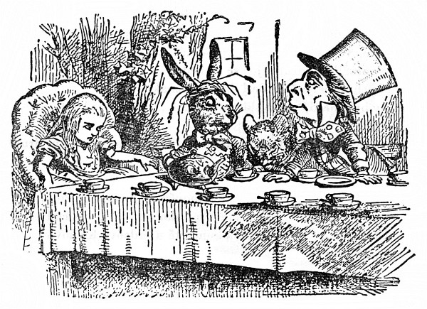
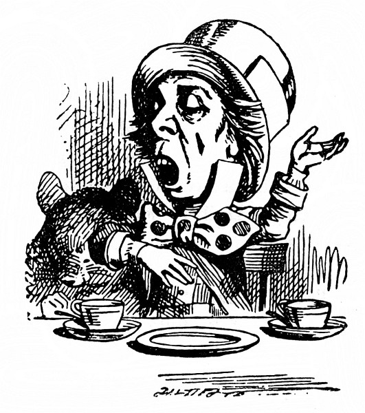
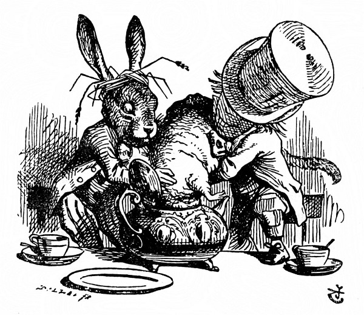

<section>

Pod stromem u domu bylo prostřeno a svačili tam Zajíc Březňák se Ševcem. Mezi nimi seděl Plch a tvrdě spal a oni loktem o něho opřeni bavili se mu nad hlavou.

</section>

<section>

Moc pohodlné to ten Plch zrovna nemá, pomyslila si Alenka, ale když spí, snad je mu to jedno.

Byl to velký stůl, ale všichni tři se tlačili na jednom rohu. „Není tu místo! Není tu místo!“ pokřikovali na Alenku. „Místa je tu až dost!“ odsekla Alenka a usedla do křesla na druhém konci stolu.

„Napij se vína,“ pobízel ji Zajíc Březňák.

Alenka se rozhlížela po stole, ale byl tam jenom čaj. „Žádné víno nevidím,“ prohodila.

„Taky že tu není,“ řekl zajíc Březňák.

„Co je to za slušnost, sedat si bez pozvání,“ odbyl ji Zajíc Březňák.

„To jsem nevěděla, že je to váš stůl,“ řekla Alenka. „Vždyť je tu prostřeno pro víc než pro tři.“

„Měla by ses dát ostříhat,“ řekl Švec. Chvíli si už Alenku zvědavě prohlížel, a teprve teď promluvil.

„Co si to dovolujete,“ okřikla ho Alenka. „To je neomalenost.“

Švec nad tím vyvalil oči, ale na víc se nezmohl než: „Proč je havran jako psací stůl?“

Teď bude zábava, pomyslila si Alenka. To jsem ráda, že dávají hádanky. „Myslím, že to uhodnu,“ řekla nahlas.

„Chceš říct, že na to umíš odpovědět?“ řekl Zajíc Březňák.

„Tak jest,“ řekla Alenka.

„Tak řekni, co myslíš,“ pokračoval Zajíc Březňák.

„To taky dělám,“ vyhrkla Alenka, „totiž myslím, co říkám – to je přec stejné.“

„Vůbec ne!“ řekl Švec. „To bys pak taky mohla říct, že ‚vidím, co jím‘ je stejné jako ‚jím, co vidím‘!“

„To bys taky mohla říct,“ ozval se Plch jakoby ze spaní, „že ‚dýchám, když spím‘ je stejné jako ‚spím, když dýchám‘!“

„U tebe je to ovšem stejné,“ řekl Švec. Rozhovor ustal a chvíli seděli mlčky; Alenka se zatím rozpomínala, co ví o havranech a psacích stolech, a moc toho nebylo.

První se ozval Švec. „Kolikátého je dnes?“ obrátil se k Alence. Vytáhl hodinky, rozčileně na ně hleděl, třepal jimi a přikládal si je k uchu.

Alenka se chvilku rozmýšlela, pak řekla: „Čtvrtého.“

„Jdou o dva dny pozadu!“ povzdechl si Švec. „Říkal jsem ti, že máslo kolečkům nesvědčí!“ pustil se do Zajíce Březňáka.

„Vždyť to bylo nejlepší máslo,“ špitl Zajíc Březňák.

„Jenže s máslem se tam nejspíš dostaly nějaké drobečky,“ huboval Švec. „Neměls je mazat nožem na chleba.“

Zajíc Březňák vzal hodinky a zachmuřeně si je prohlížel. Pak je ponořil do šálku s čajem, znovu si je prohlížel, ale na nic lepšího nepřipadl, než co řekl prve: „Vždyť to bylo nejlepší máslo.“

</section>

<section>

</section>

<section>

Alenka mu zvědavě koukala přes rameno. „To jsou mi divné hodinky!“ utrousila. „Ukazují, kolikátého je, a ne kolik je hodin!“

„A proč taky?“ bručel Švec. „Ukazují snad tvé hodinky, který máme rok?“

„Toť se ví, že ne,“ odsekla Alenka. „Protože je tam dlouho stejný rok.“

„A takové já mám – zcela vyhovují,“ řekl Švec.

Alence to vrtalo hlavou. Švec se vyjadřuje zřetelně, jenže to nemá hlavu ani patu. „Není mi to jasné,“ řekla co nejzdvořileji.

„Plch zase usnul,“ řekl Švec a ukápl mu trochu horkého čaje na nos.

Plch jenom mrzutě zavrtěl hlavou, oči neotevřel a řekl: „Jistě, jistě, zrovna jsem to měl na jazyku.“

„Už jsi tu hádanku uhodla?“ zeptal se Švec Alenky.

„Ne, dám se poddat,“ odpověděla Alenka: „Co to je?“

„Nemám ani ponětí,“ řekl Švec.

„Já taky ne,“ řekl Zajíc Březňák.

Alenka si omrzele povzdechla. „Taky byste mohli naložit s časem líp a nemařit ho hádankami bez rozluštění.“

„Kdybys znala Čas tak jako já,“ pravil Švec, „nemluvila bys o maření času. Je to někdo,“ řekl Švec.

„Já vás nechápu,“ bránila se Alenka.

„Bodejť,“ pokývl pohrdavě hlavou Švec. „Jistě jsi s ním jakživa nemluvila!“

„Asi ne,“ řekla Alenka opatrně, „ale když hraju na piano, tluču si takt a ten Čas –“

„Teď už tomu rozumím,“ vpadl jí do řeči Švec. „Tlouct se on nedá. Kdo je s ním zadobře, tomu nařídí hodiny, jak je mu libo. Tak třeba je devět ráno, vyučování začíná: pošeptáš Času jen slovíčko, a v mžiku se hodiny otočí! Půl druhé, jde se k obědu!“

(„To bych taky chtěl,“ hlesl Zajíc Březňák.)

„To by bylo něco,“ zamyslila se Alenka, „jenže – já bych ještě neměla chuť na oběd.“

„Třeba ne hned,“ řekl Švec, „ale hodiny ti zůstanou na půl druhé, jak dlouho chceš.“

</section>

<section>

</section>

<section>

„A vy to tak děláte?“ zeptala se Alenka.

Švec zavrtěl hlavou. „Kdepak!“ odpověděl. „Loni v březnu jsme se pohádali, zrovna než tomuhle v hlavě přeskočilo – (ukázal lžičkou na Zajíce Březňáka) – bylo to na koncertě u Srdcové Královny a já jsem měl zpívat píseň:

> _Hvězdičky už vyšly, červánek už zhas,  
> netopýr nám lítá po obloze zas._

Znáš ji?“

„Něco takového jsem už slyšela,“ řekla Alenka.

Švec vedl svou: „Takhle je to dál:

> _Ve hnízdečku sladce, tiše usnul pták  
> a svačina sviští vzhůru do oblak.  
>              Sviští, sviští –“_

Vtom sebou Plch trhl a ze spaní zapěl: „Sviští, sviští, sviští, sviští –“ a zpíval tak dlouho, až ho štípli, aby přestal.

„No, a sotva jsem tam dozpíval první sloku, Královna vylítla a zaječela: ‚Maří čas! Srazte mu hlavu!‘“

„To je ale strašná surovost!“ vykřikla Alenka.

„A od té doby,“ hovořil Švec smutně, „nic mi k vůli neudělá! Teď je pořád šest hodin.“

Alence svitlo: „Tak proto máte toho tolik prostřeno k svačině,“ řekla.

„Tak jest,“ povzdechl si Švec. „Pořád je svačina, a na umývání nádobí nemáme kdy.“

„To si vždycky poposednete?“ řekla Alenka.

„Právě,“ odpověděl Švec. „Když se jedno nádobí ušpiní, poposedneme o kus dál.“

„A co když se zas vrátíte na začátek?“ osmělila se zeptat Alenka.

„Mluvme radši o něčem jiném,“ přerušil je Zajíc Březňák a zívl. „Už mě to nebaví. Navrhuju, aby nám slečinka povídala pohádku.“

„Ale já žádnou neumím,“ polekala se Alenka.

„Tak ať povídá Plch,“ zvolali oba dva. „Probuď se, Plchu!“ a každý z jedné strany ho naráz štípli.

Plch pomalu rozevřel oči. „Nespal jsem,“ zachrčel tichounce, „ani slovo mi, kamarádi, neušlo z toho, co jste si povídali.“

„Povídej nám pohádku!“ řekl Zajíc Březňák. „Ano, povídej,“ žadonila Alenka.

„A dělej honem,“ dodal Švec, „nebo nad tím zas usneš!“

„Byly jednou tři sestřičky,“ spustil honem Plch, „jmenovaly se Líza, Mína a Týna, a žily na dně studánky –“

„A čím se živily?“ zeptala se Alenka, protože o jídlo a pití se vždycky tuze starala.

„Živily se sirupem,“ řekl Plch po krátkém rozmýšlení.

„To není možné,“ pronesla šetrně Alenka, „vždyť by jim bylo špatně.“

„Však jim taky bylo špatně, a jak,“ řekl Plch.

Alenka si ten prapodivný život všemožně domýšlela; ale nešlo jí to, a tak znovu spustila: „A proč žily na dně studánky?“

„Dolej si ještě čaje,“ řekl Alence se vší vážností Zajíc Březňák.

„Ještě jsem čaj nedostala, tak si ho nemohu dolít,“ odpověděla Alenka.

„To myslíš odlít,“ řekl Švec. „Snáz se dolívá, než odlívá z ničeho.“

„Vás se nikdo neptá,“ řekla Alenka.

„A kdo si teď dovoluje?“ řekl vítězoslavně Švec.

Alenka nevěděla, co na to říct. Nalila si tedy čaj a nabrala chleba s máslem a znovu se zeptala Plcha: „Proč žily ve studánce?“

Plch chvilku přemýšlel a pak řekl: „Byla to sirupová studánka.“

„Vždyť žádná není,“ hartusila Alenka, ale Švec a Zajíc Březňák na ni dělali Pst! Pst! a Plch vybuchl: „Když se neumíš slušně chovat, tak si to dopověz sama.“

</section>

<section>

</section>

<section>

„Ale ne, prosím vás, povídejte dál!“ prosila Alenka. „Už nebudu vyrušovat. Tak tedy _jedna_ taková studánka je.“

„Vida, jedna!“ horlil Plch, ale přece si dal říct a povídal dál.

„A tak ty tři sestřičky – se vám učily vážit –“

„Co vážily?“ zeptala se Alenka – na svůj slib nadobro zapomněla.

„Sirup,“ odpověděl Plch tentokrát bez rozmýšlení.

„Chtěl bych čistý šálek,“ přerušil ho Švec. „Poposedněme si.“

Po těch slovech poposedl a Plch to udělal po něm. Zajíc Březňák se pošoupl na Plchovo místo a Alenka chtíc nechtíc usedla na místo Zajíce Březňáka. Jediný Švec při té výměně dobře pochodil, zato Alenka na tom byla mnohem hůř, protože si Zajíc Březňák právě převrhl na talíř konvičku s mlékem.

Alenka se bála znovu Plcha urazit, opatrně tedy spustila: „Ale já tomu nerozumím. Odkud ten sirup vážily?“

„Z vodní studánky se váží voda,“ řekl Švec, „tak proč bys nemohla vážit sirup ze sirupové studánky, ty hloupá.“

„Ale vždyť byly ve studánce,“ řekla Alenka Plchovi a Ševcovy poznámky si vůbec nevšímala.

„To se ví, že byly v ní – a ne vně.“

Touto odpovědí byla Alenka tak zmatena, že nechala Plcha chvíli bez přerušení povídat.

„Tak se tedy učily vážit,“ hovořil Plch a mnul si oči a zíval, jak na něj šly dřímoty, „a vážily si všeho možného, všeho, co začíná na M –“

„Proč na M?“ zeptala se Alenka.

„A proč ne?“ řekl Zajíc Březňák. Alenka zmlkla.

Plch přivíral oči a podřimoval; ale Švec ho štípl, až vyjekl a procitl a mluvil dále: „Co začíná na M jako myš, měsíc, myšlenka, mermo – víš, jak se říká mermomocí – jestlipak si pořádně vážíš mermomocí?“

„Když se tak ptáte, zdá se mi, že ne,“ řekla Alenka rozpačitě.

„Tak nemluv,“ řekl Švec.

Ta hrubost Alence dodala. Rozezleně vstala a šla pryč; Plch rázem usnul a druzí dva si jejího odchodu vůbec nevšímali, ačkoli se ohlížela, zda ji snad nezavolají zpátky. Zahlédla ještě, jak cpou Plcha do čajové konvice, a pak už je neviděla.

„Tam už rozhodně nepůjdu!“ řekla si Alenka, jak se prodírala lesem. „Jakživa jsem nebyla na hloupější svačině!“

Jen to dořekla, všimla si, že v jednom stromě jsou dvířka. To je ale divné! napadlo jí. Ale dnes je všechno divné. Co kdybych šla dovnitř. A šla. A opět se octla v dlouhé síni, hned vedle skleněného stolečku.

„Už si dám lepší pozor,“ řekla si a rovnou sebrala zlatý klíček a odemkla dvířka do zahrady. Potom uždibovala houbu (měla jí kousek v kapse), až se zmenšila na pouhou stopu. Potom prošla chodbičkou; a potom se konečně octla – v divukrásné zahradě, mezi bujně kvetoucími záhony a chladivými vodotrysky.

</section>
