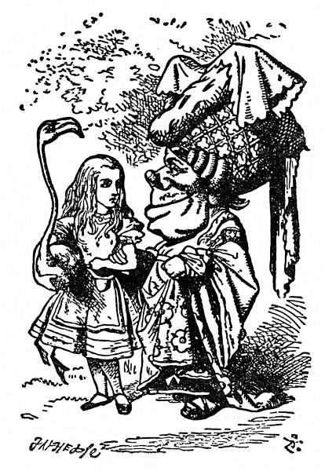
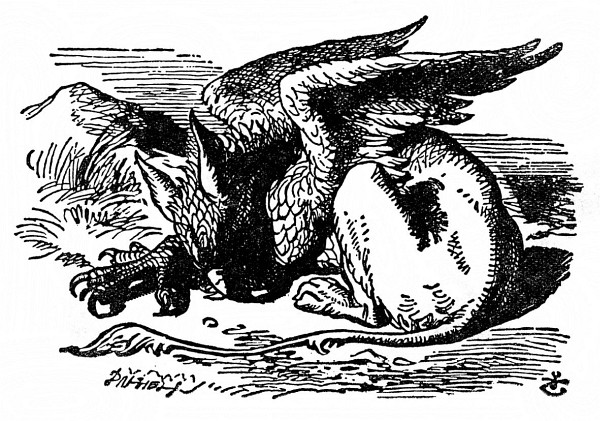
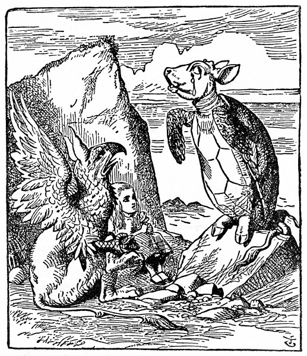

<section>

„Ani nevíš, jak jsem ráda, že jsem se s tebou, dušinko, zase shledala,“ řekla Vévodkyně, něžně se do Alenky zavěsila a tak spolu odešly z hřiště.

</section>

<section>

Alenka se nad její dobrou náladou zaradovala, tam v kuchyni, napadlo jí, rozzuřil ji snad jenom ten pepř.

„Až já budu Vévodkyní,“ řekla si Alenka (ale moc přesvědčeně to neznělo), „pepř v kuchyni vůbec nestrpím. Polévka se bez něho obejde – lidé bývají podráždění možná jen z pepře,“ libovala si, na jaké nové pravidlo to zas kápla, „z octa bývají kyselí – z heřmánku hořcí – a – z cukrkandlu a podobných sladkostí bývají děti milé. Kdyby si to dospělí uvědomili, to by pak cukrovím tolik neškudlili.“

Na Vévodkyni už docela zapomněla a skoro se lekla, když se jí ozvala u samého ucha. „Ty na něco myslíš, děvenko, a zapomínáš mluvit. Tak honem ti to neřeknu, jaké z toho plyne naučení, ale za chvíli si vzpomenu.“

„Možná že z toho žádné naučení neplyne,“ troufla si Alenka.

„Ale, ale, dítě!“ napomenula ji Vévodkyně. „Ze všeho plyne nějaké naučení, jenom je umět najít.“ Při těch slovech se k Alence ještě víc přitiskla.

Že se na ni tolik lepí, to nebylo Alence po chuti. Předně je tuze ošklivá; a za druhé jí sahá bradou právě na rameno, a jak se o ně opírá, bradu má protivně špičatou. Ale nechtěla k ní být nezdvořilá a snášela to statečně. „Jak se zdá, jde jim hra lépe,“ řekla.

„Tak jest,“ řekla Vévodkyně. „A z toho plyne naučení – _že světem hýbe láska!_“

„Někdo řekl,“ zašeptala Alenka, „že se svět hýbe tehdy, když si každý hledí svého!“

„No dobře! To je skoro totéž,“ řekla Vévodkyně, špičatou bradu zaryla do Alenčina ramene a dodala: „A z toho plyne naučení – _dbej na smysl, slova přijdou sama__._“

</section>

<section>

</section>

<section>

Ta hledá ve všem naučení, pomyslila si Alenka.

„Jistě je ti divné, proč tě nevezmu kolem pasu,“ ozvala se po chvilce Vévodkyně. „To jenom proto, že nevím, jakou má tvůj plameňák povahu. Mám to zkusit?“

„Třeba vás štípne,“ varovala ji Alenka, protože nestála Vévodkyni o to, aby to zkusila.

„To je pravda,“ řekla Vévodkyně, „plameňák a hořčice štípou. Z toho plyne naučení – _vrána k vráně sedá, rovný rovného si hledá__._“

„Jenže hořčice není pták,“ podotkla Alenka.

„Správně,“ řekla Vévodkyně. „Ty se ale umíš jasně vyjadřovat!“

„Je to myslím nerost,“ řekla Alenka.

„Samozřejmě.“ Vévodkyně si nejspíš umínila na všechno jí přizvukovat. „Jsou tady opodál velké hořčicové doly. Z toho plyne naučení – _tam, kde jsou doly, nejsou žádné hory_.“

„Už to mám!“ Alenka poslední větu přeslechla. „Je to zelenina. Nevypadá jako zelenina, ale je.“

„Úplně s tebou souhlasím,“ řekla Vévodkyně, „a z toho plyne naučení – _buď tím, čím se zdáš_ – nebo stručně řečeno – _nikdy se nedomýšlej, že nejsi jiná, než by ses jiným mohla zdát, že buď jsi, nebo jsi byla, a nejiná, než by ses jim byla bývala zdála__._“

„Snad bych to lépe pochopila,“ řekla Alenka zdvořile, „kdybych si to napsala – když to povídáte, nějak mi to není jasné.“

„To nic není, kdybych chtěla, to bych ti to teprve pověděla,“ troštovala se Vévodkyně.

„Jen se prosím neobtěžujte a nepovídejte to ještě obšírněji,“ bránila se Alenka.

„Jaképak obtěžování!“ řekla Vévodkyně. „Věnuji ti všechno, co jsem až doposud řekla.“

Laciný dárek! pomyslila si Alenka. Ještě štěstí, že se nedávají takové dárky k narozeninám! Ale nahlas říct se to neodvážila.

„Zase přemýšlíš?“ Vévodkyně znovu zaryla Alence bradou do ramene.

„Mám právo přemýšlet,“ odpověděla Alenka zhurta, už ji to dopalovalo.

„Povídali,“ řekla Vévodkyně, „to by pak měli vepři právo lítat; a z toho plyne na –“ Ale tu Vévodkyně zmlkla, oblíbené slovo „naučení“ nedopověděla a paže, kterou byla do Alenky zavěšená, se jí rozechvěla. Alenka zdvihla hlavu a před nimi stála Královna, ruce založené, a mračila se jako hrom.

„To je dnes hezky, Vaše Veličenstvo!“ hlesla Vévodkyně tichounkým hláskem.

„Předem vás upozorňuji,“ Královna křikla a přitom dupla nohou, „než řeknu švec, buď zmizíte vy, nebo vaše hlava! Vyberte si!“

Vévodkyně si vybrala a v mžiku byla tatam.

„Hrajme dál,“ řekla Královna Alence, a Alenka samým strachem ani necekla a pomalu šla za ní zpátky na kroketové hřiště.

Ostatní hosté Královniny nepřítomnosti hned využili a hověli si v chládku, ale sotva ji spatřili, honem se vrátili do hry; a Královna jen prohodila, že kdo se omešká, zaplatí to životem.

Královna se při hře s druhými hráči ustavičně hádala a pokřikovala: „Usekněte mu hlavu!“ nebo „Usekněte jí hlavu!“ A koho odsoudila, toho vojáci hned zatkli; pak ovšem nemohli dělat branky, a tak tam za nějakou půlhodinku žádné branky nezbyly a všichni hráči až na Krále, Královnu a Alenku byli zatčeni a odsouzeni k smrti.

</section>

<section>

</section>

<section>

Královna celá udýchaná nechala hry a zeptala se Alenky: „Už jsi viděla Paželva?“

„Neviděla,“ řekla Alenka. „Ani nevím, co to je Paželv.“

„Dělá se z něho paželví polívka,“ řekla Královna.

„Jakživa jsem o něm neslyšela ani ho neviděla,“ řekla Alenka.

„Pojď se mnou,“ řekla Královna, „bude ti o sobě vyprávět.“

Když pak spolu odcházely, zaslechla Alenka Krále, jak říká tlumeně přítomným: „Dávám všem milost.“ „Tak to má být,“ oddechla si Alenka, však ji ta hromada poprav nařízených Královnou nemálo trápila.

Zakrátko narazily na Noha, spal tam na sluníčku. (Jestli nevíte, jak vypadá Noh, podívejte se na obrázek.) „Hybaj, lenochu!“ řekla Královna. „Doveď tuhle slečinku k Paželvovi, ať jí o sobě vypravuje. Já musím jít dohlédnout na popravy, které jsem nařídila.“ Odešla a nechala Alenku s Nohem o samotě. Alence se ta obluda moc nelíbila, ale řekla si, že jí u ní nebude hůř než u té sveřepé Královny, a tak čekala, co bude dál. Noh se posadil a protřel si oči; díval se za Královnou, až jim zmizela, a pak se zachechtal. „K smíchu!“ řekl napůl k sobě a napůl k Alence.

„Co je k smíchu?“ zeptala se Alenka.

„No přece ona,“ řekl Noh. „Vždyť si to všecko jen namlouvá. Oni stejně nikdy nikoho nepopraví. Tak pojď!“

Tady je pořád samé pojď! pomyslila si Alenka a loudala se za Nohem. Nikdo mě jakživ tolik nekomandoval.

Ušli kousek a tu zahlédli opodál Paželva, jak sedí smutný a sklíčený na skalisku, a když přišli blíž, slyšela ho Alenka vzdychat, jako by mu mělo srdce puknout. Bylo jí ho upřímně líto. „Co ho trápí?“ zeptala se Noha a Noh jí skoro stejnými slovy odpověděl: „To on si všechno jen namlouvá, nic ho netrápí. Tak pojď!“

Přistoupili tedy k Paželvovi; ten na ně zíral velkýma uslzenýma očima, ale nic neříkal.

„Tadyhle slečinka by ráda, kdybys jí, víme, pověděl něco o sobě,“ řekl Noh.

„Povím,“ řekl Paželv hlubokým, dutým hlasem. „Posaďte se oba a ani nemukejte, než domluvím.“

Tak tedy usedli a chvíli bylo ticho. Alenka si pomyslila: To nevím, jak chce domluvit, když mluvit nezačal. Ale čekala trpělivě dál.

Konečně si Paželv zhluboka vzdychl a spustil: „Kdysi jsem byl pravý Želv.“

Po těchto slovech se zas nadlouho rozhostilo ticho, jen občas přerývané Nohovým „Hžkrrr!“ a Paželvovými srdcervoucími vzdechy. Alenka užuž chtěla vstát a říct: Děkuju vám za vaše zajímavé vyprávění, ale zdálo se jí, že snad přece něco přijde, i zůstala mlčky sedět.

„Když jsme byli malí,“ Paželv mluvil už klidněji, jen občas si ještě vzdychl, „chodili jsme do mateřské školy. Učil nás starý Želvák, říkali jsme mu Marhůl.“

„Pročpak jste mu říkali Marhůl, když to Marhůl nebyl?“ zeptala se Alenka.

„Že se nestydíš, takhle bláhově se ptát,“ dodal Noh a pak oba seděli a mlčeli a koukali na Alenku; ta by se byla nejradši do země propadla.

Nakonec řekl Noh Paželvovi: „Tak povídej dál, kamaráde, ať to netrvá celý den!“ a Paželv hovořil těmito slovy:

„Tak jsem tedy chodil do školy v moři, i když tomu snad nevěříš –“

„To jsem neřekla,“ vpadla mu do řeči Alenka.

„Řekla,“ odpověděl Paželv.

„Buď zticha!“ ozval se Noh, ještě než Alenka otevřela ústa. Paželv pokračoval:

„Dostalo se nám výborného vzdělání – však jsme se celý den učili.“

„My jsme taky měli celodenní vyučování,“ řekla Alenka, „tak se tolik nechlubte!“

„A měla jsi nějaké nepovinné předměty?“ zeptal se starostlivě Paželv.

„Ano!“ řekla Alenka. „Měli jsme francouzštinu a hudbu.“

„A co prádlo?“ zeptal se Paželv.

„To vůbec ne,“ nadurdila se Alenka.

„Á! Tak to moc dobrá škola nebyla,“ oddychl si Paželv. „To u nás jsme měli na konci vysvědčení nepovinné předměty: Francouzština a hudba a _prádlo_.“

</section>

<section>

</section>

<section>

„Tomu, kdo žije na dně mořském, to není zapotřebí,“ řekla Alenka.

„Však jsem na to ani neměl,“ vzdychl si Paželv, „chodil jsem jen na povinné předměty.“

„A které?“ zeptala se Alenka.

„No především samozřejmě na bdění a spaní,“ odpověděl Paželv.

„A pak na motyku s všelijakými početními úkony, jako je svítání, odmítání, nasolení a želení.“

„Nasolení, to jsem nikdy neslyšela,“ osmělila se Alenka. „Co je to?“

Samým úžasem zvedl Noh obě tlapy a zvolal: „Cože? Ty že jsi nikdy neslyšela o nasolení! Co je oslazení, to doufám víš?“

„Ano, to je – to je – když se něco pocukruje.“

„Jestli tedy nevíš, co je nasolení, pak jsi ťululum.“

Alenku přešla chuť ještě se ho na něco ptát, otočila se tedy k Pa-želvovi: „Co jste se ještě učili?“

„Pak jsme měli hájesloví,“ počítal Paželv na prackách, „mořepis, příhodopis – dále rýžování – jednou za týden k nám chodil starý úhoř a učil nás třeslení, svinování a svalování.“

„Co to bylo?“ zeptala se Alenka.

„To ti nemohu ukázat,“ řekl Paželv. „Mám na to tuhé kosti. A Noh se to neučil.“

„Neměl jsem čas,“ řekl Noh, „ale zato jsem chodil na klasické jazyky. Učil mě stařičký mořský pavouk.“

„Já jsem k němu nechodil,“ povzdychl Paželv. „Říkali, že učí zmatinu a vřeštinu.“

„To učil,“ povzdychl taky Noh a oba si zakryli obličej prackou.

„A kolik hodin denně jste se učili?“ vyhrkla Alenka, aby obrátila řeč jinam.

„První den jich tu bývalo deset,“ řekl Paželv, „druhý den jich tu bývalo devět a tak to šlo dále.“

„To je mi divný rozvrh!“ zvolala Alenka.

„Podle toho, kolik jich tu bývalo,“ prohodil Noh, „taky jich pak ubývalo.“

Tohle Alence dosud nenapadlo, chvíli nad tím hloubala a potom řekla: „Jedenáctý den bylo tedy volno, ne?“

„Toť se ví,“ řekl Paželv.

„A co jste dělali dvanáctý den?“ dorážela Alenka.

„Dost o tom, jak jste se učili,“ skočil jí rázně do řeči Noh. „Pověz jí ještě, jak jste si hráli.“

</section>