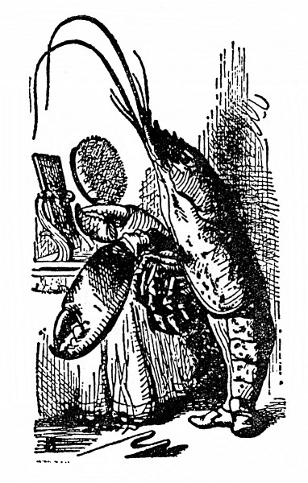

Paželv si zhluboka vzdychl a jednou prackou si otřel oči. Hleděl na Alenku, soukal ze sebe slova, ale hrdlo měl sevřené samým štkaním. „Jako by mu kost zaskočila,“ Noh jím zalomcoval a bouchal ho do zad. Posléze se Paželv zmohl na řeč a všecek uslzen takto hovořil dále:

  

„Ty jsi pod mořem asi mnoho nežila –“ („To ne,“ řekla Alenka.) „a s Humrem ses vůbec neseznámila –“ (Užuž měla Alenka na jazyku: Jednou jsem ho ochutnala –, ale honem se zarazila a řekla: „Vůbec ne.“) „a tak ani netušíš, jak rozkošná je Humří čtverylka.“

„To ne,“ řekla Alenka. „A jaký je to tanec?“

„Inu,“ řekl Noh, „nejprve si tanečníci na pobřeží stoupnou do řady –“

„Do dvou řad!“ zakřikl ho Paželv. „Jsou to Tuleni, Želvi a tak dále; slimýši se odklidí z cesty…“

„To obyčejně chvíli trvá,“ skočil mu do řeči Noh.

„… udělají se dva kroky vpřed…“

„Za tanečníka má každý Humra!“ křikl Noh.

„No ovšem,“ řekl Paželv. „Dva kroky vpřed se svým tanečníkem –“

„– potom se tanečníci vymění a v stejném pořádku se couvne,“ připomenul Noh.

„A potom se, rozumíš,“ vedl svou Paželv, „vyhodí –“

„Humři!“ vřískl Noh a poskočil.

„– co nejdál do moře –“

„A plave se za nimi!“ zaječel Noh.

„V moři se udělá kotrmelec!“ křikl Paželv a hopsal jako divý.

„Humří tanečníci se znovu vymění!“ zahulákal Noh.

„Plave se zpátky na břeh a – to je první figura,“ řekl Paželv a rázem ztišil hlas; až dosud obě stvoření řádila jako pominutá a teď se smutně a pokojně dívala na Alenku.

„Tanec je to jistě pěkný,“ pronesla nesměle Alenka.

„Chtěla bys ho kousek vidět?“ řekl Paželv.

„Moc ráda,“ řekla Alenka.

„Zkusme tedy první figuru!“ řekl Paželv Nohovi. „Bez Humrů se nějak obejdem. Kdo z nás bude zpívat?“

„Zpívej ty, já jsem slova zapomněl,“ řekl Noh.

I tančili vážně kolem Alenky, a když došli až k ní, vždycky jí šlápli na prsty, předními prackami mávali do taktu. Paželv přitom zvolna a smutně prozpěvoval:

> _„Hněte sebou, no tak honem,“ Bělice řve na Šneka.  
> „Delfín na ocas nám šlape, tlačí se a nečeká,  
> na písku zas Tuňák s Humrem rozdávají šťouchance,  
> hleďte, jak to s nimi šije – pustíte se do tance?  
> Pustíte se, nepustíte s námi do tance?  
> Pustíte se, nepustíte s námi do tance?_

> _Vždyť vy ani netušíte, jak to duši lahodí,  
> když nás popadnou a s Humry naráz hodí do vody.“  
> „Netroufám si tak daleko, když tu nemám zachránce,“  
> Šnek že mockrát děkuje, leč nepustí se do tance.  
> Ne a ne a nepustí se s nimi do tance.  
> Ne a ne a nepustí se s nimi do tance._

> _„Co byste se moře lekal, bledl strachy,“ ryba dí,  
> „mně ta dálka, milý Šneku, ani trochu nevadí.  
> Z Anglie je malý kousek do Francie k Marjánce,  
> hlavu vzhůru, no tak, jářku – pustíte se do tance? –  
> Pustíte se, nepustíte s námi do tance?  
> Pustíte se, nepustíte s námi do tance?“_

„Děkuji, napohled je ten tanec velmi zajímavý,“ Alenka si oddechla, že už je konečně po něm, „a ta zvláštní píseň o Bělici se mi tuze líbí.“

„Copak Bělice,“ řekl Paželv, „ty jsi je asi viděla už dřív, ne?“

„Ano,“ řekla Alenka, „vídala jsem je na ob – –,“ a honem se zarazila.

„Kde leží Ob, to nevím,“ řekl Paželv, „ale když jsi je vídala, pak ovšem víš, jak vypadají.“

„Snad ano,“ odpověděla váhavě Alenka. „Ocásek mají v hubě a jsou posypány strouhanou houskou.“

„S tou strouhanou houskou to není pravda,“ řekl Paželv. „V moři by se jim spláchla. Ale ocásek v hubě mají, a to proto, že –,“ tu Paželv zívl a přimhouřil oči. „Pověz jí, proč a nač to je,“ řekl Nohovi.

„Je to proto, že se chtěly pustit s Humry do tance,“ řekl Noh. „A tak je hodili do moře. A tak dlouho a dlouho padaly. A tak si ocásek zastrčily do huby. A tak ho už z huby nevytáhly. Tak je to.“

„Děkuji,“ řekla Alenka, „velmi zajímavé. To jsem o bělicích nevěděla.“

„Chceš-li, povím ti toho o nich ještě víc,“ řekl Noh. „Jestlipak víš, proč se jim říká bělice?“

„O tom jsem nikdy nepřemýšlela,“ řekla Alenka. „Proč?“

„Protože se jimi leští obuv,“ smrtelně vážně jí odpověděl Noh.

Alenka nad tím zkoprněla. „Obuv?“ opakovala nedůvěřivě.

„No, a čímpak se leští tvé střevíce?“ řekl Noh. „Od čeho se ti tak lesknou?“

Alenka se na ně zahleděla, chvíli přemýšlela a potom řekla: „Myslím, že se leští černidlem.“

„Pod mořem se obuv leští bělidlem,“ dodal hlubokým hlasem Noh. „Teď to víš.“

„A z čeho se ta obuv vyrábí?“ zeptala se zvědavě Alenka.

„No přece z pstruže a mloků,“ odsekl jí podrážděně Noh, „to ti každý garnát poví.“

„Být já Bělicí,“ Alence ta píseň pořád nešla z hlavy, „ten Tuňák by mi vadil. Řekla bych mu: ‚Zpátky, prosím – o tebe nestojíme!‘“

„Ale když on k nim patřil,“ namítl Paželv, „chytrá ryba se bez něho nikam nepustí.“

„Vážně?“ žasla Alenka.

„No ovšem,“ řekl Paželv, „když plave ryba ve velikánské hloubce, říká si, že to Tuňák vydrží.“

„Jak tomu mám rozumět?“ řekla Alenka.

„Tak jak to myslím,“ urazil se Paželv. A Noh prohodil: „A teď nám pověz, co dobrodružného jsi ty zažila.“

„Mohla bych vám vypravovat, co dobrodružného jsem zažila – ale jenom od dnešního rána,“ řekla nesměle Alenka. „Na včerejšek darmo vzpomínat, protože to jsem byla docela jiná.“

„Vysvětli nám to,“ řekl Paželv.

„Kdepak! Napřed dobrodružství,“ zlobil se Noh, „vysvětlování zabere hrůzu času.“

I vyprávěla jim Alenka, jaká dobrodružství ji potkala od té chvíle, co spatřila Bílého Králíka. Zprvu se zajíkala, obě ta svoření se na ni z obou stran lepila s vypoulenýma očima a s ústy dokořán, ale brzy se vzpamatovala. Posluchači ani nedutali, až došla k tomu, jak Houseňákovi odříkávala _Na svatého Řehoře_ a všechno se jí popletlo, tu se Paželv nadýchl a řekl: „To je divné.“

„Divnější to ani být nemůže,“ řekl Noh.

„Všechno se jí popletlo!“ opáčil zamyšleně Paželv. „Měla by nám taky něco odříkat. Ať spustí.“ Pohlédl na Noha, jako by si o něm myslel, že má nad Alenkou nějakou moc.

„Vstaň a odříkej nám _Za horama svítá_,“ řekl Noh.

Ta stvoření by člověka pořád jen komandovala a dávala mu něco odříkávat! pomyslila si Alenka. Úplně jako ve škole. Ale přece jen vstala a začala odříkávat, jenže měla dosud plnou hlavu Humří čtverylky, a tak ani nevěděla, co říká, a znělo to moc prapodivně:

> _Za horama svítá, bude brzy den,  
> připálený humr stojí špičky ven,  
> hlavu zamoučenou, pěkný ferina,  
> opasek si nosem svižně zapíná,  
> rejdí na břehu, když vlny opadnou,  
> před žralokem nemá úctu pražádnou.  
> Ale běda! úzko na duši mu je,  
> sotva s přílivem zas žralok připluje._

„Je to jinak, než jsem to já v dětských letech říkával,“ řekl Noh.

„Já jsem to doposud neslyšel,“ řekl Paželv, „ale pitomost je to k pohledání.“

Alenka nic neříkala; seděla, obličej v dlaních, a dumala, jestlipak jí ještě někdy něco dopadne jaksepatří.

„Někdo by mi to měl vysvětlit,“ řekl Paželv.

„Ona ti to vysvětlí,“ vyhrkl Noh. „Odříkávej další báseň.“

„Ale co ty špičky ven?“ Paželv si to nedal vzít.

„To je základní taneční postoj,“ řekla Alenka, ale byla nad tím celá pryč a chtěla to nějak zamluvit.

„Odříkávej další báseň,“ opakoval Noh, „začíná _Znám křišťálovou studánku_.“

Alenka věděla, že se jí to zase poplete, ale vzdorovat si netroufala, i spustila třaslavým hlasem:

> _Znám křišťálovou studánku, kde nejhlubší je les,  
> tam Pardál se Sovou se sešli na paštiku dnes.  
> Spořádal Pardál maso se šťávou, měl velký hlad,  
> Sovu, tu milostivě nechal talíř vylízat,  
> a tak tam svorně oba hodovali pospolu.  
> Dal Pardál Sově lžíci, když pak sklízel ze stolu,  
> nůž s vidličkou si nechal. Než bys napočítal pět,  
> zavrčel, zuby vycenil a milou Sovu – –_

„Nač celý ten krám opakovat,“ přetrhl jí to Paželv, „když nám to pořádně nevysvětlíš. Takovou slátaninu jsem jakživ neslyšel.“

„Tak přestaň,“ poručil Noh. A Alenka mileráda přestala.

„Neměli bychom zkusit další figuru z Humří čtverylky?“ dodal Noh. „Nebo ti má Paželv něco zazpívat?“

„Ať Paželv laskavě něco zazpívá,“ doprošovala se Alenka tak horlivě, že Noh nemálo dotčeně řekl: „Inu, každý má jiný vkus! Zazpívej jí, kamaráde, _Želví polívku_.“

Paželv zhluboka vzdychl a přerývaným hlasem plačtivě zazpíval:

> _Když přijde večer, kouří se  
> z husté polívky na míse.  
> Radostí všem září líčka,  
> večer chutná polívčička,  
>         polívčička!  
>         polívčička!  
> Večer chutná  
>         polívka, polívčička._

> _Polívka! Co je proti té  
> srnčí mandlemi nadité,  
> holoubě, štika, krkovička!  
> Nejlepší je polívčička,  
> nejlepší je polívčička,  
>         polívčička!  
>         polívčička!  
> Večer chutná  
>         polívka, POLÍVČIČKA!_

„Ještě jednou refrén!“ zvolal Noh a Paželv už k němu nasazoval, a tu k nim zdálky dolehl křik: „Začíná soud!“

„Pojď!“ poručil Noh, nečekal na konec písně, vzal Alenku za ruku a už běžel.

„Co je to za soud?“ Alenka sotva popadala dech, ale Noh odsekl: „Pojď!“ a běžel ještě rychleji a vánek k nim stále slaběji a slaběji zanášel truchlivá slova:

> _Večer chutná – á – á  
> polívka, polívčička!_
