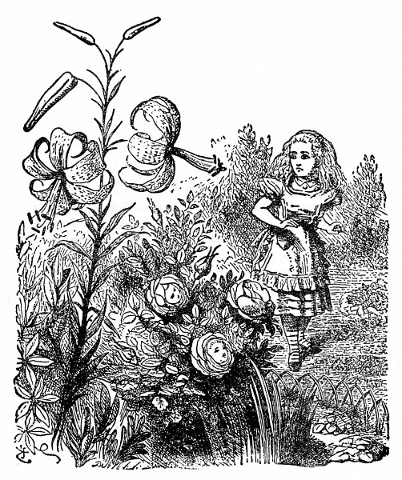
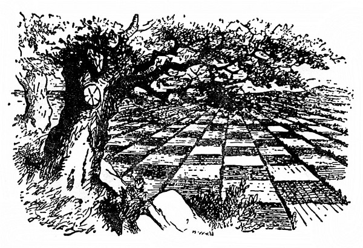

<section>

„Tamhle z toho vršku,“ řekla si Alenka, „se po zahradě líp rozhlédnu. Tady k němu vede pěšinka – snad, ba ne, nevede –“ (ušla kousek po pěšině a několikrát ostře zahnula), „ale nakonec třeba přece povede. Ta se nějak divně klikatí! To je vývrtka, a ne pěšina! A tudy snad odbočuje na vršek – ne, neodbočuje! Míří zpátky k domu. Zkusím to jinudy.“

</section>

<section>

A tak to zkoušela, zahýbala sem a tam, zahýbala hned na tu, hned na druhou stranu, ale dělej co dělej, vždycky došla zpátky k domu. Jednou dokonce zahnula prudčeji, a než se stačila zastavit, vrazila do něho.

„Darmo o tom mluvit,“ Alenka si změřila dům, jako by se s ní hádal, „zatím se tam nevrátím. Vím, že bych zas musila projít zrcadlem do starého pokoje, a veta by bylo po mém dobrodružství!“

Rázně se otočila k domu zády, znovu vyrazila po pěšině a umínila si, že se jí nespustí, dokud nedojde na vršek. Chvíli to šlo, už si říkala: „Tentokrát to přece jen dokážu –“ a v tom se pěšina zkroutila a otřepala (jak to později Alenka popisovala) a vzápětí byla Alenka už zase u samých dveří.

„To je k zlosti!“ zvolala Alenka. „Kdo to jakživ viděl, aby se dům takhle pletl do cesty!“

Jenže vršek se tyčil přímo před ní a nezbylo jí, než se tam znovu vydat. Tentokrát došla k velkému květinovému záhonu vroubenému sedmikráskami a uprostřed záhonu stála vrba.

„Ach Lilie Tygrovitá,“ řekla Alenka k jedné lilii kývající se ladně ve větru, „kdybys tak uměla mluvit!“

„My mluvit umíme,“ řekla Lilie Tygrovitá, „ale jen s tím, kdo nám stojí za to.“

Alenka nad tím tak užasla, že chvíli ze sebe slovo nevypravila; až se jí zatajil dech. Lilie Tygrovitá se dále kývala, až nakonec Alenka bázlivě – šeptem promluvila: „A to umějí všechny květiny mluvit?“

„Zrovna jako ty,“ řekla Lilie Tygrovitá, „a o moc hlasitěji.“

„U nás se nesluší promluvit první,“ řekla Růže, „a už jsem si říkala, kdy začneš! ‚Obličej,‘ povídám si, ‚bezduchý docela není, ale chytrý taky ne!‘ Ale barvu máš správnou a to znamená mnoho.“

„Barva je mi lhostejná,“ prohodila Lilie Tygrovitá, „kdyby jen měla načechranější okvětní lístky, nic by jí nechybělo.“

Alenka nesnášela výtky, a začala se tedy sama vyptávat: „Nebojíte se někdy, když vás vysázeli tak daleko a nikdo vás tu nehlídá?“

„Tamhleten strom uprostřed,“ řekla Růže, „k čemu by tu byl?“

„Ale co dělá, když hrozí nebezpečí?“ zeptala se Alenka.

„Vyje,“ řekla Růže.

„Ano, vyje,“ řekla Sedmikráska, „protože se z jeho proutí metla vije.“

„A to jsi nevěděla?“ rozhorlila se jiná Sedmikráska a křičely jedna přes druhou, až z jejich vřískotu uši zaléhaly.

„Budete ticho!“ okřikla je Lilie Tygrovitá a celá rozechvělá rozčilením kývala se zuřivě sem a tam. „Ony vědí, že na ně nemohu!“ sípala a roztřesenou hlavu nakláněla k Alence. „Jinak by si tak netroufaly!“

„Nic si z toho nedělej,“ chlácholila ji Alenka a sklonila se k Sedmikráskám, které už zase začínaly: „Jestli nebudete zticha, tak vás utrhnu!“

Rázem zmlkly a ty růžové zbledly.

„Tak to má být,“ řekla Lilie Tygrovitá. „Sedmikrásky, to je ti čeládka. Jen promluvíš, všechny spustí naráz, a poslouchat to jejich drmolení, z toho bys uschla!“

„Čím to, že tady umíte tak hezky mluvit?“ Alenka doufala, že ji tou poklonou lépe naladí. „Byla jsem už v mnoha zahradách, ale žádné květiny tam nemluvily.“

„Sáhni si na záhon,“ řekla Lilie Tygrovitá, „hned to pochopíš.“

Alenka si sáhla. „Sypký není,“ řekla, „ale co to má s tím společného?“

„Jinde v zahradách bývají sypky a květiny v nich pořád spí,“ řekla Lilie Tygrovitá.

Znělo to přesvědčivě a Alenka byla ráda, že to ví. „To jsem si nemyslila!“ řekla.

„Jak se mi zdá, ty vůbec nemyslíš,“ řekla přísně Růže.

</section>

<section>

</section>

<section>

„Aby někdo tak hloupě vypadal, to jsem neviděla,“ pronesla Fialka tak neočekávaně, že sebou Alenka trhla; předtím totiž vůbec nemluvila.

„Ty mlč!“ okřikla ji Lilie Tygrovitá. „Copak vůbec někoho vidíš? Hlavu máš pod listím, chrníš si a o světě toho víš tolik jako nějaké poupátko.“

„Jsou kromě mne v zahradě ještě jiní lidé?“ Alenka si Růžiny poslední poznámky nevšímala.

„Je tady v zahradě ještě jedna květina, která se pohybuje jako ty,“ řekla Růže. „Je mi divné, jak to děláš – („Tobě je pořád něco divné,“ řekla Lilie Tygrovitá), jenže je proti tobě střapatější.“

„Je jako já?“ vyhrkla Alenka, protože jí blesklo hlavou: „V zahradě je ještě jedno děvče!“

„Inu, neforemná je stejně jako ty,“ řekla Růže, „jenže černější – a myslím, že okvětní lístky má kratší.“

„Má je ulízané skoro jako Jiřina,“ skočila jí do řeči Lilie Tygrovitá, „a ne takové roztřepané jako ty.“

„Ale ty za to nemůžeš,“ řekla vlídně Růže, „ty už odkvétáš, a nic naplat, okvětní lístky se pak trochu pocuchají.“

Alence to pomyšlení nebylo po chuti; aby odvedla řeč jinam, zeptala se: „A chodívá sem někdy?“

„Však ty ji brzy uvidíš,“ řekla Růže. „Ona patří k bodlákovitým s devíti ostny.“

„A kde má ty ostny?“ zeptala se zvědavě Alenka.

„Toť se ví, že kolem hlavy,“ odpověděla Růže. „Hned mi bylo divné, že ty žádné nemáš. Myslela jsem si, že je to u vás běžné.“

„Už jde!“ vykřikla Stračí Nožka. „Už ji slyším, jak dupe bum bum po štěrkované cestičce!“

Alenka se honem ohlédla a ona to byla Černá Královna. „Ta ale vyrostla,“ všimla si Alenka. A opravdu: když ji prve našla v popelu, měřila jenom tři palce, a teď najednou byla o půl hlavy větší než Alenka.

„To dělá čerstvý vzduch,“ řekla Růže, „máme tady báječný vzduch!“

„Půjdu radši za ní,“ řekla si Alenka; květiny byly sice zajímavé, ale pohovořit si s opravdovou Královnou ji vábilo mnohem víc.

</section>

<section>

</section>

<section>

„To je vyloučeno,“ řekla Růže, „radím ti, pusť se opačným směrem.“

Alence to připadalo bláhové, nic neříkala a pustila se rovnou k Černé Královně. Kupodivu naráz ji ztratila z očí a octla se zase u dveří. Rozmrzele couvla ode dveří, ohlížela se po Královně (posléze ji v dáli vyslídila) a řekla si, že tentokrát zkusí jít opačným směrem.

Skvěle se to povedlo. Ani ne za minutu se octla tváří v tvář před Černou Královnou a přímo před ní se zdvíhal vršek, kam měla už dávno namířeno.

„Kde se tu bereš?“ řekla Černá Královna. „A kam jdeš? Dívej se zpříma, mluv způsobně a nehrej si pořád s prsty.“

Alenka se podle těch příkazů zařídila a usilovně jí vysvětlovala, že bloudí.

„Bloudi jsou ti, kdo sem chodí – vždyť ta zahrada patří mně – pročpak jsi sem vůbec přišla?“ dodala vlídnějším hlasem. „Pokloň se, než se rozmyslíš, co řekneš. Ušetří se tím čas.“

Alence to bylo trochu divné, ale nevěřit Královně, na to ji příliš ctila. „Až půjdu doma pozdě k obědu,“ umínila si, „tak to zkusím.“

„Už máš načase odpovědět,“ Královna se podívala na hodiny. „Při řeči otvírej trochu víc ústa a nevynechávej ‚Vaše Veličenstvo‘.“

„Chtěla jsem si, Vaše Veličenstvo, jenom prohlídnout zahradu –“

„Dobře,“ Královna ji pohladila po hlavě, což se Alence vůbec nezamlouvalo, „ale když říkáš ‚zahrada‘, já jsem ti viděla zahrady, proti kterým tohle je hotová pustina.“

Odporovat jí si Alenka netroufala: „– a tak jsem si řekla, že zkusím dojít na tamhleten vršek –“

</section>

<section>

</section>

<section>

„Když říkáš vršek,“ skočila jí do řeči Královna, „já bych ti mohla ukázat vršky, proti kterým tamhleten nazveš hotovým údolím.“

„A nenazvu,“ Alenka se sama podivila, že jí konečně odporuje, „vždyť vršek nemůže být údolí. To by byla hloupost.“

Černá Královna zavrtěla hlavou. „Říkej si tomu třeba ‚hloupost‘, ale já jsem slyšela hlouposti, proti kterým tahle vypadá tak rozumně jako nějaký slovník.“

Alenka se znovu poklonila, protože z Královnina hlasu měla dojem, že se jí nemile dotkla; a tak šla mlčky, až se dostaly na nízký vršek.

Chvíli Alenka stála, nic neříkala a rozhlížela se vůkol po krajině – a byla to prapodivná krajina. Od jednoho konce na druhý jí protékaly potůčky a půda mezi nimi byla rozdělena v políčka živými ploty sahajícími od jednoho potůčku k druhému.

„Ta krajina je rozdělená jako nějaká šachovnice,“ pronesla posléze Alenka. „Někde by se tu měli hýbat lidi – však se taky hýbají!“ zaradovala se a samým vzrušením se jí srdce rozbušilo. „Je to velká šachová partie – hraná po celém světě – jestli je ovšem tohle svět. Ach! To je legrace! Kdybych tak k nim patřila! Kdyby mě tak vzali do hry, klidně bych byla třeba pěšcem – ale ještě radši bych byla Královnou.“

Při těch slovech vrhla plachý pohled po Královně, ale její společnice se vlídně usmála a řekla: „To je snadná věc. Chceš-li, můžeš být pěšcem Bílé Královny, protože Lilinka je na hru ještě malá; začínáš v druhém políčku, a až se dostaneš do osmého, bude z tebe Královna –“ V tom okamžiku se zčistajasna rozběhly.

Když tak o tom Alenka později přemýšlela, ne a ne přijít na to, jak to vlastně začalo. Jenom to si pamatuje, že běžely a držely se za ruce a Královna uháněla, že jí Alenka sotva stačila; a Královna pořád křičela: „Rychlej!“, jenže Alenka už rychleji nemohla, ale říct jí to, na to neměla dech.

Nejpodivnější na tom bylo, že stromy a jiné věci kolem se nehýbaly z místa; ať běžely seberychleji, jako by vůbec nic nenechávaly za sebou. Copak se kdeco pohybuje zároveň s námi? pomyslila si chudák zmatená Alenka. Královna, jako by uhodla její myšlenku, křikla: „Rychlej! Nech mluvení!“

Alence to ani nenapadlo. Zdálo se jí, že už nikdy mluvit nebude, tak se zadýchala; a Královna pořád křičela: „Rychlej! Rychlej!“, a táhla ji s sebou. „Už tam budem?“ vyjekla konečně Alenka.

„Cože, budem!“ opáčila Královna. „Vždyť jsme tam už před deseti minutami byly! Rychlej!“ Mčky běžely dále, vítr hvízdal Alence kolem uší, div jí vlasy neodvál.

„No tak! No tak!“ křičela Královna. „Rychlej! Rychlej!“ Uháněly, nakonec se jenom vzduchem nesly a nohama se sotva země dotýkaly, a když už byla Alenka se silami u konce, najednou se zastavily. Tu Alenka zjistila, že sedí na zemi, popadá dech a hlava se jí točí. Královna ji opřela o strom a vlídně řekla: „Trochu si odpočiň.“

Alenka se udiveně rozhlédla. „Tak se mi zdá, že jsme pořád pod tímto stromem! Všechno je, jak bylo!“

„Toť se ví,“ řekla Královna. „A jak jinak?“

</section>

<section>

</section>

<section>

„To v naší zemi,“ Alenka se stále ještě zajíkala, „když se běží tak dlouho, jak my jsme běžely, obyčejně se dojde někam jinam.“

„To je mi nějaká loudavá země!“ řekla Královna. „Jak vidíš, tady musíš běžet ze všech sil, abys setrvala na jednom místě. Chceš-li se dostat jinam, musíš běžet aspoň dvakrát tak rychle!“

„To bych prosím radši nezkoušela!“ řekla Alenka. „Zůstanu klidně tady – ale zahřála jsem se a mám žízeň!“

„Já vím, na co máš chuť,“ řekla dobromyslně Královna a vytáhla z kapsy krabičku. „Nechceš sušenku?“

Říct ne, to se Alence zdálo neslušné, ačkoli na sušenku zrovna chuť neměla. Vzala si a nutila se do ní. Byla náramně suchá. Řekla si, že takhle jí dosud nic v hrdle nevázlo.

„Než se občerstvíš,“ řekla Královna, „já to zatím vyměřím.“ Vytáhla z kapsy šňůrku rozdělenou na couly, měřila půdu a tu a tam zarážela kolíky.

„Po dvou yardech,“ zarazila v té vzdálenosti kolík, „podám ti návod – nechceš ještě sušenku?“

„Děkuji, nechci,“ řekla Alenka, „jedné je až dost!“

„Žízeň jsi doufám zahnala,“ řekla Královna.

Alenka nevěděla, co na to říct, ale Královna naštěstí odpověď nečekala a hovořila dál. „Po třech yardech ti návod zopakuji – abys ho nezapomněla. Po čtyřech se s tebou rozloučím. A po pěti odejdu!“

Zatím už měla všechny kolíky zaraženy a Alenka ji napjatě sledovala, jak se vrací ke stromu; potom se Královna pomalu ubírala pryč po pěšině.

U dvouyardového kolíku se po ní ohlédla a řekla: „Prvním tahem postoupí pěšec o dvě políčka. Třetí políčko projedeš rychle – nejspíš vlakem – a mžikem se octneš v čtvrtém políčku. To patří Tydlitákovi a Tydlitkovi – páté je samá voda – šesté patří zas Valihrachovi – ale ty na to nic neříkáš!“

</section>

<section>

„Když já jsem nevěděla, že mám něco říct,“ vykoktala Alenka.

„Měla jsi říct,“ Královna ji přísně pokárala, „‚Jste velmi laskavá, že mi to povídáte‘ – nu, jako bys to řekla – sedmé políčko je les – ale jeden Jezdec tě jím provede – a v osmém políčku budeme pak Královny obě dvě, a to bude samý jásot a ples!“ Alenka vstala, poklonila se a znovu se posadila.

U dalšího kolíku se Královna znovu otočila a řekla: „Když něco nevíš česky, řekni to francouzsky – našlapuj špičkami od sebe – a pamatuj, kdo jsi!“ Tentokrát nečekala na Alenčinu poklonu, pokročila rázně k dalšímu kolíku, tam se otočila, řekla „sbohem“ a uháněla k poslednímu.

Jak se to stalo, to Alenka nikdy nepochopí: sotva Královna došla k poslednímu kolíku, byla tatam. Marné bylo hádat, jestli se rozplynula do vzduchu nebo snad zaběhla do lesa („a běžet ona umí!“ řekla si Alenka), byla tatam a tu si Alenka vzpomněla, že je Pěšec a bude hnedle na tahu.

</section>
