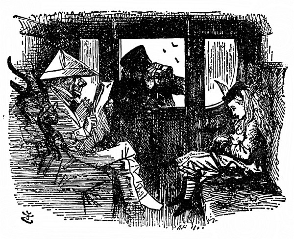
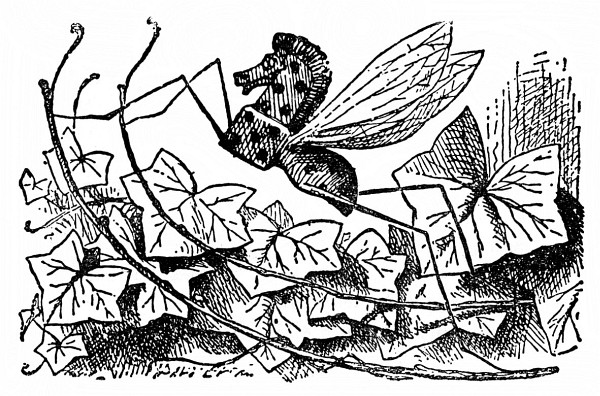
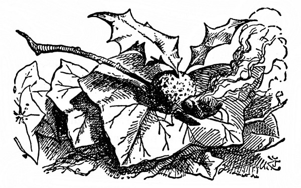
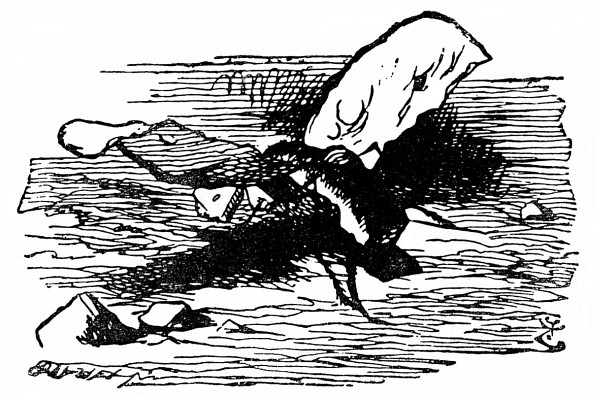

<section>

Nejprve bylo ovšem nutno prozkoumat krajinu, po které měla putovat. Alenka si stoupla na špičky, že tak dohlédne kousek dál, a řekla si: „Je to, jako když se učím zeměpis. Největší řeky – žádné. Největší hory – je jediná a na té stojím, ale nijak se nejmenuje. Největší města – copak jsou to tamhle za stvoření, co dělají med? Včely to nebudou – copak je včelu vidět na míli daleko –“ a delší chvíli mlčky pozorovala, jak s hlomozem lítá od jedné květiny ke druhé a strká do nich chobot, „docela jako obyčejná včela,“ řekla si Alenka.

</section>

<section>

Ale obyčejná včela to není: „Vždyť je to slon –“ Alenka na to sama přišla, až se jí nad tím dech zatajil. Potom jí napadlo: Ty květiny budou jistě taky velikánské! Jako když z domků strhnou střechu a nasadí jim stopku – a toho medu, co z nich je! Co abych se na ně šla podívat – ba ne, zatím nepůjdu, a jak běžela z vršku dolů, zůstala stát a hledala výmluvu, že si to najednou rozmyslila. To by to dopadlo, pustit se mezi ně, když nemám pořádnou větev na odhánění – to bude legrace, až se mě jednou zeptají, jak jsem se prošla. Řeknu jim – „no, ušlo to –“ (a tu pohodila hlavou, jak to jen ona uměla), „jenže bylo plno prachu a vedro a moc mě obtěžovali sloni!“

Chvíli mlčela a potom si řekla: „Dám se druhou stranou a za slony si zajdu jindy. Ostatně už abych byla v třetím políčku.“

Výmluvu si tedy našla. Sběhla z vršku a přeskočila první ze šesti potůčků.

„Lístky prosím!“ Průvodčí strčil hlavu do okna. A hned mu všichni podávali lístek. Velcí byli skoro jako lidé a byl jich plný vagón.

„No tak, děvče! Ukaž mi lístek!“ průvodčí se kabonil na Alenku. Naráz zahlaholilo plno hlasů („jako když se sborem zpívá refrén,“ řekla si Alenka). „Nezdržuj ho, děvče! Vždyť každá hodina času ho stojí tisíc liber!“

„Když já bohužel žádný nemám,“ řekla ustrašeně Alenka, „tam u nás není pokladna.“ A znovu zahlaholil sbor: „Tam u nich není na pokladnu místo. Coul půdy tam stojí tisíc liber.“

„Jen se nevymlouvej,“ řekl průvodčí. „Měla sis ho koupit u strojvůdce.“ A znovu zahlaholil sbor: „U toho, co řídí lokomotivu. Vždyť jeden kotouč kouře stojí tisíc liber!“

Alenka si pomyslila: Darmo mluvit. Protože nic neřekla, tentokrát nemluvili sborem, jenom kupodivu sborem myslili (co to je, myslit sborem, doufám víte – přiznám se vám, že já to nevím). Radši nemluv. Jedno slovo řeči stojí tisíc liber!

Dnes se mi bude zdát o tisíci librách, to je jisté, pomyslila si Alenka.

Průvodčí si ji prohlížel, nejprve dalekohledem, potom drobnohledem a potom divadelním kukátkem. Nakonec řekl: „Jedeš nesprávným směrem,“ zavřel okno a odešel.

„Taková dívenka,“ ozval se pán naproti ní (byl oblečený v bílé papírové šaty), „má vědět, kam jede, i když třeba neví, jak se jmenuje!“

</section>

<section>

</section>

<section>

Vedle pána v bílých papírových šatech seděl Kozel; přivřel oči a silně zamečel: „Má vědět, jak se jde k pokladně, i když třeba neumí abecedu.“

Vedle Kozla seděl Brouk (cestující to byli prapodivní), a protože se zřejmě řídili pravidlem, že se mají střídat, řekl: „Zpátky ji pošlou jako zavazadlo!“

Kdo sedí za Broukem, to Alenka neviděla; někdo tam zasípal: „Připojte novou lokomotivu –“ a tu se zajíkl a ustal.

„Mluví jako kůň,“ řekla si Alenka. A tu se jí u samého ucha ozval slabounký hlásek: **„Na to bys mohla udělat vtip, třeba něco jako ‚slyším koně sípat‘ a ‚jdu mu oves sypat‘.“**

A tu se někdo zdálky slabounce ozval: „Musíte na ni nalepit cedulku: A/Sk LENKA, NEKLOPIT –“

A tu zahlaholili druzí (To jich tady ve voze je, pomyslila si Alenka) a řekli: „Musí jít telegraficky –“ „Zbytek cesty musí táhnout vlak sama –“ a tak dále.

Ale pán v bílých papírových šatech se k ní nahnul a zašuškal jí: „Děvenko, nic si z těch řečí nedělej, a na každé stanici si kup zpáteční lístek.“

„A nekoupím!“ utrhla se na něj Alenka- „Vždyť já do tohohle vlaku vůbec nepatřím – byla jsem v lese – kdybych tak mohla zpátky.“

**„Na to bys mohla udělat vtip,“** u samého ucha se jí zas ozval ten hlásek, **„třeba něco jako kdyby jsou chyby.“**

„Netrap mě,“ řekla Alenka a marně pátrala, odkud se ten hlas ozývá, „když tolik stojíš o vtipy, proč je neděláš sám?“

Někdo si tenounkým hláskem hluboce povzdychl. Zřejmě byl velmi smutný a Alenka užuž měla na jazyku nějakou útěchu, ale tu jí napadlo: Pročpak nevzdychá jako druzí! On vzdychal tak slaboulince, že nemít ho až u samého ucha, ani by ho neslyšela. Šimral ji do ucha a tím se stalo, že na smutek toho nešťastníka nadobro zapomněla.

**„Vím, že jsi má přítelkyně,“** ozýval se hlásek, **„milá přítelkyně, dávná přítelkyně. A že mi neublížíš, i když jsem pouhý hmyz.“**

„Jaký hmyz?“ zatrnula Alenka. Chtěla jen vědět, jestli píchá, nebo ne, ale ptát se na to jí nepřipadalo dost slušné.

**„Tak ty ne –,“** pípl hlásek, ale tu ho přehlušil hvizd lokomotivy tak ostrý, že kdekdo vyskočil a Alenka s nimi.

Kůň vystrčil hlavu z okna, klidně ji zas vtáhl zpátky a řekl: „To jenom přeskočíme potůček.“ Všichni se uklidnili, jen Alenka trnula nad tím, že by měl vlak skákat. „Aspoň nás zaveze na čtvrté políčko!“ utěšovala se. Vzápětí se vlak vznesl do povětří; Alenka samým leknutím chňapla, co měla nejblíž, a byla to kozlí brada.

Ale jen se jí dotkla, brada se rozplynula a Alenka si zas klidně hověla pod stromem – a na větvi nad ní se pohupoval Komár (to byl ten hmyz, co s ním předtím mluvila) a ovíval ji křídly.

Byl to náramně velký Komár. „Jako kuře,“ řekla si Alenka. Ale tolik si už toho napovídali, co by se ho tedy bála.

„Tak tobě se hmyz nelíbí?“ hovořil klidně Komár, jako by se nic nestalo.

„Líbí, když umí mluvit,“ řekla Alenka. „Ale tam u nás žádný hmyz nemluví.“

„Na jaký hmyz si tam u vás potrpíte?“ vyzvídal Komár.

„Já si na hmyz vůbec nepotrpím,“ vykládala Alenka, „protože se ho trochu bojím – aspoň toho většího. Ale některý ti mohu uvést jménem.“

„Na to jméno slyší, ne?“ utrousil Komár.

„To jsem ani nevěděla.“

„K čemu by mu bylo jméno, když na ně neslyší,“ řekl Komár.

„Hmyzu samému není k ničemu,“ řekla Alenka, „ale je snad užitečné těm, kdo mu je dávají. Nač by se potom věci vůbec nějak jmenovaly?“

„To nevím,“ řekl Komár. „U nás v lese se nejmenují nijak – ale vyjmenuj mi ten hmyz. Zbytečně maříš čas.“

„Předně Koníček,“ spustila Alenka a počítala na prstech.

„Dobrá,“ řekl Komár, „podívej se, tamhle v křoví uvidíš Houpacího Koníčka. Je celý ze dřeva a pohybuje se tak, že se houpá z větve na větev.“

„Čímpak se živí?“ zeptala se Alenka zvědavě.

„Mízou a pilinami,“ řekl Komár. „Vypočítávej dál.“

</section>

<section>

</section>

<section>

Alenka si Houpacího Koníčka se zájmem prohlídla a usoudila, že je nejspíš čerstvě natřen, protože je tak lesklý a lepkavý; potom zase vypočítávala.

„Dále Modráček.“

„Podívej se na tu větev, co máš nad sebou,“ řekl Komár, „a uvidíš tam Ohniváčka. Trup má z biskupského chlebíčka, křídla z majoránky a hlavu z ohnivé rozinky pražené v kořalce.“

„A čím se živí?“ zeptala se Alenka zase jako dřív.

„Pšeničnou kaší a zapékanou paštikou,“ odpověděl Komár, „a hnízdí pod vánočním stromkem.“

„A dále Babočka,“ vykládala Alenka, ale nejprve si ten hmyz s ohnivou hlavou důkladně prohlídla a řekla si: „Snad proto můry tak rády lítají do plamene – protože se chtějí proměnit v Ohniváčky.“

„Všimni si, u nohou ti leze,“ řekl Komár (a Alenka hned zděšeně ucouvla), „motýl Vánočka. Křídla má z citrónové kůry a z mandlí, trup z třeného těsta a hlavu z cukru a vanilky.“

„A čím se živí?“

„Slabým čajem s kapkou smetany.“

V Alence se ozvala nová pochybnost: „A co když žádný čaj nesežene?“ „Potom ovšem hyne.“

„Ale to se jistě děje často,“ řekla starostlivě Alenka.

„To se děje napořád,“ řekl Komár.

Alenka chvíli mlčela a dumala. Komár se zatím bavil tím, že jí bzučel kolem hlavy, nakonec pak znovu usedl a prohodil: „Ty o jméno přijít nechceš, viď?“

„Kdepak, to ne,“ lekla se Alenka.

„Nevím, nevím,“ utrousil Komár, „představ si to pohodlí, kdyby se ti tak povedlo přijít domů beze jména! Tak třeba domácí učitelka tě chce zavolat na hodinu a křikne: ‚Šla sem -,‘ a dál se nedostane, protože jí vypadlo jméno, a ty ovšem na hodinu jít nemusíš.“

„Marná sláva,“ řekla Alenka, „kvůli tomu mi hodinu učitelka neodpustí. Když si nevzpomene, jak se jmenuju, zavolá: ‚ta tam!‘, jak na mě volá služebnictvo.“

„Inu, když řekne ‚ta tam‘ a nic víc,“ prohodil komár, „pak bude ovšem hodina tatam. To je vtip. Škoda žes ho neudělala ty.“

</section>

<section>

</section>

<section>

„A proč jsem ho měla udělat?“ divila se Alenka. „Vždyť je špatný.“ Ale Komár jenom hluboce vzdychl a po lících mu skanuly dvě veliké slzy.

„Když tě vtipy tak rozesmutňují,“ řekla Alenka, „neměl bys je dělat.“

Komár si znovu truchlivě povzdechl a tentokrát se snad nadobro uvzdychal.

Alenka zdvihla hlavu a na větvi kde nic, tu nic. Dlouhým seděním prostydla, vstala tedy a šla dál.

Brzy se octla v širém poli, a za ním se táhl les. Byl tmavší než ten poslední a Alenka se trošinku bála do něho jít. Ale potom se rozmyslela a umínila si, že přece jen půjde. „Vracet se nebudu,“ řekla si, ostatně na osmé políčko se mohla dostat jen tamtudy.

„To bude ten les,“ řekla si zamyšleně, „kde nic nemá jméno. Až tam vkročím, kampak se asi moje jméno poděje. Moc nerada bych o ně přišla – to by mi pak dali jinačí, nejspíš nějaké ošklivé. Najít potom to stvoření s mým starým jménem, to bych se nahledala! Jako když se dá inzerát na zatoulaného psa – ‚slyší na jméno Raf, na krku má mosazný obojek‘ – kdekomu na potkání říkat Alenko, až se na to jméno někdo ozve, to by bylo! Žádný rozumný člověk by se neozval.“

</section>

<section>

</section>

<section>

Tak kráčela, až došla do lesa; připadal jí chladný a stinný. „To se člověku uleví,“ řekla si, když se octla pod stromy, „z takového vedra vkročit do – do – do čeho?“ Bylo jí divné, že na to slovo nemůže kápnout. „Totiž octnout se pod – pod – no přece pod tímhle!“ a sáhla rukou na kmen stromu. „Jakpak se mu říká? Snad žádné jméno nemá – ba určitě ne.“

Mlčky, zamyšleně postála, až zas najednou řekla: „Tak na to přece došlo! A kdo jsem já? Však já si nějak vzpomenu! Jsem pevně odhodlána vzpomenout si.“ Odhodlání nebylo nic platné a jenom tolik nakonec vydumala: „Ale vím, že to začíná Ale!“

Najednou se tamtudy ubíral Kolouch. Něžnými kukadly se díval na Alenku, ale zřejmě se nebál. „Pojď! Pojď!“ Alenka natáhla k němu ruku, že ho pohladí; on před ní necouvl, jenom stál a díval se na ni.

„Jak ti říkají?“ ozval se posléze Kolouch. Hlas měl hebký a líbezný.

Kdybych to já věděla! pomyslila si Alenka a posmutněle mu odpověděla: „Teď nijak.“

„To mi nestačí,“ řekl, „jen přemýšlej.“

Alenka přemýšlela, ale marně. „Pověz mi prosím, jak tobě říkají,“ pronesla nesměle. „Třeba to pak bude snazší.“

„Povím ti to,“ řekl Kolouch, „jen co kousek ujdeme. Tady si nevzpomenu.“

A tak spolu kráčeli lesem, Alenka oběma rukama láskyplně objímala Kolouchovi hebkou šíji, až zas vyšli na širé pole; tu Kolouch rázem poskočil a vysmekl se Alence z náručí. „Jsem Kolouch!“ zajásal. „Jéje, a ty jsi člověčí mládě!“ Krásné hnědé oči mu najednou zneklidněly a vzápětí vyrazil a uháněl pryč.

Alenka se za ním dívala, div se nerozplakala žalem nad tím, jak náhle zas o svého spolupoutníčka přišla. „Ale vím, jak se jmenuju,“ řekla, „to je hned člověku líp, Alenka – Alenka – už to nezapomenu. Jenom bych ráda věděla, kterým tím ukazatelem se mám řídit.“

Odpověď na to nebyla těžká, vedla tam jenom jedna cesta a oba ukazatele směřovaly po ní. „Však na to přijdu,“ řekla si Alenka, „až budou ukazatele někde na rozcestí mířit každý jinam.“

Ale moc slibně to nevypadalo. Dlouho šla a šla, ale na každém rozcestí ukazatele mířily vždycky jedním směrem, na jednom stálo: **K TYDLITÁKOVI** a na druhém **K TYDLITKOVI**!

„Jak se zdá,“ řekla posléze Alenka, „oni bydlí spolu! Že mi to dřív nenapadlo – Ale dlouho u nich nepobudu. Jenom si k nim zaskočím, slušně pozdravím a vyptám se jich na cestu z lesa. Jestlipak se před soumrakem dostanu na osmé políčko!“ A tak se ubírala dál a něco si jen tak pro sebe povídala, až v prudké zatáčce narazila na dva tlouštíky, a to tak neočekávaně, že leknutím ucouvla, ale hned se zas vzpamatovala; věděla, že to jsou jistě –

</section>

<section>

</section>
