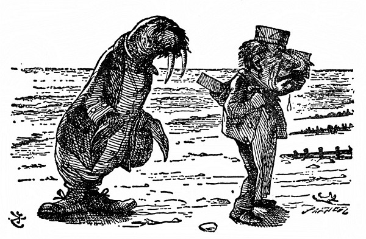
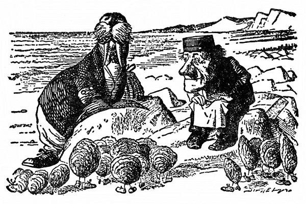
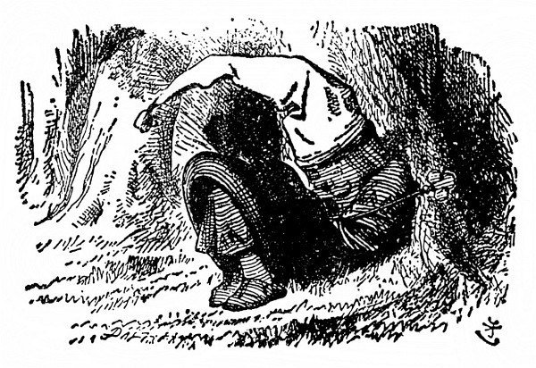
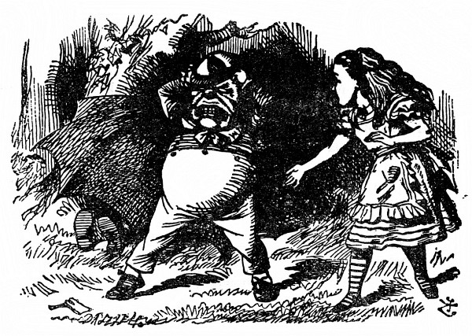

<section>

Stáli pod stromem, drželi se kolem krku, a kdo je kdo, poznala Alenka rázem podle toho, že jeden měl na límci vyšito **ták** a druhý **tek.** „Vzadu na límci mají asi oba **tydli**,“ řekla si Alenka.

</section>

<section>

Jak tak strnule stáli, nadobro zapomněla, že jsou živí, a prohlížela si je, mají-li opravdu vzadu na límci **tydli**, a tu ten, který byl označen **ták**, promluvil, až sebou trhla.

„Jestli si myslíš, že jsme voskové figurky,“ řekl, „tak bys za to měla zaplatit. Na dívání zadarmo voskové figurky nejsou. Nikterak!“

„Naopak,“ dodal ten, který byl označen **tek**, „jestli si myslíš, že jsme živí, tak co nemluvíš?“

„Odpusťte mi to prosím,“ vypravila ze sebe Alenka; slova staré písničky zněla jí v hlavě jako tikot hodin a jen taktak že je neodříkala nahlas:

> _Tydliták vám s Tydlitkem  
>          začal divou rvačku,  
> protože mu Tydlitek  
>          šlápl na řehtačku._

> _Najednou, propánajána!  
>          ti se ale lekli,  
> přiletěla černá vrána,  
>          hned se rozutekli._

„Já vím, nač myslíš,“ řekl Tydliták, „jenže tak to není, nikterak.“

„Naopak,“ doplnil ho Tydlitek, „jestli to bylo, třeba to i bylo, a být to tak, pak to být mohlo, ale aby to bylo, to zas nebylo. To je logika.“

„Myslím jen na to,“ řekla zdvořile Alenka, „kudy se dostanu ven z lesa. Už se stmívá. Povězte mi to prosím.“

</section>

<section>

</section>

<section>

Ale tlouštíci jenom koukli po sobě a oba se ušklíbli.

Vypadali úplně jako školáci, a tak Alenka bezděky ukázala na Tydlitáka prstem a řekla: „První žák!“

„Nikterak,“ okřikl ji Tydliták a sklapl ústa, až to cvaklo.

„Další žák!“ Alenka ukázala dále na Tydlitka, třebaže tušila, že na ni vybafne „Naopak!“, a taky vybafl.

„Špatně jsi začala!“ obořil se na ni Tydliták. „Když přijdeš někam na návštěvu, nejprve máš pěkně pozdravit a podat ruku!“ Oba bratři se pak ještě víc k sobě přimkli a každý napřáhl volnou ruku k Alence.

Alence se nechtělo podávat ruku napřed jednomu, aby se snad druhý neurazil; pomohla si tím, že je oba popadla za ruce najednou – a už se točili dokolečka dokola. Jak si potom vzpomínala, připadalo jí to tehdy samozřejmé a nic se nedivila, že jim vyhrává hudba. Ozývala se ze stromu, pod nímž tančili, a vyluzovaly ji, jak se zdálo, větve. Třely se o sebe jako housle a smyčec.

„K smíchu mi to přece jen bylo“ (vyprávěla o tom později Alenka sestře), „že zpívám _Kolo, kolo mlýnský_. Kdy jsem se dala do zpěvu, nevím, ale připadalo mi, že zpívám dlouho a dlouho!“

Druzí dva tanečníci se při své tloušťce brzy zadýchali. „Čtyřikrát dokola je na jeden tanec až dost,“ hekal Tydliták, a jak se roztočili, právě tak naráz přestali. V tu chvíli umlkla také hudba.

Pustili Alenčiny ruce a chvíli na ni koukali. Alenka tonula v trapných rozpacích, jak se s nimi po tanci dát do řeči. Říct jim: „Pěkně vítám,“ to nejde, to už jsem o kus dál!

„Doufám, že nejste uříceni,“ řekla konečně.

„Nikterak. Děkuji za optání,“ řekl Tydliták.

„Upřímné díky,“ dodal Tydlitek. „Máš ráda básně?“

„Ano, mám – aspoň některé,“ ozvala se nejistě Alenka. „Povězte mi prosím, kudy se dostanu z lesa.“

„Kterou mám přednášet?“ Tydlitek se vážně vykulenýma očima ohlédl po Tydlitákovi a Alenčiny otázky si nevšímal.

„Nejdelší je _Mrož a tesař,_“ odpověděl mu bratr a něžně ho přitiskl k sobě. Tydlitek hned spustil:

> _Nad mořem vyšlo slunečko –_

A tu se Alenka osmělila skočit mu do řeči: „Jestli je ta báseň hodně dlouhá,“ řekla co nejzdvořileji, „povězte mi prosím, kudy –“

Tydlitek se vlídně usmál a spustil znovu:

> _Nad mořem vyšlo slunečko  
> a září planoucí  
> zlatilo vlnky, snažilo  
> se příboj přemoci –  
> Divná to věru, divná věc:  
> bylo už k půlnoci._

> _Luna, ta nad tím pořádkem  
> jen hlavou vrtěla  
> a na neslušné slunečko  
> zlost měla docela –  
> Takhle jí kazit řemeslo,  
> to se přec nedělá!_

> _Mokře, přemokře vlnil se  
> mohutný mořský proud,  
> a přece písek na břehu  
> byl suchý jako troud.  
> Obláčky nikde, proto je  
> neviděl nikdo plout._

</section>

<section>

</section>

<section>

> _Mrož s Tesařem tam na břehu  
> chodili ostošest.  
> Rozplakali se nad pískem,  
> bylo ho, všechna čest!  
> „Tu velikánskou hromadu  
> by neškodilo smést.“_

> _„Mít sedm služek,“ pravil Mrož,  
> „(kupa je vysoká!)  
> a sedm košťat, co myslíš,  
> smetou ji do roka?“  
> „To ne,“ děl Tesař, slza se  
> mu vkradla do oka._

</section>

<section>

</section>

<section>

> _Mrož úlisný tón nasadil:  
> „Jen pojďte, ústřice,  
> ona vám menší procházka  
> prospěje velice.  
> Jsme dva a můžem provádět  
> nanejvýš čtveřice.“_

> _Nejstarší z ústřic nevrle  
> ho zrakem měřila,  
> vrtěla hlavou. Aniž mu  
> slovíčko pravila,  
> dala mu znát, že nepůjde,  
> není tak zpozdilá._

> _Ven zlákal čtyři mladice  
> ten nápad veselý.  
> V parádě vyšly, botičky  
> se jim jen blyštěly.  
> Podivné je to nemálo,  
> vždyť nohy neměly._

> _Druhá a třetí čtveřice  
> se daly na pochod  
> a davy ústřic za nimi  
> se draly o překot,  
> až nakonec tam na břehu  
> byl celičký ten rod._

> _Mrož s Tesařem však zatím dál  
> kráčeli po písku,  
> šli dobrou míli nebo víc,  
> až došli k skalisku,  
> tam stanuli. A ústřice  
> čekaly nablízku._

> _„Vyčerpat pořad,“ pravil Mrož,  
> „snad se nám podaří:  
> střevíce – lodě – pečírvosk –  
> kapusta – vladaři –  
> proč vepři lítají a proč  
> se moře zavaří.“_

> _„Alespoň chvilku, chvilinku  
> nás popovídat nech.  
> Jsme všechny trochu otylé  
> a popadáme dech.“  
> Děl Tesař: „Počkám.“ Děkoval  
> mu ústřic plný břeh._

</section>

<section>

</section>

<section>

> _„Bochníkem chleba,“ pravil Mrož,  
> „je nutno zahnat hlad,  
> pepř s octem jako příloha  
> se bere napořád.  
> Nuž, moje milé ústřice,  
> začneme hodovat.“_

> _„Ne na nás,“ křikly ústřice  
> a rázem zsinaly.  
> „Jste hodní – a teď pášete  
> čin tuze nekalý.“  
> „Jak se vám líbí,“ řekl Mrož,  
> „ten výhled do dáli?_

> _Hodné jste vy, že přišly jste,  
> mé milé ústřice!“  
> Tesař se zlostně rozkřikl:  
> „Tak krájej krajíce:  
> copak jsi hluchý jako peň –  
> začínám zlobit se!“_

> _„Fuj! to jsme na ně,“ pravil Mrož,  
> „vyzráli – já i ty,  
> bezelstně z vody lezly ven  
> cupity dupity.“  
> Děl Tesař: „Ten můj krajíček  
> je máslem napitý.“_

> _„Je mi vás líto,“ pravil Mrož,  
> „a srdce puká mi.“  
> Vybíral si ty nejlepší,  
> tlusté jak salámy,  
> a na oči si šátek klad  
> zkropený slzami._

> _„Chuďátka,“ Tesař promluvil,  
> „to jste si užila.  
> Tak hajdy domů!“ Mrtvý klid  
> tam byl – Věc nemilá.  
> Ach, po nešťastných ústřicích  
> památka nezbyla._

„Víc se mi líbí Mrož,“ řekla Alenka. „Ono mu těch nešťastných ústřic bylo přece jen trošinku líto.“

„Jenže jich snědl víc než Tesař,“ řekl Tydlitek. „Před ústy si přidržoval kapesník, a kolik si jich nabírá, to Tesař počítat nestačil. Naopak.“

„To je sprosté!“ rozhořčila se Alenka. „To se mi tedy víc líbí Tesař – že jich nesnědl tolik jako Mrož.“

„Snědl jich, kolik mohl,“ řekl Tydliták.

Chvíli si nad tím Alenka lámala hlavu a potom ze sebe soukala: „No, lumpi to byli oba –“ A tu se samým leknutím zarazila, protože z lesa k ní cosi dolehlo, jako když funí nějaká obrovská lokomotiva, nebo spíš nějaká divoká šelma. „Jsou tady lvi nebo tygři?“ zeptala se bázlivě.

„To chrápe Černý Král,“ řekl Tydlitek.

„Pojď se na něho podívat!“ Bratři popadli Alenku za ruce a zavedli ji k spícímu Králi.

„Ten je hezounký, co?“ řekl Tydliták.

Ani bych neřekla, pomyslila si Alenka. Na hlavě měl černou noční čepici s třapcem, ležel tam schoulený jako hromádka neštěstí a chrápal, jako když prkna řeže – „div si hlavu neuřeže!“ prohodil Tydliták.

„Jen aby se na té mokré trávě nenastydl,“ řekla ohleduplně Alenka.

„O něčem se mu zdá,“ řekl Tydlitek. „Co myslíš, o čem se mu asi zdá?“

Alenka řekla: „To nikdo neuhodne.“

„No o tobě!“ zvolal Tydlitek a samou radostí zatleskal. „Kdyby se mu tak přestalo o tobě zdát, kde myslíš, že bys byla?“

„Toť se ví, že tady,“ řekla Alenka.

„Kdepak!“ odsekl pohrdlivě Tydlitek. „Nebyla bys nikde. Vždyť jsi jenom něčím v jeho snu!“

„Kdyby se ten Král probudil,“ podotkl Tydliták, „pff! – zhasla bys jako svíčka!“

„A nezhasla!“ vybuchla Alenka. „Ostatně jestli jsem jenom něčím v jeho snu, co jste potom vy, to bych ráda věděla.“

„Totéž,“ řekl Tydliták.

„Totéž, totéž!“ křikl Tydlitek.

Tak hlasitě se rozkřikl, že ho Alenka bezděky napomenula: „Pst! Ještě ho tím řevem vzbudíš.“

„Co ty máš co mluvit o tom, že ho vzbudím,“ řekl Tydlitek, „když jsi jenom něčím v jeho snu. Sama víš, že nejsi skutečná.“

„A jsem!“ rozplakala se Alenka.

„Pláčem se o nic skutečnější nestaneš,“ prohodil Tydlitek, „nač tedy plakat.“

</section>

<section>

</section>

<section>

„Kdybych nebyla skutečná,“ Alenka se přes slzy pousmála, tak jí to připadalo směšné, „nemohla bych plakat.“

„Snad si nemyslíš, že jsou to skutečné slzy,“ skočil jí opovržlivě do řeči Tydliták.

Oni jen blábolí, pomyslila si Alenka, plakat nad tím je hloupost. Utřela si tedy slzy a pokud možno nenuceně hovořila dál: „Ať je to jak chce, už bych se měla dostat ven z lesa, valem se stmívá. Co myslíte, bude pršet?“

Tydliták roztáhl nad sebou i nad bratrem velikánský deštník a pohlédl vzhůru do něho: „Myslím, že ne,“ řekl, „aspoň ne pod ním. Nikterak.“

„Ale třeba bude pršet kolem něho?“

„Třeba – přijde na to,“ řekl Tydlitek. „My proti tomu nic nemáme. Naopak.“

Sobci! pomyslila si Alenka a už jim chtěla dát sbohem a odejít, ale tu vyskočil zpod deštníku Tydliták a popadl ji za zápěstí.

„Vidíš to?“ sípal vzteky, oči mu rázem zežloutly a lezly z důlků, jak třaslavě ukazoval prstem na nějakou tretku pod stromem.

„Pouhá řehtačka na chřestění,“ řekla Alenka, když si tu tretku prohlídla. „Žádný chřestýš, to ne,“ honem podotkla, aby se snad nebáli. „Stará řehtačka – dávno polámaná.“

„Vždyť jsem to věděl!“ Tydliták zuřivě dupal a rval si vlasy. „Toť se ví, je po ní!“ Koukl po Tydlitkovi a ten se hned posadil na zem a schovával se pod deštník. Alenka mu sáhla na rameno a chlácholila ho: „Co by ses zlobil kvůli staré řehtačce.“

„Ale ona není stará!“ křičel Tydliták ještě vztekleji. „Je nová, povídám – včera jsem si ji koupil – tu hezkou novou řehtačku,“ vřískal na celé kolo.

Tydlitek se zatím snažil sklapnout deštník a sám se do něho zaklapnout. Bylo to tak úžasné, že si Alenka rozhněvaného bratra už nevšímala. Ale nějak se mu to nepovedlo a nakonec se zachumlaný do deštníku skulil na zem, jenom hlava mu čouhala. Ležel tam a otvíral a zavíral ústa a poulil a mhouřil kukadla – docela jako ryba, pomyslila si Alenka.

</section>

<section>

</section>

<section>

„Ale bít se budeš, ne?“ řekl Tydliták klidnějším hlasem.

„Snad,“ zabručel Tydlitek, když se vyhrabal z deštníku, „ale ona nás na to musí vystrojit.“

I odebrali se oba bratři ruku v ruce do lesa a za chvíli se vrátili a nesli plnou náruč všelijakých krámů – podušky, přikrývky, rohožky, ubrusy, poklice a kbelíky na uhlí. „Jestlipak umíš špendlit a vázat?“ zeptal se Tydliták. „Tohle všecinko si musíme nějak navléct.“

Později pak Alenka vyprávěla, co zbytečných řečí tehdy nadělali – co se nalítali – co krámů na sebe navlékli – a co se s tím ona nadřela, než jim uvázala všecky smyčky a zapjala všecky knoflíky. „Nakonec budou vypadat jako ranec hadrů!“ řekla si, když Tydlitkovi na jeho přání obložila krk poduškou, „prý aby mu neusekli hlavu.“

„Víš,“ dodal vážně Tydlitek, „když ti v boji useknou hlavu – to je náramně vážná věc.“

Alenka z řehotu přešla do kašlání, aby ho snad neurazila.

„Jsem hodně bledý?“ Tydliták si k ní přišel dát uvázat přílbu. (Říkal tomu přílba, ale spíš to byl pekáč.)

„No – trošinku,“ odpověděla mu šetrně Alenka.

„Jindy bývám statečný,“ ujišťoval ji potichu, „jenže dnes mě bolí hlava.“

Tydlitek to zaslechl a hned se ozval: „A mě zas zuby. Mně je hůř než tobě!“

„Snad byste dnes neměli bojovat,“ Alenka si umínila, že je smíří.

„Trochu si zabojujeme, ale dlouho bojovat se mi nechce,“ řekl Tydliták. „Kolik je hodin?“

Tydlitek koukl na hodinky a řekl: „Půl páté.“

„Bojujme tedy do šesti a potom se navečeřme,“ řekl Tydliták.

„Dobře,“ svolil posmutněle druhý. „Ona se na nás bude dívat – a moc blízko nechoď,“ dodal, „když se rozlítím – rozsekám všechno, co vidím.“

„A já zas rozsekám všechno, nač dosáhnu, ať to vidím, nebo ne,“ křikl Tydliták.

</section>

<section>

</section>

<section>

Alenka se zasmála a řekla: „Tak to asi rozsekáš hodně stromů.“

Tydliták se samolibě rozhlédl kolem sebe. „Až dobojujem, myslím, že široko daleko tady nezůstane stát jediný strom!“

„A to všechno kvůli řehtačce!“ řekla Alenka; doufala, že se aspoň trošinku zastydí bojovat pro takovou hloupost.

„Já bych si z toho tolik nedělal,“ řekl Tydliták, „ale když ona je nová.“

Kdyby tak přilétla ta obrovská vrána! pomyslila si Alenka.

„Meč máme jenom jeden,“ řekl Tydliták bratrovi. „Ty si vezmi deštník – ostrý je stejně. Ale už honem začněme. Je tma jak v pytli.“

„Ještě víc,“ řekl Tydlitek.

Najednou se setmělo; to bude bouřka, pomyslila si Alenka.

„To je mi nějaký hustý černý mrak!“ řekla. „A jak se valí. Co to, snad má křídla!“

„Vrána!“ zapištěl zděšeně Tydliták. Oba bratři vzali do zaječích a v tu ránu byli pryč. Alenka vběhla do lesa a zůstala stát pod rozložitým stromem. Sem na mě nemůže, pomyslila si, je tak mohutná, že se mezi stromy nevmáčkne. Ale nemusela by tolik mávat křídly – po celém lese tím rozdouvá vichřici – tady někomu ulítla šála!

</section>