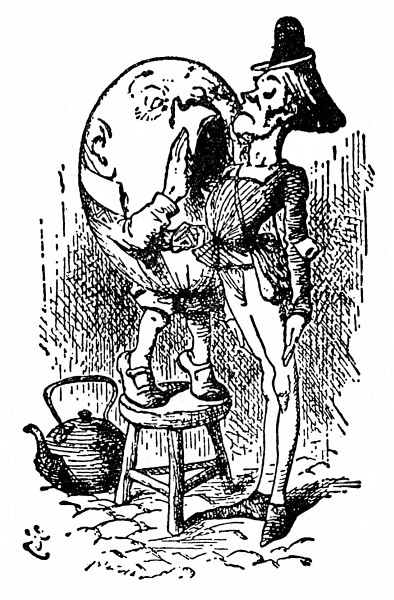

Ale zatím vejce rostlo a rostlo do lidské podoby. Ze vzdálenosti několika metrů na něm Alenka rozeznala oči a nos a ústa; přistoupila až k němu a tu nade vši pochybnost zjistila, že je to sám Valihrach. „Nikdo jiný to být nemůže!“ řekla si. „Vím to jistě, jako by to měl na tváři napsáno!“

  

Napsat se to dalo na tu ohromnou tvář třeba stokrát. Valihrach seděl po turecku se zkříženýma nohama až nahoře na zídce – zídka byla uzounká, Alence nešlo do hlavy, jak tam vůbec udrží rovnováhu –, a protože hleděl upřeně jinam a jí si nevšímal, připadal jí jako vycpaný panák.

„Vypadá úplně jako vejce!“ pronesla nahlas a zůstala před ním stát s napřaženýma rukama, že ho zachytí, kdyby spadl.

Valihrach dlouho mlčel, potom aniž Alence uštědřil jediný pohled, řekl: „Dát si říkat vejce, to by člověk namouduši z kůže vyletěl!“

„Já jsem prosím řekla, že jenom tak vypadáte,“ mírnila to Alenka. „Vždyť jsou taky hezká vejce,“ obracela to v lichotku.

Valihrach jí zase jediný pohled neuštědřil a řekl: „Někteří lidé nemají za krejcar rozumu.“

Alenka se nezmohla na odpověď; jakápak rozmluva, pomyslila si, když on s ní nemluví – to, co naposled řekl, zřejmě platí stromu –, a tak stála a potichu si odříkávala:

> _Valihrach ze zídky spad jako knedlík.  
> Královská kavalerie,  
> královská infanterie  
> ho zvedaly a zvedaly, a přece neuzvedly._

„Poslední řádek je na tu básničku moc dlouhý,“ pronesla polohlasem; že ji Valihrach uslyší, na to docela zapomněla.

„Co tady stojíš a brebentíš si pro sebe,“ teprve nyní Valihrach na ni pohlédl, „radši mi pověz, jak se jmenuješ a co děláš.“

„Jmenuju se Alenka, ale –“

„Takové hloupé jméno!“ utrhl se na ni Valihrach. „Co vlastně znamená.“

„Copak musí jméno něco znamenat?“ zeptala se nejistě Alenka.

„Toť se ví, že musí,“ zachechtal se Valihrach. „Moje znamená, jakou mám postavu – tu mám tuze pěknou. Ty máš jméno, že bys mohla mít postavu všelijakou.“

„Proč tam sedíte tak sám?“ Alenka se s ním nechtěla hádat.

„Protože tu se mnou nikdo není!“ zvolal Valihrach. „Ty sis myslila, že na to nekápnu? Dej mi jinou hádanku.“

„Co myslíte, nebylo by to na zemi jistější?“ Alenka to řekla z upřímné starosti o to podivné stvoření, a ne jako hádanku. „Ta zídka je uzounká.“

„Ty máš úžasně snadné hádanky!“ zavrčel Valihrach. „To jistě ne! Ale kdybych nakrásně spadl – což se nestane – i kdybych spadl –“ Tu našpulil rty a zatvářil se velkopansky, až Alenka málem vyprskla smíchy. „Kdybych opravdu spadl,“ hovořil Valihrach, „_Král mi slíbil_ – jen si bledni, jak chceš! Že tohle řeknu, to sis nemyslila, viď. _Král mi na to dal své královské slovo__,_ že – že –“

„Že vám pošle svou kavalerii a infanterii,“ vyhrkla unáhleně Alenka.

„To přestává všechno!“ rozlítil se Valihrach. „To jsi tajně poslouchala za dveřmi – za stromy – v komíně – jinak bys to nevěděla!“

„Ba ne, neposlouchala!“ bránila se klidně Alenka. „Stojí to v knize.“

„V knize takových věcí je,“ řekl Valihrach už klidněji. „A tomu se potom říká Anglické dějiny. Dobře se na mě podívej! Já jsem mluvil s Králem, opravdu mluvil. Takového člověka hned tak neuhlídáš; a abys viděla, že jsem nezpychl, můžeš mi podat ruku!“ Zasmál se od ucha k uchu, nahnul se dopředu (div přitom ze zídky nespadl) a napřáhl ruku k Alence. Stiskla mu ji a starostlivě ho pozorovala. Jestli se usměje ještě víc, koutky úst se mu spojí, pomyslila si, a bůhví co bude s jeho hlavou! Snad mu upadne!

„Ano, že mi pošle svou kavalerii a infanterii,“ hovořil Valihrach. „A ty mě rázem zase zvednou! Ale už o tom mluvíme moc dlouho. Vraťme se k tomu, co jsi říkala předposledně.“

„Bohužel si už na to nepamatuju,“ namítla zdvořile Alenka.

„Tak začneme něco zbrusu nového,“ řekl Valihrach, „teď je na mně řada, já rozhoduju, o čem bude řeč –“ (Mluví o tom jako o nějaké hře, pomyslila si Alenka.) „Tak zní otázka. Kolik jsi říkala, že ti je?“

Alenka si to honem spočítala a řekla: „Sedm let šest měsíců.“

„Chyba!“ zajásal Valihrach. „Nic takového jsi neřekla.“

„Myslil jste přece, kolik je mi let.“

„Kdybych to myslil, tak to řeknu,“ odsekl Valihrach.

Alenka neměla chuť do hádky, a tak nic neříkala.

„Sedm let a šest měsíců!“ dumal Valihrach. „Nepříjemný věk. Měla ses mě zeptat, byl bych ti poradil: ‚V sedmi přestaň‘ – teď už je pozdě!“

„Jestli mám stárnout, na to se nikoho neptám**,“** rozzlobila se Alenka.

„To jsi tak pyšná –?“ zeptal se Valihrach.

Alenka se nad tím ještě víc rozzlobila: „Vždyť jeden stárne, ať chce, nebo nechce.“

„Jeden snad ano,“ řekl Valihrach, „ale ne dva. Mít na to někoho, mohla jsi v sedmi letech přestat.“

„Vy ale máte krásný opasek,“ prohodila Alenka. (O stárnutí se toho napovídalo až dost, řekla si, a mají-li střídavě rozhodovat, o čem bude řeč, je teď řada na ní.) „Totiž nákrčník,“ rozmyslila se, „tak jsem to chtěla říct – a ne opasek, – promiňte prosím!“ dodala rozpačitě; Valihrach se totiž tvářil uraženě a už litovala, že o tom začala. „Kdybych tak věděla,“ řekla si, „kde má krk a kde má pas.“

Valihrach se zřejmě velmi rozhněval, protože dlouhou chvíli nemluvil, až konečně zavrčel hlubokým hlasem:

„To by člověk – namouduši – z kůže vyletěl, když někdo nerozezná nákrčník od opasku!“

„Já vím, je to ode mě hloupost,“ pronesla Alenka tak zkroušeně, že si tím Valihracha zase udobřila.

„Vždyť je to, děvenko, nákrčník, a krásný nákrčník, jak říkáš. Je to dárek od Bílého Krále a Královny. Tak vidíš.“

„Jistě?“ Alenka se zaradovala, že přece jen kápla správně na to, o čem má být řeč.

„Dali mi ho,“ hovořil unyle Valihrach, přehodil nohu přes nohu a obemkl si je rukama, „byl to dárek k nenarozeninám.“

„Jak? Odpusťte prosím?“ řekla zkoprněle Alenka.

„Vždyť já se nezlobím,“ řekl Valihrach.

„Já se jenom ptám, co je to dárek k nenarozeninám?“

„No přece dárek, který dostaneš, když nemáš narozeniny.“

Alenka se zamyslela a řekla: „Když já mám radši dárek k narozeninám.“

„Nevíš, co mluvíš,“ řekl Valihrach. „Kolikpak je dní do roka?“

„Tři sta pětašedesát,“ řekla Alenka.

„A kolikeré máš narozeniny?“

„Jedny.“

„Kolik zbude, když odečteš jednu od tří set pětašedesáti?“

„Samozřejmě tři sta čtyřiašedesát.“

Valihrach se zatvářil nejistě. „Radši bych to měl vypočítáno na papíře,“ řekl.

S bezděčným úsměvem vytáhla Alenka notýsek a odečtla mu to:

365

 – 1

364

Valihrach vzal notýsek do ruky a bedlivě si ho prohlížel. „Jak se zdá, odečteno je to správně –,“ spustil.

„Vždyť ho držíte vzhůru nohama,“ skočila mu do řeči Alenka.

„Bodejť!“ přisvědčil rozjařeně Valihrach, když mu Alenka notes otočila. „Taky mi to bylo divné. Jak se zdá, jářku, odečteno je to správně – abych to teď přepočítával, na to nemám kdy – a vyplývá z toho, že je celkem tři sta čtyřiašedesát dní, kdy můžeš dostat dárek k nenarozeninám –“

„Jistěže,“ řekla Alenka.

„A jenom jeden, kdy dostaneš dárek k narozeninám. To jsem ti udělal radost!“

„Radost? – Nevím, jak to myslíte,“ řekla Alenka.

Valihrach se pohrdlivě ušklíbl. „Jak to taky máš vědět, když ti to nepovím. Myslím to tak, ‚Že jsem na tebe vyzrál!‘“

„Ale udělat někomu radost neznamená na někoho vyzrát,“ namítla Alenka.

„Když já řeknu nějaké slovo,“ řekl povýšeně Valihrach, „pak znamená to, co se mi zrovna zlíbí, aby znamenalo – a nic jiného.“

„Jde o to,“ řekla Alenka, „jestli dokážete, aby slovo mělo různý význam.“

„Jde o to, kdo z obou rozhoduje,“ řekl Valihrach, „to je to celé.“

Alenka nad tím nadobro zkoprněla, a tak spustil Valihrach za chvíli znovu: „Bývá s nimi těžké pořízení – nejpyšnější jsou slovesa – přídavná jména si spíš dají říct, slovesa, ta ne – ale já si s nimi přece jen umím poradit! Neproniknutelnost. Tak je to!“

„Povězte mi prosím, co to znamená,“ řekla Alenka.

„Tak mluví rozumné děvče,“ udobřil se Valihrach. „Slovem ‚neproniknutelnost‘ myslím jen to, že jsme toho o té věci už dost napovídali a že by ses sama měla ozvat, co chceš dál dělat, do smrti tu snad zůstat nechceš?“

„Na jedno slovo to znamená hodně,“ dumala Alenka.

„Když mi nějaké slovo udělá takový kus práce,“ řekl Valihrach, „vždycky mu připlatím.“

„No ne!“ samým úžasem se Alenka na víc nezmohla.

„To bys koukala,“ Valihrach vrtěl vážně hlavou na obě strany, „když si ke mně v sobotu navečer přijdou pro výplatu.“ (Zeptat se ho, čím je vyplácí, to si Alenka netroufala; a já vám to tedy taky nepovím.)

„Jak se zdá, vy umíte každé slovo důmyslně vyložit,“ řekla Alenka. „Povězte mi prosím, co znamená Báseň _Tlachapoud_.“

„Nejprve si ji poslechnu,“ řekl Valihrach. „Já ti vyložím všechny básně, jaké kdy byly vymyšleny, a ještě spoustu těch, co vůbec ještě vymyšleny nejsou.“

Vypadalo to slibně, a tak Alenka odříkávala první sloku:

> _Je svačvečer. Lysperní jezeleni  
> se vírně vrtáčejí v mokřavě.  
> Vetchaří hadroušci jsou roztruchleni  
> a selvy syští tesknoskuhravě._

„Pro začátek to stačí,“ skočil jí do řeči Valihrach. „Je tam spousta těžkých slov. _Svačvečer_ je ta doba po svačině, kdy se peče něco dobrého na večer.“

„To by šlo,“ řekla Alenka, „a co je _lysperný_?“

„Inu, _lysperný_ je lysý a čiperný. To máš jako kufřík – do jednoho slova napěchuješ dvojí význam.“

„Už rozumím,“ řekla zamyšleně Alenka. „A co _jezeleni_?“

„Inu, _jezeleni_ jsou trochu jezevci – a trochu jeleni.“

„Ti asi vypadají divně.“

„To vypadají,“ řekl Valihrach, „hnízdí pod slunečními hodinami – a živí se sýrem.“

„A co je _vírně _vrtáčet__?“

„To je tolik jako vířit, vrtat a otáčet se jako nebozez.“

„A _mokřava_ je snad trávník kolem slunečních hodin, ne?“ Alenku překvapilo, že na to sama kápla.

„A mokrý je asi proto –“

„– že tam na stráni hodně prší,“ dořekla za něho Alenka.

„Správně. A _vetcharý_ je vetchý a charý (už zase takový slovní kufřík). A _hadroušek_ je vyzáblý opelichaný papoušek s nadrchaným peřím – jako nějaký živý hadr.“

„A co _selva_?“ řekla Alenka. „Nerada vás tolik obtěžuju.“

„Inu, _selva_ je trochu sele, trochu želva, aspoň se mi tak zdá.“

„A co _syštět_?“

„To je tolik jako syčet a svištět a uprostřed toho ještě zvuk, jako když kýchneš; však to možná – tamhle v lese – sama uslyšíš – a až to uslyšíš, budeš toho mít dost. Kdopak ti tu těžkou báseň odříkával?“

„Četla jsem ji v knize,“ řekla Alenka. „Jiné básničky, mnohem snazší, mi odříkával – myslím Tydlitek.“

„Básničky,“ Valihrach se jednou rukou široce rozpřáhl, „těch já ti odříkám, když na to přijde –“

„Proč by na to mělo přijít?“ vyhrkla Alenka, jen aby ho odradila.

Valihrach si toho nevšímal a mluvil dále: „Odříkám ti kousek napsaný pro tvou zábavu.“

„To bych si měla poslechnout,“ řekla si Alenka, usedla a posmutněle řekla: „Děkuju.“

> _Sněží, v zimě na poli vám  
> pro potěchu píseň zpívám –_

jenže já ji nezpívám,“ vysvětloval.

  

„Že nezpíváte, to vidím,“ řekla Alenka.

„Jestli vidíš, zdali zpívám, nebo nezpívám, to máš tedy hodně bystrý zrak,“ okřikl ji Valihrach. Alenka zmlkla.

> _Ta vám bude vysvětlena,  
> až se jaro zazelená._

„Děkuju,“ řekla Alenka.

> _Když pak léto vydá kvítek,  
> snad tu píseň pochopíte._

> _V podzimu pak smutném, šerém  
> zapište tu píseň perem._

„Jestli si ji zapamatuji, tak si ji zapíšu,“ řekla Alenka.

„Nech si ty poznámky pro sebe,“ řekl Valihrach, „jsou pošetilé a jenom mě pletou.“

> _Rybičkám jsem poslal vzkaz:  
> „Jenom o to žádám vás.“_

> _Rybky nemeškaly, hned  
> doručily odpověď._

> _Byl to od nich pěkný koš:  
> „Nemůžeme, jelikož –“_

„Já tomu bohužel nerozumím,“ řekla Alenka.

„Dále je to srozumitelnější,“ prohodil Valihrach.

> _Vzkázal jsem jim přísněji,  
> vzdorovat že nesmějí._

> _„Vida toho zlostníka!“  
> Prý se jich to netýká._

> _Dvakrát jsem jim povídal,  
> ony trucovaly dál._

> _Kotlík jsem si přichystal,  
> vydrhnutý dočista,_

> _naplnil ho u studny.  
> Zlostí jsem byl nerudný._

> _Posel přišel: „Zklamu tě,  
> rybičky šly na kutě._

> _Dej si na ně zajít chuť.“  
> Já mu na to: „Tak je vzbuď._

> _Vzbuď je,“ křičím z plných plic.  
> „Ať už je to, dej si říct.“_

Poslední verš Valihrach přímo ječel a Alenka se až otřásla hrůzou „Tím poslem bych nechtěla být ani zanic.“

> _Posel poslechnout se brání:  
> nepohne jím moje lání._

> _Okřikl mě: „Ty tvé ryby  
> šel bych vzbudit, jenom kdyby –“_

> _Vývrtku jsem ze šuplíku  
> vytáh, že je vzbudím v mžiku._

> _Na petlici dveře byly.  
> Třesu jimi ze vší síly,_

> _kopu do nich, pěstí mlátím,  
> mačkám kliku, ona zatím –_

Dlouho bylo ticho. „To je celé?“ zeptala se Alenka nesměle.

„Ano, celé,“ řekl Valihrach. „Buď zdráva.“

Toho se Alenka nenadála; ale když jí to tak okatě naznačuje, řekla si, že se nesluší, aby tam ještě zůstala. Vstala, napřáhla k němu ruku a přívětivě mu řekla: „Buďte zdráv a na shledanou!“

„Jestli se někdy shledáme, tak tě nepoznám,“ zavrčel Valihrach a podal jí prst. „Jsi stejná jako druzí.“

„Po tváři se pozná člověk,“ řekla zamyšleně Alenka.

„Právě to mi u tebe vadí,“ řekl Valihrach. „Tvář máš jako každý jiný – dvě oči tady –“ (palcem jí naznačil ve vzduchu, kde je má,) „uprostřed nos a dole ústa. Pořád totéž. Kdybys tak měla obě oči na jedné straně nosu – nebo ústa nahoře – hned by to bylo lepší.“

„Hezky by to nevypadalo,“ namítla Alenka. Valihrach přimhouřil oči a řekl: „Zkus to, a uvidíš.“

Alenka chvilku čekala, jestli ještě promluví, ale on oči neotvíral a jí si nevšímal, řekla mu tedy podruhé „Buďte zdráv!“, a když se nedočkala odpovědi, klidně odešla. Po cestě si říkala: „Nesympatičtějšího –“ (pro útěchu si to dlouhé slovo ještě opakovala) „nesympatičtějšího člověka jsem jaktěživa –“ Ale už to nedopověděla, protože v tom okamžiku se v lese rozlehl ohlušující hřmot.

