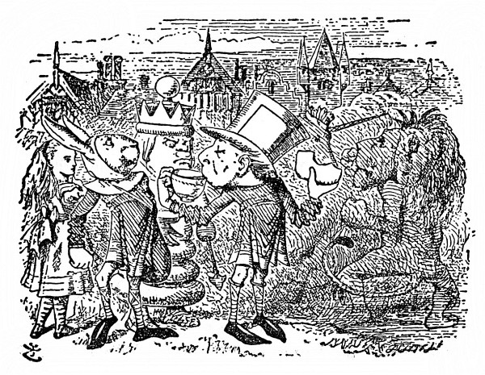
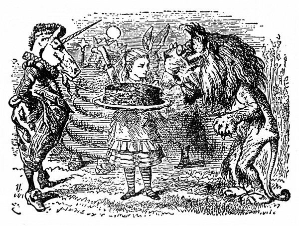
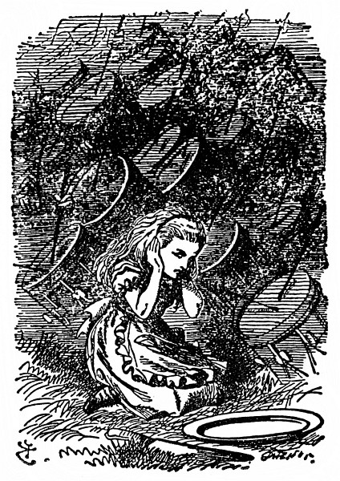

<section>

Vzápětí se rozběhli po lese vojáci, nejprve běhali po dvou, po třech, potom po desíti, po dvacíti a nakonec v houfech, až jich bylo všude plno. Aby ji snad neporazili, schovala se Alenka za strom a odtamtud je pozorovala.

</section>

<section>

Takové vrávoravé vojáky jakživa neviděla. Pořád o něco zakopávali, a jak jeden upadl, upadli přes něho další, až nakonec byla země kupami vojáků přímo poseta.

Za nimi táhla jízda. Po čtyřech jim to šlo líp než pěšákům, ale i koně klopýtali, a sotva nějaký kůň klopýtl, jezdec se jako z udělání hned skutálel na zem. Zmatku přibývalo, Alenka si oddechla, když se dostala na volné prostranství. Seděl tam na zemi Bílý Král a něco si zapisoval do notýsku.

Jakmile uviděl Alenku, hned si liboval: „Vyslal jsem je všechny. Děvenko, nepotkala jsi v lese nějaké vojáky?“

„Ano, potkala,“ řekla Alenka, „bylo jich na tisíce.“

„Přesně vzato dva tisíce dvě stě sedm.“ Král nahlédl do notesu. „Jezdce jsem nemohl poslat všechny, dva patří do hry. A kurýry jsem taky nevyslal, oba šli do města. Koukni na silnici, jestli tam někoho není vidět.“

„Nikoho,“ řekla Alenka.

„Takové oči bych taky chtěl mít,“ durdil se Král. „Vidět Nikoho!

A na takovou dálku! Za takového světla já mám co dělat, abych vůbec někoho uviděl!“

Alenka to přeslechla; jednou rukou si zacláněla oči, upřeně zírala na silnici, až najednou zvolala: „Už někoho vidím! Ale nějak se loudá – a v jakém divném postoji to sem kráčí!“ (Kurýr totiž ustavičně přeskakoval z nohy na nohu, úhořovitě se kroutil vpřed, mohutné dlaně rozpřažené jako ploutve.)

</section>

<section>

</section>

<section>

„Ba ne, neloudá se,“ řekl Král. „Je to anglosaský kurýr – a má anglosaský postoj. Ten zaujímá, jenom když je šťastný. Jmenuje se Švejda.“ (Vyslovil to tak, že se to rýmovalo na „strejda“.)

Alenka spustila, ani nevěděla jak: „Já mám ráda chlapce s Š, protože je Šťastný. Nemám ráda chlapce s Š, protože je Špatný. K jídlu mívá – mívá – mívá Šunku, taky Škubánky. Jmenuje se Švejda a žije ve –“

„Žije ve Švédsku,“ vpadl jí zčistajasna do hry Král, zatímco ona ještě vymýšlela nějakou zemi na Š. „Druhý kurýr se jmenuje Zejda. Já totiž potřebuju dva – na cestu semo a tamo. Jeden chodí semo a druhý tamo.“

„Poníženě prosím, jak?“ řekla Alenka.

„Poníženě prosit se nesluší,“ řekl Král.

„To já jenom, že jsem nerozuměla,“ vysvětlovala Alenka. „Nač chodí jeden semo a druhý tamo?“

„Vždyť ti to říkám,“ utrhl se na ni Král. „Na to semotamování potřebuju dva – jednoho semo, druhého tamo.“

Tu došel kurýr až k nim. Byl tak udýchaný, že slovo ze sebe nevypravil, jenom mával rukama a na chudáka Krále se příšerně šklebil.

„Tahle slečinka tě má ráda s Š,“ Král mu představil Alenku, aby se tak zbavil jeho dotěrnosti – ale nic naplat – kurýr byl v tom anglosaském postoji stále roztodivnější a zuřivě koulel očima.

„Ty mě děsíš!“ řekl Král. „Ještě omdlím. Podej mi šunkovou housku!“

Alenka mohla na nich oči nechat. Z pytle pověšeného na krku vytáhl kurýr housku, podal ji Králi a ten ji zhltl.

„Ještě jednu housku!“ řekl Král.

Kurýr koukl do pytle a řekl: „Už jsou tam jenom Škubánky.“

„Tak tedy Škubánky,“ hlesl Král.

Alenku nemálo potěšilo, jak po nich okřívá. S chutí je žvýkal a najednou prohodil: „Není nad Škubánky.“

„Ještě lepší by snad bylo pokropit vás studenou vodou,“ nadhodila Alenka, „nebo vám dát čichnout čpavé soli.“

„Já jsem neřekl: _nic lepšího_,“ odbyl ji Král, „řekl jsem: _nic nad to_.“ To Alenka popřít nemohla.

„Kohopak jsi na silnici potkal?“ Král natáhl ruku ke kurýrovi, aby mu přidal Škubánků.

„Nikoho,“ řekl Kurýr.

„Vida,“ řekl Král, „tady slečinka ho taky potkala. To se tedy loudá ještě víc než ty.“

„Dělám, co mohu,“ zakabonil se kurýr. „Kdopak chodí rychleji než já? Nikdo!“

„To zas nechodí,“ řekl Král, „jinak by tu byl první. Už sis vydechl, tak nám pověz, co se děje ve městě.“

„Já to pošeptám,“ kurýr přiložil dlaně k ústům jako trubku a naklonil se ke Královu uchu. Alenku to mrzelo, chtěla se taky něco dovědět. Ale kurýr nezašeptal; zařval z plných plic: „Už se zas perou!“

„Tomu říkáš šeptat!“ zaúpěl chudák Král, skokem vstal a celý se otřásl. „Jestli mi to ještě uděláš, rozsekám tě na maděru! Zalehlo mi to v hlavě jako zemětřesení.“

Spíš zemětřeseníčko! pomyslila si Alenka. „Kdo se zas pere?“ osmělila se zeptat.

„Kdo jiný než Lev a Jednorožec,“ řekl Král.

„To se rvou o korunu?“

„Zajisté,“ přisvědčil Král, „a nejlepší na tom je, že ta koruna je moje! Běžme se na ně podívat.“ Hned vyrazili a Alenka si v tom běhu odříkávala slova staré písně:

> _O korunu se Jednorožec se Lvem porvali.  
> Lev přes město ho prohnal, shon byl nemalý.  
> Chléb bílý, černý, koláče jim podali,  
> až za město je potom vybubnovali._

„A jestlipak – ten co vyhraje – dostane tu – korunu?“ vyrážela ze sebe Alenka, uřícená tím během.

„Ale kdepak!“ řekl Král. „Co tě napadá!“

Alenka zase kus běžela a potom zahekala: „Buďte tak – hodný – zastavte – minoutku – ať trochu – vydechnu.“

</section>

<section>

</section>

<section>

„Hodný jsem dost,“ řekl Král, „ale ne dost silný. Minoutka uteče jako nic. To bys spíš Pentlochňapa zastavila.“

Alenka popadala dech, mluvit nemohla, a tak uháněli dál, až zahlédli nějaký zástup a uprostřed něho bojovali Lev s Jednorožcem. Byli zahaleni oblakem prachu a zprvu je Alenka ani nemohla od sebe rozeznat, ale podle rohu brzy poznala Jednorožce.

Stoupli si vedle druhého kurýra, Zejdy; ten se díval na boj, v jedné ruce držel šálek čaje, v druhé namazaný krajíc.

„Právě ho propustili z vězení, a než ho zavřeli, neměl kdy posvačit,“ pošeptal Alence Švejda. „Tam jim dávají jenom ústřicové škeble – bodejť by neměl hlad a žízeň. Jak se máš, chlapče?“ řekl Zejdovi a něžně ho vzal kolem krku.

Zejda se ohlédl, pokynul hlavou a dál jedl namazaný krajíc.

„Bylo ti, chlapče, ve vězení blaze?“ řekl Švejda.

Znovu se Zejda ohlédl, po líci mu tentokrát skanuly slzy, ale slovo neřekl.

„Tak mluv!“ křikl nedůtklivě Švejda. Ale Zejda jenom žmoulal chleba a upíjel čaje.

„Tak mluv!“ křikl Král. „Jakpak se činí?“

Zejda s nadlidským úsilím spolkl pořádný žvanec chleba. „Činí se jedna radost,“ řekl přiškrceným hlasem, „oba už byli asi sedmaosmdesátkrát na zemi.“

„To budou brzo roznášet bílý a černý chleba, ne?“ špitla Alenka.

„Hned to bude,“ řekl Zejda, „už ho kousek ujídám.“

V boji nastala přestávka, Lev a Jednorožec se celí schvácení posadili a Král zvolal: „Deset minut na občerstvení!“ Švejda a Zejda nelenili a roznášeli mísy s bílým a černým chlebem. Alenka si také vzala kousek na ochutnání, ale byl náramně suchý.

</section>

<section>

</section>

<section>

„Dnes už myslím bojovat nebudou,“ řekl Král Zejdovi. „Jdi a poruč, ať zavíří bubny.“ Zejda odhopkal jako luční kobylka.

Chvíli za ním Alenka mlčky hleděla. Najednou se zaradovala a honem ukazovala prstem: „Hele! Hele! Přes pole běží Bílá Královna. Vylítla tamhle z lesa – Ty Královny ale umějí utíkat!“

„Nejspíš je jí v patách nepřítel,“ řekl Král a ani se po ní neohlédl.  
„V lese je jich plno.“

„To jí nepoběžíte na pomoc?“ Alenka se divila, že zůstává tak klidný.

„A nač? A nač?“ řekl Král. „Ona běží úžasně rychle. To bys spíš Petrochňapa dohonila! Ale když si přeješ, tak si ji poznamenám – Je taková miloučká,“ říkal si potichu pro sebe, jak rozevíral notes. „Píše se ‚miloučká‘ s měkkým i, nebo s tvrdým y?“

V tu chvíli se k nim přištrachal Jednorožec s rukama v kapsách. Jak šel kolem Krále, mrkl po něm a řekl: „To jsem mu dal!“

„Jakžtakž,“ ozval se nejistě Král. „Rohem probodávat jsi ho neměl.“

„Nic se mu nestalo,“ odbyl ho Jednorožec; už odcházel, a tu zavadil zrakem o Alenku. Hned se po ní otočil a chvíli na ni s hlubokým odporem hleděl. „Copak – je – tohle?“ řekl posléze.

„Je to holčička!“ Zejda hned Alenku horlivě představoval, stoupl si před ni a v anglosaském postoji napřáhl k ní obě ruce. „Dnes jsme ji našli. Je v životní velikosti a v nadveliké životnosti.“

„Já jsem si vždycky představoval, že to jsou bájné obludy!“ řekl Jednorožec. „Je živá?“

„Umí mluvit,“ řekl smrtelně vážně Zejda.

Jednorožec se na Alenku unyle zadíval a řekl: „Mluv, holčičko.“

Alenka bezděky našpulila ústa do úsměvu, když odpovídala: „A já jsem si zas vždycky představovala, že bájné obludy jsou Jednorožci. Živého Jednorožce jsem doposud neviděla.“

„Tak a teď jsme se navzájem spatřili,“ řekl Jednorožec. „Když ty uvěříš ve mne, já uvěřím v tebe. Platí?“

„Ano, jak si přejete,“ řekla Alenka.

„Hej, starouši, dej mi koláč!“ otočil se Jednorožec po Králi. „O černý chleba nestojím.“

„S radostí – s radostí!“ zabručel Král a kývl na Švejdu. „Otevři pytel!“ pošeptal mu. „Honem! Ten ne – v tom jsou Škubánky!“ Švejda vytáhl z pytle velikánský koláč; dal ho podržet Alence a zatím vytahoval ještě mísu a nůž na krájení. Kde se v tom pytli vzaly, to Alenka neuhodla. Vypadalo to jako nějaké čáry máry.

Při tom čarování přistoupil k nim Lev; byl utrmácený a ospalý a oči se mu klížily. Lenivě zamžoural po Alence a řekl hlubokým hlasem, jako když vyzvánějí hrana: „Co je to?“

„Copak to asi je?“ Jednorožci to nedalo a křikl: „Že to neuhodneš. Já jsem to taky neuhodl.“

Lev se omrzele podíval po Alence a „jsi živočich – rostlina – nebo nerost?“ řekl a při každém slově zívl.

Než mu Alenka odpověděla, vykřikl Jednorožec: „Je to bájná obluda!“

</section>

<section>

</section>

<section>

„Tak podej koláč, Obludo,“ řekl Lev a ulehl s bradou opřenou o pracky. „A vy se posaďte,“ řekl Králi a Jednorožci, „koláč ať mi rozdělíte spravedlivě!“

Sedět mezi dvěma takovými šelmami bylo Králi zřejmě nemilé, ale jinam si sednout nemohl.

„Teď by se nám to bojovalo o korunu,“ Jednorožec se po ní šibalsky koukl; Král se klepal, div ji z hlavy nestřásl.

„Tu bych vyhrál jako nic,“ řekl Lev.

„Jen jestli,“ řekl Jednorožec.

</section>

<section>

</section>

<section>

„Vždyť jsem tě, ty strašpytle, prohnal přes celé město!“ řekl. „To je pěkný kus cesty. Šli jste po starém mostě, nebo přes rynek? Nejlepší vyhlídka je ze starého mostu.“

„Copak já vím,“ zavrčel Lev a znovu ulehl. „Pro samý prach jsem nic neviděl. To krájení koláče trvá Obludě nějak moc dlouho!“

Alenka usedla na břehu potůčku, velikou mísu si položila na klín a pilně krájela nožem. „Z kůže bych nad tím vyletěla!“ odpovídala Lvovi (že jí říkají Obluda, na to si už zvykla). „Rozkrojila jsem několik kousků, ale vždycky se zas spojí.“

„A ty nevíš, jak se to za zrcadlem dělá s koláči?“ prohodil Jednorožec. „Nejprve koláč podej a teprve potom ho rozkrájej.“

Byl to čirý nesmysl, ale Alenka poslušně vstala, podávala mísu dokola a koláč se sám od sebe rozpadl na tři díly. Když se pak s prázdnou mísou vrátila na své místo, Lev jí řekl: „A teď ho rozkrájej.“

Alenka s nožem v ruce usedla a rozmýšlela, jak začít. „Jářku, to je nespravedlivost!“ křikl Jednorožec. „Obluda dala Lvovi dvakrát víc než mně.“

„Ale sama si nic nenechala,“ řekl Lev. „Máš ráda koláč, Obludo?“

Než mu stačila Alenka odpovědět, zavířily bubny.

Marně pátrala, odkud se ten hřmot ozývá; ze všech stran jí zaléhal do uší, div z toho neohluchla. Hned byla na nohou a v tom leknutí přeskočila potůček; ještě zahlédla, jak Lev a Jednorožec, vzteklí nad tím vyrušením při hostině, vstávají,

potom padla na kolena a zacpala si uši, aby ten strašlivý rámus neslyšela.

</section>

<section>

„Jestli tímhle je nevybubnují až za město,“ řekla si, „tak už ničím.“

</section>
