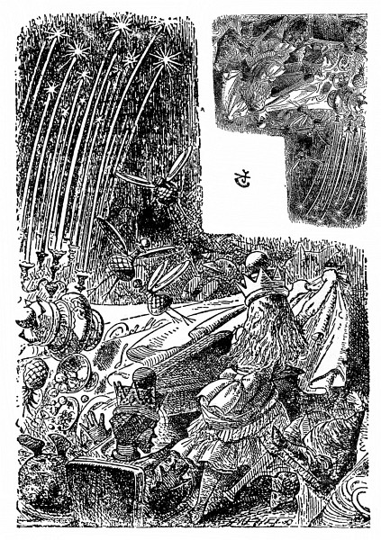

<section>

„To je báječné!“ řekla Alenka. „Ani jsem se nenadála, že budu tak brzo Královnou – a řeknu vám, Vaše Veličenstvo,“ dodala přísným hlasem (vždycky se totiž ráda peskovala), „to nejde, takhle se povalovat v trávě! Královny musí zachovávat důstojnost!“

</section>

<section>

Vstala a procházela se – zprvu trochu strnule, aby jí snad koruna nespadla, ale utěšovala se tím, že ji nikdo nevidí; znovu usedla a řekla si: „Jestli jsem doopravdy Královna, však já se do toho časem vpravím.“ Všechno, co se s ní dělo, bylo podivné, a tak ji ani nepřekvapilo, že vedle sebe má po jedné straně Černou a po druhé Bílou Královnu. Měla chuť zeptat se jich, kde se tu berou, ale nezdálo se jí to dost zdvořilé.

Ale snad se nic nestane, když se zeptá, je-li už po hře. „Povězte mi prosím –,“ pohlédla nesměle na Černou Královnu.

„Mluv, až na tebe někdo promluví!“ přerušila ji zhurta Královna. Alenka se ráda přela a hned spustila: „Kdyby se tím pravidlem řídil každý a mluvil jen tehdy, když na něho někdo promluví, a ten druhý zas čekal na něho, až začne, to by jakživ nikdo nic neřekl, a tak –“

„K smíchu!“ obořila se na ni Královna. „Copak, děvenko, nechápeš –,“ tu se zamračila, na chvíli se zamyslila a zničehonic zavedla řeč jinam. „Jak to myslíš, ‚Jestli jsi doopravdy Královna‘? Jakým právem si tak říkáš? Královnou se staneš, až složíš zkoušku. A čím dřív se do ní dáme, tím líp.“

„Řekla jsem jenom jestli!“ bránila se zkroušeně Alenka.

Královny se na sebe podívaly a Černá Královna pohoršeně pronesla: „Ona prý řekla jenom ‚jestli‘ –“

„Jenže ona toho napovídala mnohem víc!“ zakvílela Bílá Královna a zalomila rukama. „Mnohem a mnohem víc!“

„A taky že jsi řekla,“ pustila se Černá Královna do Alenky. „Mluv vždycky pravdu – rozmysli se, než promluvíš – a potom si to zapiš.“

„Co jsem řekla, nemělo ten smysl –,“ bránila se Alenka, ale Černá Královna jí skočila do řeči.

„To mi právě vadí! Smysl to mít mělo! Bez smyslu není děvče k ničemu. I vtip má mít smysl – a děvče je doufám něco víc než vtip. Nepopřeš to ani oběma rukama, i kdybys chtěla.“

„Já rukama nic nepopírám,“ namítla Alenka.

„Však to taky nikdo netvrdí,“ řekla Bílá Královna, „že mermomocí chce něco popřít – jenže neví co!“

„Je protivná a zlostná,“ prohodila Černá Královna; potom nastalo trapné ticho. Přerušila je Černá Královna; řekla Bílé Královně: „Zvu vás odpoledne na Alenčin dýchánek.“

Bílá Královna se pousmála a řekla: „A já zase zvu vás.“

„Že mám mít dýchánek, to jsem nevěděla,“ řekla Alenka. „Když už tedy dýchánek bude, snad bych na něj měla zvát hosty sama?“

„Tu možnost jsme ti poskytly,“ prohodila Černá Královna, „ale jak se zdá, v učení slušným způsobům jsi zatím moc nepokročila.“

</section>

<section>

</section>

<section>

„Slušným způsobům se ve škole neučí,“ řekla Alenka, „tam se učí počtům a podobným věcem.“

„Umíš Sčítání?“ otázala se Bílá Královna. „Kolik je jedna a jedna a jedna a jedna a jedna a jedna a jedna a jedna a jedna a jedna?“

„Nevím,“ řekla Alenka. „Nestačím počítat.“

„Sčítání neumí,“ vpadla do toho Černá Královna. „Jestlipak umíš Odčítání? Odečti devět od osmi.“

„Devět od osmi? To nejde,“ řekla pohotově Alenka, „ale –“

„Odčítání neumí,“ řekla Bílá Královna. „A co Dělení. Rozděl bochník nožem – jaký je výsledek?“

„Já myslím,“ spustila Alenka, ale Černá Královna to dopověděla za ni. „Toť se ví, že chleba s máslem. Zkus ještě jeden příklad na Odčítání. Pes má kost. Tu kost mu vezmi. Co zbude?“

Alenka přemýšlela. „Když vezmu kost, ta samozřejmě nezbude – a nezbude ani pes; ten se rozběhne za mnou a pokouše mě – ze mě tedy taky moc nezbude!“

„To myslíš, že nezbude vůbec nic?“ řekla Černá Královna.

„Snad je to tak.“

„Už zase chyba,“ řekla Černá Královna. „Zbude psova trpělivost.“

„Jak to –?“

„Tak se podívej!“ křikla Černá Královna. „Pes ztratí trpělivost, ne?“

„Možná,“ odpověděla opatrně Alenka.

„Když tedy pes odejde, zbude jeho trpělivost,“ zvolala vítězoslavně Královna.

Alenka jí na to co nejvážněji odpověděla: „Třeba půjde pes jinam a trpělivost jinam.“ Ale bezděky si řekla: „Co to mluvíme za hlouposti.“

„Počítat neumí ani trošku,“ řekly důrazně naráz obě Královny.

„A vy umíte?“ pustila se Alenka do Bílé Královny, protože takové kárání neměla ráda.

Královna popadla dech a zavřela oči. „Sčítání umím,“ řekla, „když mi na to dopřeješ čas – ale Odčítání, to vůbec ne.“

„Abecedu jistě umíš, ne?“ řekla Černá Královna.

„Toť se ví, že umím,“ řekla Alenka.

„Já ji umím taky,“ pošeptala jí Bílá Královna. „Budeme si ji, panenko, spolu odříkávat. A ještě ti prozradím tajemství – už umím číst slova o jednom písmenu. To je báječné, viď! Jen neztrácej hlavu. Časem se to taky naučíš.“

Tu se do toho zase vložila Černá Královna a řekla: „Umíš odpovědět na praktické otázky? Jak se peče chléb?“

„To vím,“ vyhrkla Alenka. „Nejprve mouku namel –“

„Námel mouku ničí.“

„Ta mouka není ničí,“ vysvětlovala Alenka, „ta je moje, a s trochou péče –“

„Tak se tedy chleba peče?“ řekla Bílá Královna. „A co kvásek? Nějak toho moc vynecháváš.“

„Ovívejte jí hlavu!“ přerušila ji starostlivě Černá Královna. „Ještě nám z toho přemýšlení dostane horečku.“ Daly se do toho obě a ovívaly ji lupením, až je Alenka snažně poprosila, aby toho nechaly, že jí to cuchá vlasy.

„Už okřála,“ řekla Černá Královna.

„Umíš cizí řeči? Jakpak je francouzsky Ententyky?“

„Ententyky stejně v naší řeči nic není,“ zarputila se Alenka.

„A kdo tvrdí, že je?“ řekla Černá Královna.

Alenka si tentokrát věděla rady. „Povězte mi, v jaké řeči je Ententyky, a já vám povím, jak je to francouzsky!“ zvolala vítězoslavně.

Ale Černá Královna jí na to upjatě řekla: „Královny nesmlouvají.“

Kdyby se radši taky na nic neptaly, pomyslila si Alenka.

„Nehádejme se,“ starostlivě zakročila Bílá Královna. „Co je příčinou blesku?“

„Příčinou blesku,“ odpovídala rázně Alenka, „je hrom – ba ne, ba ne!“ honem se opravila, „je to naopak.“

„Pozdě opravovat,“ řekla Černá Královna, „co řekneš, to platí a za to si odpovídáš.“

„Teď si vzpomínám –“ Bílá Královna sklopila oči a rozčileně svírala a rozevírala ruce, „to vám bylo hromobití minulé úterý – totiž jedno z poslední kupy úterků.“

„U nás,“ prohodila Alenka, „máme dny jenom po jednom.“

Černá Královna řekla: „To je mi ubohé zařízení. U nás máme dny a noci aspoň po dvou, po třech a někdy v zimě máme i pět nocí najednou – to kvůli teplu, víš.“

„Copak je teplejší pět nocí než jedna noc?“ špitla Alenka.

„Samozřejmě, pětkrát teplejší.“

„Ale podle toho pravidla taky pětkrát studenější –“

„Jistěže –,“ zvolala Černá Královna. „Pětkrát teplejší a pětkrát studenější – jako jsem já pětkrát bohatší než ty a pětkrát chytřejší.“

Alenka si vzdychla a mávla nad tím rukou: Je to hádanka, na kterou se nedá odpovědět, pomyslila si.

„Valihrach tu bouřku taky viděl,“ broukala si jen tak pro sebe Bílá Královna. „Přišel ke dveřím s vývrtkou v ruce –“

„Co chtěl?“ řekla Černá Královna.

„Chtěl dovnitř,“ dodala Bílá Královna, „že prý hledá hrocha. Jako z udělání, zrovna ten den nic takového v domě nebylo.“

„A jindy bývá?“ žasla Alenka.

„Jenom ve čtvrtek,“ řekla Královna.

„Já vím, proč přišel,“ řekla Alenka. „Chtěl potrestat ryby, protože –“

A tu se do toho znovu vložila Bílá Královna. „Bylo to hromobití, o tom nemáš ani zdání!“ („Ta nemá o ničem zdání,“ řekla Černá Královna.) „Spadl kus střechy a velikánský hrom vlítl dovnitř a v chuchvalcích se koulel po pokoji – a porážel stoly a kdeco – tak jsem se lekla, že jsem zapomněla, jak se jmenuju!“

Alenka si pomyslila: Vzpomínat si při nějaké pohromě, jak se jmenuju, to mě ani nenapadne! Nač taky? Ale nahlas to neřekla, aby se nějak nedotkla nešťastné Královny.

„Vaše Veličenstvo jí to laskavě promine,“ řekla Alence Černá Královna a uchopila Bílou Královnu za ruku a něžně ji pohladila: „Myslí to dobře, ale obyčejně z toho vyjde hloupost.“

Bílá Královna koukla bázlivě po Alence; té se zdálo, že by jí měla povědět něco vlídného, ale na nic nepřišla.

„Vychování žádné nemá,“ řekla Černá Královna, „ale je úžasný dobrák! Pohlaď ji po hlavě a uvidíš, jakou bude mít radost!“ Alenka k tomu neměla dost odvahy.

„Trochu vlídnosti a natočit jí vlasy na papírky – hned je v sedmém nebi.“

Bílá Královna hluboce vzdychla a hlavu opřela o Alenčino rameno. „Chce se mi spát!“ zakvílela.

„Chudinka je unavená!“ řekla Černá Královna. „Přihlaď jí vlasy – půjč jí noční čepec – a zazpívej jí konejšivou ukolébavku.“

Alenka jí podle příkazu přihlazovala vlasy a řekla: „Nemám s sebou noční čepec a žádnou konejšivou ukolébavku neznám.“

„Co naplat, tak jí zazpívám sama,“ řekla Černá Královna a spustila:

> _Spinkej sladce v Alenčině klíně,  
> krasavice, půjdem po hostině –  
> Alenka a obě Královny –  
> zatančit si na ples čarovný._

</section>

<section>

</section>

<section>

Potom dodala: „Slova už znáš, teď ji celou zazpívej mně, na mě jdou taky dřímoty,“ a opřela hlavu o druhé Alenčino rameno. A v mžiku spaly obě Královny, jako když je do vody hodí, a chrápaly na celé kolo.

„Co si počnu,“ Alenka se rozpačitě rozhlížela; nejprve jedna kulatá hlava a pak druhá jí sklouzly z ramene a těžce jí spočinuly na klíně. „To se snad ještě nikomu nestalo, aby se staral o dvě spící Královny najednou!“ Aspoň v dějinách Anglie – ani to nešlo, protože tu byla vždycky jenom jedna Královna. „Vzbuďte se, vy tího tíhoucí!“ vadila se s nimi; ale ony místo odpovědi chrápaly dál.

Chrápání stále silnější a silnější přecházelo v nápěv, až nakonec bylo rozumět i slovům; Alenka poslouchala s takovým zaujetím, že obě hlavy vůbec nepohřešila, když jí najednou zmizely z klína.

Stála před klenutým vchodem, nad nímž byl velkými písmeny nápis **královna alenka** a po obou stranách vchodu zvonek. Na jednom stálo „Pro hosty“ a na druhém „Pro služebnictvo“.

„Počkám, až ta píseň dozní,“ řekla si Alenka, „a potom zazvoním – zazvoním – ale na který zvonek?“ Hloubala nad těmi nápisy: „Nejsem ani host, ani služebná. Měl by tu být zvonek ‚Pro Královnu‘ –“

A tu se dveře pootevřely, nějaké stvoření s dlouhým zobákem vystrčilo hlavu a řeklo: „Vstup až za čtrnáct dní!“ a zase dveře přibouchlo.

Alenka dlouho tloukla a zvonila, ale marně; starý Žabák, uvelebený opodál pod stromem, nakonec vstal a belhal se k ní. Měl na sobě světle žluté šaty a na nohou nehorázné boty.

„Co se děje?“ zašeptal sípavě Žabák.

Alenka se otočila, měla chuť někoho vyplísnit. „Kterýpak sluha obsluhuje tyto dveře?“ osopila se na něho.

„Které dveře?“ řekl Žabák.

Alenka div nedupla zlostí nad tím, jak to ze sebe souká. „No přece tyhle dveře!“

Žabák si tupými kukadly měřil chvíli dveře. Potom přistoupil až k nim, přejel po nich palcem, jako by zkoušel, jestli nepouštějí barvu; potom pohlédl na Alenku.

</section>

<section>

</section>

<section>

„Obsluhuje dveře?“ řekl. „A čím je má obsloužit?“ Tak sípal, že mu Alenka sotva rozuměla.

„Jak to myslíš?“ řekla.

„Snad mluvím srozumitelně, ne?“ odsekl jí Žabák. „Copak jste hluchá? Čím je má obsloužit?“

„Ničím!“ utrhla se na něho Alenka. „Já jsem na ně klepala.“

„To jste neměla – to jste neměla –,“ zabručel Žabák. „To nemají rády,“ přistoupil ke dveřím a velikánskou nohou do nich kopl. „Nevšímejte si jich,“ zahekal a belhal se zpátky ke stromu, „a ony si vás taky nevšimnou.“

Vtom se dveře rozlétly a někdo pronikavým hlasem prozpěvoval:

> _Kolem se Alenka rozhlédla pátravě:  
> „Žezlo mám v dlani a korunu na hlavě,  
> poddaným zazrcadlovým až pokynu,  
> každý nechť pospíchá na slavnou hostinu.“_

Stovky hlasů pak spustily refrén:

> _Po okraj dolejte šumivé koflíky,  
> na stole rozhoďte otruby s knoflíky,  
> myši šup do čaje a kočky do kávy –  
> každý nechť Královnu Alenku třikrát po třiceti pozdraví._

Potom se ozvalo hlomozné provolávání slávy a Alenka si řekla: „Třikrát po třiceti je devadesát. Jestlipak to někdo počítá?“ Rozhostilo se ticho a někdo zas pronikavým hlasem zpíval další sloku:

> _Všichni vy zazrcadloví mí poddaní,  
> přistupte ke mně blíž, nestrpím meškání,  
> za vzácnou výsadu vzdejte hold děkovný.  
> Vítá vás Alenka, s ní obě Královny._

A zase se ozval refrén:

> _Sirup a inkoust v číších nechť nechybí  
> neb nápoj jinačí podobně přelibý,  
> šup vlnu do vína do moštu píseček skřípavý –  
> každý nechť Královnu Alenku devětkrát po devadesáti pozdraví._

„Devětkrát po devadesáti!“ opakovala zoufale Alenka. „To nikdo nedokáže! Půjdu rovnou dovnitř –“ Vešla, a jen se tam objevila, nastalo hrobové ticho.

Alenka kráčela síní a rozčileným pohledem přelétla prostřenou tabuli; zahlédla tam asi padesát hostů všeho druhu. Byla tam zvířata, ptáci, ba i květiny. To jsem ráda, že přišli bez říkání, pomyslila si. Sama bych nevěděla, koho sluší pozvat!

V čele stolu stála tři křesla; ve dvou seděly Černá a Bílá Královna, prostřední bylo prázdné. Alenka do něho usedla. To ticho ji tísnilo, toužila po tom, aby někdo promluvil.

Konečně se ozvala Černá Královna: „O polévku a rybu jsi přišla,“ řekla. „Přineste pečeni!“ A číšníci položili před Alenku skopovou kýtu. Alenka na ni hleděla starostlivě, ještě nikdy pečeni nekrájela.

</section>

<section>

</section>

<section>

„Jsi nějaká nesmělá, dovol, abych ti představila Skopovou Kýtu,“ řekla Černá Královna. „Tohle je Alenka – tohle je Kýta. Tohle je Kýta – tohle je Alenka.“ Skopová Kýta na míse povstala a poklonila se Alence; Alenka jí poklonu oplatila a nevěděla, má-li se bát, nebo se smát.

„Chtěly byste plátek?“ podívala se z jedné Královny na druhou a už se chápala nože a vidličky.

„Vůbec ne,“ ozvala se rázně Černá Královna. „Řezat někoho, kdo ti byl představen, to se nesluší. Odneste pečeni!“ Číšníci ji odnesli a přinesli velký Koláč.

„Nepředstavujte mě prosím Koláči,“ vyhrkla Alenka, „nebo se vůbec nenajíme. Přejete si kousek?“

Ale Černá Královna se nasupila a zavrčela: „Tohle je Koláč – tohle je Alenka. Tohle je Alenka – tohle je Koláč!“ a číšníci ho odnesli tak rychle, že mu Alenka ani nemohla oplatit poklonu.

Ale proč by měla poroučet jen Černá Královna? Na zkoušku tedy Alenka křikla: „Číšníku! Přineste zpátky ten Koláč!“ A jako kouzlem byl Koláč zase tady. Byl tak ohromný, že se ho trochu ostýchala jako předtím Kýty, ale přece jen ten ostych přemohla, ukrojila dílek a podala ho Černé Královně.

„To je ale drzost!“ řekl Koláč. „Copak byste tomu říkala, vy osobo, kdybych tak já z vás kousek ukrojil,“ promluvil mastným lojovým hlasem. A Alenka se nezmohla na jediné slovo, jenom seděla a koukala a lapala dech.

„Řekni něco,“ nutila ji Černá Královna. „Nechat pořád mluvit Koláč je k smíchu!“

„Já jsem se dnes naposlouchala tolika básniček,“ Alenka se zarazila, protože sotva otevřela ústa, nastalo hrobové ticho a všichni na ni upřeli oči, „a divná věc – v každé básničce bylo něco o rybách. Nevíte, proč tady mají tak rádi ryby?“

Zeptala se na to Černé Královny a ta jí odpověděla neslaně nemastně. „Co se týče ryb,“ pronesla pomalu a slavnostně a naklonila se až k Alenčinu uchu, „Její Bílé Veličenstvo umí pěknou hádanku – složenou ve verších – a ta je celá o rybách. Má ti ji odříkat?“

„Je to od Vašeho Černého Veličenstva velmi milé, že na to upozorňuje,“ zavrkala Bílá Královna holubičím hlasem Alence do druhého ucha. „To by bylo něco! Smím?“

„Prosím,“ řekla zdvořile Alenka.

Bílá Královna se polichoceně zasmála, pohladila Alenku po tváři a potom spustila:

> _Rybu v síti,  
> tu vám každé dítě chytí.  
> Bez udice, bez saku,  
> stojí jen pár šestáků._

> _Na pekáči  
> udělat ji chvilka stačí.  
> Do zlatova smaží se  
> a už leží na míse._

> _Potom spolu  
> s hosty zasedne se k stolu.  
> Ach, ta vůně líbezná!  
> Labužník ji dobře zná,_

> _už se těší…  
> Host a ryba. Co je těžší:  
> rybu z kostí vykostit,  
> nebo hosty vyhostit?_

„Chvilku přemýšlej a potom hádej,“ řekla Černá Královna. „Zatím ti připijeme na zdraví – Na zdraví Královny Alenky!“ zavřískla z plných plic a hosté rázem připili a dělali to prapodivně. Někteří si posadili sklenici na hlavu jako kratiknot a pili to, co jim kanulo po tváři – jiní zas převrátili džbány a pili víno, jak stékalo ze stolu – a tři (ti vypadali jako klokani) vlezli do mísy se skopovou pečení a chlemtali omáčku „jako prasata u koryta,“ řekla si Alenka.

„Měla bys jim poděkovat pěkným proslovem,“ zamračila se Černá Královna na Alenku.

„Musíme ti být oporou,“ zašeptala Bílá Královna, jakmile Alenka poslušně, ač trochu ustrašeně vstala.

„Mockrát vám děkuju,“ odpověděla šeptem, „to není třeba.“

„Takhle to nejde!“ zasáhla rázně Černá Královna. A tak se Alenka způsobně podrobila.

(„Tak se na mě tlačily,“ řekla později sestře, když jí vyprávěla o té hostině, „jako by mě chtěly zmáčknout na placku!“)

A opravdu měla co dělat, aby tam při tom proslovu vydržela. Obě Královny se na ni z obou stran tak tlačily, že ji vyzdvihly do vzduchu: „Zvedám se, abych vám poděkovala,“ spustila Alenka a opravdu se při těch slovech o několik palců zvedla; ale zachytila se hrany stolu a šťastně se zas přitáhla k zemi:

„Dej si pozor!“ zavřískla Bílá Královna a oběma rukama popadla Alenku za vlasy. „Něco se semele!“

A (jak to pak Alenka líčila) už se to mlelo. Svíce vyrostly až do stropu – vypadaly jako rákosí sršící oheň. Láhve zas popadly talíře, hbitě si je přidělaly jako křídla, z vidliček si udělaly nohy a poletovaly sem tam, jako nějací ptáci, stačila si ještě Alenka v tom strašném zmatku pomyslit.

Vtom zaslechla vedle sebe chraplavý smích, ohlédla se po Bílé Královně, co se jí stalo; ale místo Královny seděla v křesle Skopová Kýta. „Tady jsem,“ ozvalo se z polévkové mísy a Alenka se obrátila a přes okraj polévkové mísy ještě zahlédla Královnin široce rozšklebený dobrácký obličej, než zmizela v polévce.

Času nebylo nazbyt. Někteří hosté leželi v mísách a polévková naběračka kráčela po stole k Alenčinu křeslu a zlostněji kynula, ať uhne z cesty.

</section>

<section>

</section>

<section>

„Už to nevydržím!“ vykřikla Alenka, skočila a oběma rukama popadla ubrus – prudce trhla, a talíře, mísy, hosté i svíce, všechno se to s řinkotem sesypalo na zem.

„A ty,“ obořila se na Černou Královnu, která to všechno podle ní měla na svědomí – ale Královna už vedle ní nebyla – najednou se scvrkla na malou panenku a honila se dokolečka po stole za svou vlající šálou.

Jindy by snad Alenka užasla, ale tentokrát samým rozčilením už nežasla nad ničím. „Já s tebou,“ popadla tu osůbku, zrovna když přeskakovala láhev, která se snesla na stůl, „zatřesu, až z tebe bude kotě!“

</section>
