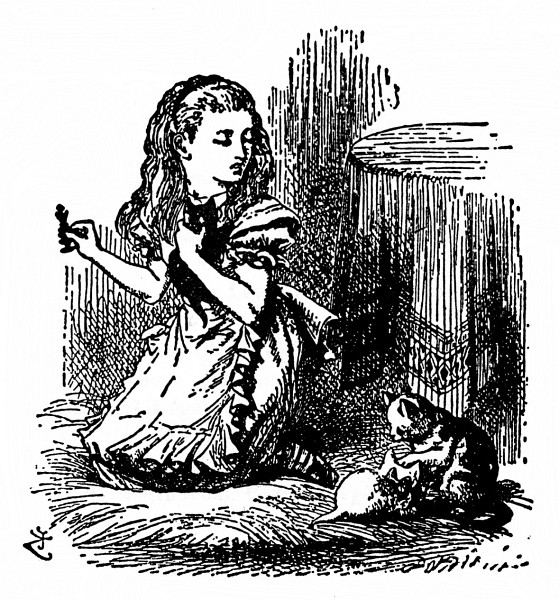

„Vaše Černé Veličenstvo by nemělo tak vrnět,“ řekla Alenka uctivě, a přece jen dost přísně kotěti a protřela si oči. „Probudila jste mě ze sna – ach, to byl krásný sen! A ty jsi byla, Katko, se mnou – v tom světě za zrcadlem. Jestlipak jsi o tom, milánku, věděla?“

  

Koťata mají nepříjemný zvyk (tak se jednou Alenka vyjádřila), že ať jim člověk řekne nevímco, vždycky jen vrní. „Kdyby tak vrněla ‚ano‘ a mňoukala ‚ne‘ nebo tak nějak,“ prohlásila, „aby se s nimi člověk dohovořil! Ale těžké domlouvání s někým, kdo pořád mele stejnou.“

Kotě tentokrát jenom vrnělo. Znamená-li to „ano“, nebo „ne“, to se nedalo uhodnout.

Alenka prohrabala na stole figurky, až našla Černou Královnu, potom poklekla na rohožku a kotě s královnou nastrčila proti sobě, aby se na sebe podívaly. „No tak, Katko!“ zatleskala vítězoslavně. „V tuhletu ses proměnila, jen se přiznej.“

(Později o tom vyprávěla sestře a řekla: „Ale ona se na Královnu nedívala. Kroutila hlavou a dělala, že ji nevidí. Trochu se styděla, tak si myslím, že přece jen Černou Královnou byla.“)

„Seď, milánku, zpříma!“ zasmála se rozpustile Alenka. „A pokloň se, když myslíš na to, co – co zavrníš. Ušetří se tím čas!“ Popadla ji do náručí a vlepila jí hubičku, „to na počest toho, žes byla Černou Královnou.“

„Sněhulko, ty můj mazlíku!“ ohlédla se přes rameno po Bílém Kotěti, které se pořád trpělivě dalo upravovat, „kdypak už bude Micka hotova s Vaším Bílým Veličenstvem? Snad proto jsi byla v mém snu tak rozcuchaná. – Micko! Jestlipak víš, že drbeš Bílou Královnu? Že k ní můžeš být tak neuctivá, to se divím!“

„A v copak se asi proměnila Micka?“ žvatlala si a loktem pohodlně opřená o rohožku a bradu v dlaních pozorovala koťata. „Pověz mi, Micko, neproměnila ty ses ve Valihracha? Tak se mi zdá, že ano – ale jistě to nevím, tak o tom zatím před známými nemluv.

Ostatně být tak, Katko, v mém snu doopravdy se mnou, to by sis užila – těch básniček, co mi odříkávali, a všechny byly o rybách! Zítra ráno se poměješ. K snídani ti budu odříkávat ‚Mrože a tesaře‘. A ty potom můžeš, milánku, dělat, jako že jsou to ústřice!

Teď se, Katko, zamysleme, komu se to vlastně zdálo. Je to, milánku, vážná věc, a neolizuj si pořád tu pracku – copak ti ji Micka dnes ráno neumyla? To máš tak, Katko, buď se to zdálo mně, nebo Černému Královi. On ovšem patřil do mého snu – jenže já zas jsem patřila do jeho! A byl to, Katko, Černý Král? Ty to budeš, milánku, vědět, bylas jeho ženou – Tak Katko, pomoz mi to rozluštit. Ta pracka počká!“ Ale to protivné kotě si olizovalo zas druhou pracku a dělalo, že neslyší.

Komu se to zdálo, co myslíte?
