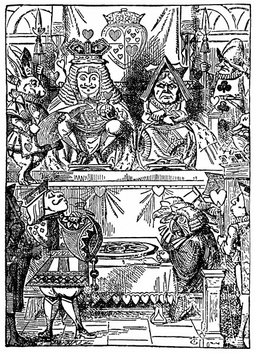
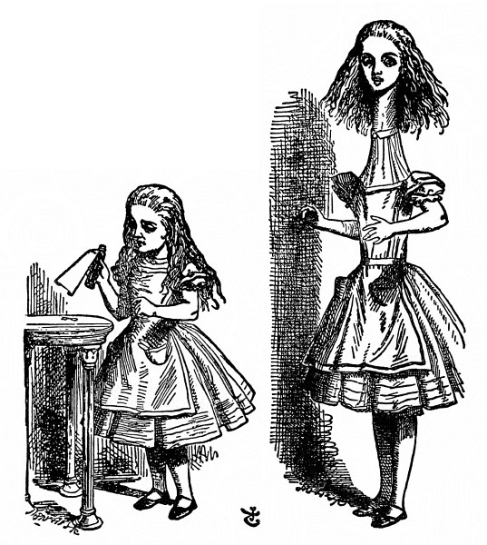

<section>

Alenku už mrzelo sedět na břehu vedle cesty a nic nedělat. Párkrát nakoukla sestře do rozečtené knížky, ale nebyly tam žádné obrázky a nic se tam nepovídalo, a co je do knížky, když v ní nejsou žádné obrázky a nic se tam nepovídá, řekla si Alenka.

</section>

<section>

Rozvažovala tedy u sebe (pokud to vůbec šlo, byla horkem celá ospalá a zmámená), zda bude dost zábavné uvít si věneček z kopretin, aby kvůli tomu vstala a natrhala si je, a tu vedle ní přeběhl Bílý Králík s červenýma očima.

Nebylo na tom nic zvláštního a nijak podivné to Alence nepřipadlo, když Králík prohodil: „Jeje! Jeje! Přijdu pozdě.“ (Když nad tím potom dumala, napadlo jí, že ji to mělo zarazit, jenže v tu chvíli jí to připadlo docela samozřejmé); ale když pak Králík dokonce _vyndal z kapsy u vesty hodinky__,_ podíval se na ně a běžel dál, Alenka vyskočila; blesklo jí hlavou, že jakživ neviděla, aby měl Králík kapsu u vesty, natož aby z ní vyndával hodinky, popadla ji zvědavost a rozběhla se přes pole za ním a šťastně ho dohonila, zrovna když pod keřem hupl do velké králičí díry.

V mžiku se pustila Alenka za ním, a jak se zas dostane ven, na to vůbec nepomyslila.

Králičí díra vedla kus rovně jako tunel a pak najednou se prudce svažovala dolů, tak prudce, že Alenka neměla vůbec kdy se zastavit a padala do hluboké jámy.

Buď byla ta jáma velmi hluboká, nebo padala Alenka tak pomalu, že měla kdy rozhlížet se kolem sebe a přemýšlet, co bude asi dál. Nejprve zkoušela dívat se dolů, kam to vlastně padá, ale nic neviděla, bylo tam tma; ohlížela se tedy po stěnách jámy a všimla si, že je tam plno polic a přihrádek: tu a tam visely na skobách mapy a obrázky. Cestou sebrala z jedné police sklenici; stálo na ní **POMERANČOVÁ ZAVAŘENINA**, ale zklamala se, byla prázdná. Zahodit ji, to se jí nezdálo, aby snad někoho nezabila, a tak ji při tom padání šťastně strčila do jedné poličky.

</section>

<section>

</section>

<section>

„No ne,“ řekla si Alenka. „Po takovémhle pádu skutálet se ze schodů, to už pro mě nic nebude. To mě ale budou doma pokládat za hrdinku! Kdybych třeba ze střechy spadla, ani nemuknu!“ (To už asi ne.)

Stále hloub a hloub a hloub. Což tomu padání nikdy nebude konec? „To bych ráda věděla, kolik mil jsem se propadla?“ řekla nahlas. „Už budu až někde u středu Země. Počkat: bude to asi čtyři tisíce mil hluboko –“ (Alenka se totiž ve škole všelico naučila, nebyla to sice nejvhodnější chvíle, chlubit se, co všechno ví, protože ji nikdo neslyšel, ale neškodí trochu si to zopakovat) „ – ano, tak daleko to asi bude – ale v jaké zeměpisné délce a šířce jsem se to octla?“ (O tom, co je zeměpisná délka a šířka, neměla Alenka ani ponětí, ale když ono to tak báječně zní.)

</section>

<section>

</section>

<section>

A potom zase spustila: „To jsem zvědavá, jestli propadnu skrz celou zeměkouli! To bude legrace, až vylezu u lidí, co chodí po hlavě! U Protichodců, myslím –“ (byla ráda, že ji teď nikdo neslyší, to slovo nějak správně neznělo) „– přece jen se budu muset zeptat, jak se to tam u nich jmenuje. Prosím vás, paní, je tady Nový Zéland nebo Austrálie?“ (při těch slovech se pokoušela uklonit – to je nápad, klanět se, když člověk padá! Jestlipak byste to dokázali?) „Co si ta paní o mně pomyslí, jaká jsem nevzdělaná holka! Ba ne, ptát se nebudu; třeba uvidím nějaký nápis.“

Stále hloub a hloub a hloub. Nic jiného se dělat nedalo, a tak se Alenka zase rozpovídala. „Micce se bude po mně večer jistě stýskat!“ (Micka byla kočka.) „Snad si na ni při svačině vzpomenou s miskou mléka. Micinko, kdybys tu tak byla se mnou! V povětří asi žádné myši nejsou, ale třeba bys chytla netopýra, ten je přece skoro jako myš. Jen jestli jedí kočky rády netopýry?“ Na Alenku šly dřímoty, jako ve snu si opakovala: „Rády kočky netopýry? Rády kočky netopýry?“ A potom zas: „Rádi kočky netopýři?“ Ani na to, ani na ono odpovědět nemohla, a tak bylo celkem jedno, jak to říká. Spánek ji zmáhal a zrovna se jí zdálo, že se vede s Mickou za ruku a vážně se jí ptá: „Pověz mi, Micko, pravdu, taky ráda netopýra?“, a vtom bum bác! dopadla na hromadu suchého listí a dál už nepadala.

Alenka si ani trochu nenatloukla a v mžiku byla zas na nohou; podívala se vzhůru, nad ní bylo tma; před sebou měla zase dlouhou chodbu a po ní pořád ještě utíkal Bílý Králík. Měla nejvyšší čas. Běžela s větrem o závod, a jak zahýbal za roh, zaslechla ještě: „U sta slechů a fousků, to už je pozdě!“ Ještě když zahýbala za roh, byla mu v patách, ale Králíka už vidět nebylo; octla se v dlouhé úzké síni osvětlené řadou lamp visících ze stropu.

Kolem dokola byly dveře, ale všechny zamčené; Alenka prošla síní po jedné straně až na konec a po druhé zas zpátky, u všech dveří brala za kliku a potom kráčela prostředkem celá smutná, jak se odtamtud dostane.

</section>

<section>

</section>

<section>

Najednou se octla před dvounohým stolkem a ten byl celý ze skla; byl na něm jenom zlatý klíček a Alence hned napadlo, jestli není od některých dveří v síni. Ale ouha! Buď byl zámek moc velký, nebo klíček moc malý, žádné dveře se nedaly otevřít. Ale když podruhé obcházela síň, octla se před záclonkou, které si předtím nevšimla, a za ní byla dvířka nějakých patnáct palců vysoká; zkoušela zlatým klíčkem odemknout a sláva, klíček se k zámku hodil!

Alenka dvířka otevřela a před ní byla chodbička o nic širší než krysí díra. Alenka poklekla a tou chodbičkou hleděla do divukrásné zahrady. Zatoužila dostat se z té tmavé síně a procházet se mezi bujně kvetoucími záhonky a chladivými vodotrysky, ale nemohla dvířky prostrčit ani hlavu: „A i kdybych hlavou prošla, co je mi to platné, když neprojdu rameny. Kdybych se tak mohla sklapnout jako dalekohled! Snad by to šlo, jenom vědět, jak na to.“ Ono totiž Alenku potkalo za tu chvíli tolik nevídaného, že už jí skoro všechno připadalo možné.

Čekat u dvířek nebylo nic platné, a tak se Alenka vrátila ke stolku, jestli tam třeba nenajde ještě nějaký klíček, nebo aspoň nějaký návod, jak se sklapnout jako dalekohled. Tentokrát tam našla lahvičku („ta tu předtím určitě nebyla,“ řekla si Alenka) a ta měla na hrdle cedulku s nápisem krásně vytištěným velkými písmeny: **VYPIJ MĚ**.

To se lehko řekne „vypij mě“, ale moudrá Alenka se do toho nepohrne. „Ba ne,“ řekla si, „napřed se podívám, jestli tam není označení _jed_.“ Co se už načetla hezkých povídek o tom, jak děti uhořely, jak je divá zvěř sežrala a mnoho jiných nepříjemností je potkalo jen proto, že nedbaly prostých ponaučení, která jim jejich přátelé vštěpovali; tak např.: že se spálíš, když držíš moc dlouho v ruce žhavý pohrabáč, že ti obyčejně teče krev, když se hodně hluboko řízneš nožem, a také nezapomínala na to, že když si pořádně přihneš z lahvičky označené _jed_, dříve nebo později ti to nebude dělat dobře.

Ale na lahvičce nestálo _jed_; Alenka se tedy odhodlala, že to ochutná. Bylo to moc dobré (chutnalo to jako třešňový koláč, krém, ananas, pečený krocan, karamel a topinky s máslem dohromady) a za chvilku to měla v sobě.

„To je mi divně,“ řekla Alenka. „Nejspíš se už sklápím jako dalekohled.“

</section>

<section>

A opravdu; měřila už jen deset palců na výšku a celá se rozzářila radostí nad tím, že takhle veliká už projde dvířky do té krásné zahrady. Ale napřed chvilku počkala, jestli se snad ještě víc nescvrkne. Trochu trnula. „A co jestli se nakonec rozplynu, jako když svíčka dohoří,“ řekla si Alenka. „Jak asi budu potom vypadat, to bych ráda věděla.“ A vymýšlela si, jak vypadá plamen svíčky, když se sfoukne, co se pamatuje, nic takového jakživ neviděla.

Nic se s ní už nedělo, a tak se za chvíli rozhodla, že půjde rovnou do zahrady; ale chudák Alenka! došla ke dvířkám a zjistila, že si ten zlatý klíček zapomněla; vrátila se pro něj ke stolku, ale už na něj nedosáhla: přes sklo ho jasně viděla, a tak šplhala po jedné noze u stolku, ale moc jí to klouzalo; až ji to šplhání nakonec zmohlo, a tak si, chudinka, sedla a dala se do pláče.

„No tak, pláčem nic nespravíš,“ spustila na sebe zhurta Alenka. „Hned přestaň, to ti radím!“ Obyčejně si radila dobře (ač málokdy uposlechla) a někdy si tak zostra vyhubovala, až jí vhrkly slzy do očí; a jednou, jak si vzpomíná, málem si napohlavkovala za to, že jak hrála sama se sebou kroket, švindlovala; ona totiž ta zvláštní holčička ráda dělala, jako by byla ve dvou osobách. „Ale dělat, že jsem ve dvou osobách, to teď nejde,“ řekla si nešťastná Alenka. „Zbývá mě ani ne na jednu pořádnou osobu!“

</section>

<section>

</section>

<section>

A tu zahlédla pod stolem skleněnou krabičku; otevřela ji a našla v ní koláček a na něm z hrozinek krásný nápis: SNĚZ **MĚ**. „Tak ho sním,“ řekla Alenka, „a jestli po něm povyrostu, dosáhnu na klíček; a jestli se ještě scvrknu, podlezu pod dvířky. Tak se přece jen do zahrady dostanu, ať se stane, co chce!“

Kousek ujedla a starostlivě si říkala: „Nahoru, nebo dolů“; sáhla si na hlavu, zdali jí přibývá, nebo ubývá, a nemálo ji překvapilo, že zůstává stejně velká; toť se ví, to už tak bývá, když se jí koláč, ale Alenka si už tak zvykla na samé nevídané věci, že obyčejnský život jí připadal nudný a hloupý. Pustila se tedy do koláče a hned ho měla v sobě.

</section>