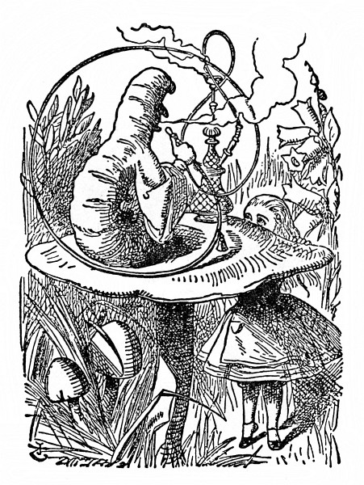

<section>

Ale to k ní zvolna hupkal zpátky Bílý Králík a starostlivě se rozhlížel, jako by byl něco ztratil; mumlal si pro sebe: „Ta vévodkyně! Ta vévodkyně! Ach vy mé běhy! Ach ty můj kožíšku, ach vy mé fousky! Ta mě dá jistě popravit, jakože jsou fretky fretky! Kde jsem je asi pohodil?“ Alenka ihned uhodla, že se shání po vějíři a bílých kozinkových rukavicích, a bez říkání je hledala a hledala, ale nebylo po nich ani vidu – po té koupeli v kaluži jako by se všechno změnilo a velká síň se skleněným stolkem a dvířky nadobro zmizela.

</section>

<section>

Králík si toho Alenčina shánění všiml a hned se na ni osopil: „Prosím vás, Marjánko, co vy tady děláte! Hned běžte domů a přineste mi rukavice a vějíř. Ale honem!“ Alenka se polekala a běžela, kam jí Králík ukázal, ani se nepokusila vyvést ho z omylu. „On myslel, že jsem jeho služka,“ řekla si v běhu. „Ten se podiví, až pozná, kdo jsem. Ale přece jen mu vějíř a rukavice donesu – jestli je ovšem najdu.“ Sotva to dořekla, octla se u pěkného domečku a na dveřích se blyštěla mosazná tabulka s vyrytým jménem „V. Králík“. Bez klepání vešla dovnitř a uháněla po schodech nahoru, celá bez sebe strachy, aby ji pravá Marjánka nepotkala a nevyhodila z domu, ještě než najde vějíř a rukavice.

„To je divné, že obstarávám Králíkovi posílky,“ řekla si Alenka. „S takovou mi brzy něco uloží naše Micka!“ A hned si domýšlela, jak to asi bude: „Slečno Alenko! Pojďte sem a oblečte se na procházku!“ „Hned, hned, Náno! Než se Micka vrátí, musím jí pohlídat myší díru, aby jí neutekla myš.“ „Jenže,“ říkala si dále Alenka „jenže ona by u nás Micka nesměla zůstat, kdyby si takhle poroučela.“

Zatím se už Alenka dostala do úhledné světničky; stál tam u okna stůl a na něm (jak se nadála) ležel vějíř a několik párů bílých kozinkových rukaviček. Popadla vějíř a jedny rukavičky, a jak odcházela ze světnice, najednou zahlédla u zrcadla lahvičku. Cedulka s nápisem **VYPIJ MĚ** na ní sice tentokrát nebyla, ale Alenka ji přece odzátkovala a přiložila k ústům. „Jakmile něco sním nebo vypiju,“ řekla si Alenka, „vždycky to zajímavě dopadne. Zkusím tedy, co tahle lahvička způsobí. Doufám, že po ní zas vyrostu, už toho mám po krk, být taková mrňavá!“

Tak se také stalo, dřív než se nadála. Ještě ani půl lahvičky nedopila, a už narazila hlavou o strop a musila se sehnout, aby si nezlomila vaz.

Honem zas lahvičku postavila a řekla si: „To úplně stačí – doufám, že už víc neporostu – takhle se nedostanu ze dveří – neměla jsem toho tolik vypít!“

Ale pozdě bycha honit! Alenka rostla a rostla, a tak chtíc nechtíc klekla na zem: za chvíli už ani v pokleku nevydržela, zkusila si tedy lehnout a loktem se opřít o dveře a druhou rukou si podložit hlavu. Ale pořád rostla, a tak jí nakonec nezbylo, než vystrčit jednu ruku z okna a jednu nohu strčit do komína a pak si řekla: „Už nemohu nic dělat, ať se stane, co stane. Co mě ještě čeká?“

</section>

<section>

</section>

<section>

Kouzelná lahvička naštěstí už dále neúčinkovala, takže Alenka přestala růst. I tak jí bylo nepříjemně; vypadalo to, že v té světnici zůstane do smrti trčet, kdo by se tedy divil, že byla celá nešťastná.

„Doma mi bylo o moc líp,“ pomyslila si nešťastná Alenka, „tam člověk tolik nerostl a zas se nescvrkal a taky se nedal komandovat od myší a králíků. Snad jsem neměla lézt do té králičí díry a – a přec – a přec – nic naplat, je tenhle život zajímavý! Moc ráda bych věděla, co se to vlastně se mnou stalo! Když jsem čítala pohádky, vždycky jsem si říkala, že to ani není možné, a najednou se to stane zrovna mně! Někdo by měl o mně napsat knihu. Až vyrostu, sama ji napíšu – ale vždyť už jsem vyrostla,“ dodala zarmouceně. „Tady aspoň dále růst nemohu.“

„To mi tedy ani let nebude přibývat?“ napadlo Alence. „Že ze mě nebude stará bába – to mě blaží – ale to tedy znamená – věčně se jen učit! A to by se mi nechtělo!“

„Ty hloupá Alenko,“ odpovídala si. „Jak se chceš tady učit? Stěží se sem sama vejdeš, jakpak by se sem vešly učebnice!“

A tak to šlo dál, Alenka se na to koukala hned z té, hned zas z druhé stránky a dlouho si tak povídala; ale za chvíli se venku někdo ozval a Alenka ztichla a napnula uši.

„Marjánko! Marjánko!“ ozývalo se zvenku. „Hned mi přineste rukavice!“ A pak někdo cupital po schodech. Alenka věděla, že za ní jde Králík, a rozklepala se, až se domek třásl; docela zapomněla, že je proti Králíkovi tisíckrát větší a že se ho už bát nemusí.

Vtom došel Králík ke dveřím a chtěl je otevřít, ale protože se dveře otvíraly dovnitř a Alenka se o ně pevně opírala loktem, nepodařilo se mu to. Alenka slyšela, jak si Králík říká: „Tak to obejdu a vlezu tam oknem.“

A nevlezeš, pomyslila si Alenka, čekala, až zaslechne Králíka přímo pod oknem, potom naráz rozevřela dlaň a nazdařbůh chňapla. Nic nechytla, ale někdo zavřískl a svalil se a zařinčelo sklo; usoudila, že Králík spadl do pařeniště s okurkami nebo něčím takovým.

</section>

<section>

</section>

<section>

Někdo se zlostně rozkřikl – byl to Králík – „Anton! Anton! Kde jsi?“ a pak se ozval hlas, který Alenka dosud neslyšela: „Tade so! Vekopávám erteple, milospane!“

„Tak ty vykopáváš brambory!“ hudroval Králík. „Sem! Pomoz mi odtud!“ (A znovu zařinčelo sklo.)

„A teď mi, Anton, řekni, co to je v okně?“

„No co be to belo, ruka, milospane!“

„Ruka, ty trdlo! Kdopak kdy viděl tak velikánskou ruku? Vždyť je jí plné okno!“

„No bať, milospane, ale ruka je to, abe né!“

„Stejně tam nemá co dělat. Hned ji odstraň!“

Pak bylo dlouho ticho a jenom občas dolehl k Alence šepot, jako: „Deš mně se to, milospane, jaksi nezamlóvá!“ „Dělej, co ti říkám, ty strašpytle!“ a nakonec zas Alenka rozevřela dlaň a nazdařbůh chňapla. Tentokrát zavřískli dva a zase zařinčelo sklo. To je mi nějakých pařenišť s okurkami! pomyslila si Alenka. A co bude teď! Kdyby mě tak chtěli vytáhnout z okna, nic lepšího bych si nepřála! Ale tady zanic nezůstanu!

Chvíli čekala, ale nebylo nic slyšet, až konečně přidrkotal nějaký vozík a potom mluvili jeden přes druhého. Pochytila z toho jenom: „Kde je druhý žebřík? – Měl jsem přinést jen jeden! Vilík nese druhý – Vilíku! Podej ho sem, chlapče! – Opřete je tady na rohu – Ne, napřed je svažte – to zdaleka nestačí – ba jo, stačí, jen se neboj – Hej, Vilíku! Chyť ten provaz – Neproboří se střecha? – Pozor na uvolněnou tašku – Už letí! Pozor na hlavu!“ (něco řachlo) – „Kdo to udělal? – To jistě Vilík – Kdo vleze do komína? – Já ne, jdi tam ty! – Já taky ne! – Ať tam vleze Vilík – Hej, Vilíku! Pán říká, že máš vlézt do komína!“

„Vilík tedy poleze do komína,“ řekla si Alenka. „Ten Vilík všechno za ně odře! Nechtěla bych být v jeho kůži – krb je úzký, ale kopnout se tam přece jen dá!“

Stáhla nohu z komína co nejdále a čekala, až zaslechla, jak se nějaké zvířátko (jaké, to si neuměla představit) kousek nad ní škrábe a šplhá v komíně. „To je Vilík,“ řekla si, prudce kopla a čekala, co se bude dít.

Nejprve křikli sborem: „Vilík letí!“, pak povelel Králík: „Chyťte ho, vy tam u plotu!“ Všichni zmlkli a znovu zahlaholili: „Podržte mu hlavu – Trochu kořalky – Ať se neudáví – Co to bylo, kamaráde? Co se ti stalo? Pověz!“

Konečně někdo slabounce zapištěl (To bude Vilík, pomyslila si Alenka). „Copak já vím – Už ne, děkuju; už je mi líp – jsem ještě celý zkoprnělý – vím jenom, že na mě něco vyrazilo jako čertík z krabičky a už jsem letěl jako rachejtle!“

„Tos taky letěl, kamaráde!“ přizvukovali ostatní.

„Musíme dům podpálit!“ ozval se Králík. A Alenka se rozkřikla: „Jen se opovažte, pošlu na vás Micku!“

</section>

<section>

</section>

<section>

Zavládlo hrobové ticho a Alenka si pomyslila: To jsem zvědavá, co bude teď. Kdyby měli špetku rozumu, sundali by střechu. Po chvilce už zas šukali kolem a Alenka zaslechla Králíka, jak říká: „Jeden trakař prozatím stačí.“ Trakař čeho? přemýšlela Alenka. Ale dlouho na pochybách nezůstala, neboť vzápětí zafičely do okna oblázky a některé ji zasáhly do tváře. „Tohle jim zatrhnu,“ řekla si a houkla na ně: „Nechte toho!“ a znovu zavládlo hrobové ticho.

Alenka si s úžasem všimla, že jakmile oblázky dopadnou na podlahu, hned jsou z nich koláčky, i dostala šťastný nápad. „Když sním jeden koláček, jistě to zapůsobí na mou velikost, a protože větší už být nemohu, budu nejspíš menší.“

Snědla tedy jeden koláček a nemálo se zaradovala nad tím, jak se valem scvrká. Když se zmenšila tak, že prošla dveřmi, vyběhla z domku a venku na ni čekal houf drobných zvířátek a ptáků. Uprostřed stál chudák Vilík Ještěřík a dvě morčata ho podpírala a napájela ho z láhve. Jakmile se tam Alenka objevila, všichni se po ní hnali, ale ona utíkala, co jí nohy stačily, a brzy se octla v hustém lese.

„Nejprve musím,“ řekla si Alenka při tom bloudění lesem, „narůst zas do správné velikosti; a potom se musím dostat do té krásné zahrady. To bude myslím nejlepší.“

Což o to, vymyslila si to skvěle, nic snazšího a jednoduššího; háček byl jen v tom, že neměla potuchy, jak to provést. Toužebně se rozhlížela mezi stromy, a tu nad ní něco prudce zaštěkalo: rázem zvedla hlavu.

Hledělo na ni obrovské štěně s velkýma kulatýma očima a lenivě po ní natahovalo packu. „Drobečku!“ mazlila se s ním Alenka a hvízdala na ně; ale hrozně přitom trnula, že má štěně hlad a přes to všechno mazlení ji třeba sežere.

Bezděky sebrala ze země proutek a strčila ho štěněti. Štěně skočilo rovnýma nohama dolů, zakňučelo radostí a hnalo se po proutku, jako by ho chtělo sežrat; Alenka uskočila za veliký bodlák, aby ji štěně nepošlapalo; sotva vykoukla z druhé strany, štěně se zas rozehnalo za proutkem, až v tom spěchu udělalo kotrmelec; Alence bylo, jako by si hrála s tažným koněm, který ji každou chvilku roznese na kopytech, a tak zase oběhla bodlák. Štěně doráželo vytrvale na proutek, vždycky se kousek rozběhlo a zas kus couvlo a chraplavě přitom štěkalo, až nakonec celé udýchané usedlo opodál, jazyk vyplazený, kukadla přimhouřená.

Alenka si řekla, že toho využije a uteče. Rozběhla se a běžela, až se celá utrmácela a zadýchala a štěkot štěněte k ní zaléhal jen zdálky.

„Stejně to bylo roztomilé štěně!“ Alenka si odpočívala opřena o blatouch a ovívala se blatouším listem. „Měla jsem chuť naučit je nějaké kousky, jenže – jenže jsem na to nebyla dost veliká! Jéje, málem jsem zapomněla, že zas musím vyrůst! Počkejme – jak to zařídit? Musím něco sníst nebo vypít; hlavní je co!“

Co, to bylo jistě hlavní. Alenka se ohlížela po květinách a travinách, ale k jídlu nebo k pití se tu pro její případ nic nehodilo. Poblíž rostla veliká houba, skoro tak veliká jako ona. Prohlédla si ji zespoda a z obou stran a napadlo jí, aby se ještě podívala, co je navrchu.

Vystoupla na špičky a nakoukla přes okraj houby, a tu se střetla s velkýma modrýma očima Houseňáka; seděl na houbě se založenýma rukama, klidně bafal z dlouhé fajfky a ničeho si nevšímal, ani Alenky.

</section>

<section>

</section>
