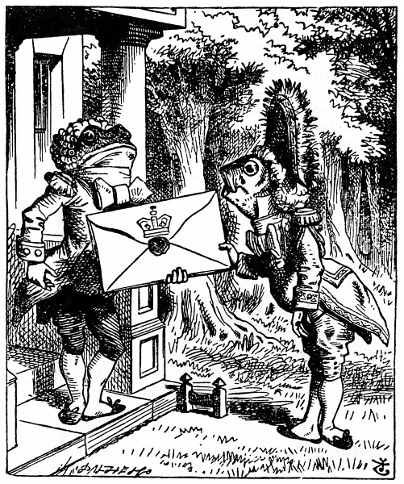
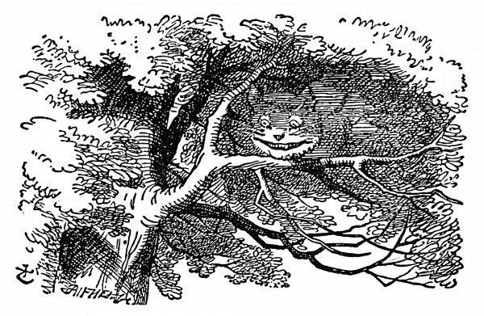

<section>

Alenka chvíli koukala na domek a uvažovala, co má dělat, a tu přiběhl z lesa livrejovaný lokaj – za lokaje ho pokládala, protože měl livrej (jinak podle obličeje by hádala spíše na rybu) – a zabušil kotníky na dveře. Otevřel mu jiný livrejovaný lokaj s kulatou tváří a vykulenýma žabíma očima; jak si Alenka všimla, oba lokajové měli po celé hlavě napudrované kadeře. Byla zvědavá, co to znamená, a vyplížila se z lesa, aby si je poslechla.

</section>

<section>

Rybí lokaj vylovil z podpaždí obrovské psaní, skoro tak velké, jako byl sám, podal je druhému lokaji a pronesl škrobeně: „Pro Vévodkyni. Pozvání od Královny na kroket.“ Žabí lokaj to po něm opakoval stejně škrobeně, jenže v pozměněném pořádku: „Od Královny. Pozvání pro Vévodkyni na kroket.“

Pak se oba hluboko uklonili, až se jim kadeře zapletly.

Alence to přišlo tak k smíchu, že musila utéci zpátky do lesa, aby ji neslyšeli; když pak zase vykoukla, rybí lokaj byl pryč a ten druhý seděl u dveří na zemi a civěl tupě do nebe.

Alenka přistoupila nesměle ke dveřím a zaklepala.

„Klepat je zbytečné,“ řekl lokaj, „a to z dvojí příčiny. Předně protože jsem na stejné straně dveří jako ty, za druhé proto, že uvnitř je takový rámus, že tě nikdo neuslyší.“ A opravdu, uvnitř se rozléhal neslýchaný rámus, v jednom kuse někdo vřískal a kýchal a pak zas něco břinklo, jako když se rozbije na kusy talíř nebo hrnec.

„Prosím vás,“ zeptala se Alenka, „jak se tedy mám dostat dovnitř?“

„Jen tenkrát by mělo smysl klepat,“ vedl svou lokaj a vůbec si Alenky nevšímal, „kdyby byly mezi námi dveře. Kdybys byla například _uvnitř,_ mohla bys zaklepat a já bych tě pustil ven.“ Jak mluvil, civěl pořád do nebe, a to Alence připadalo vyloženě nezdvořilé. „Ale snad za to nemůže,“ řekla si, „když má oči tak vysoko navrch hlavy. Ale mohl by aspoň odpovědět, když se ho ptám. – Jak se dostanu dovnitř?“ opakovala hlasitě.

„Posedím tady do zítřka,“ prohodil lokaj.

Tu se v domku otevřely dveře a velký talíř letěl rovnou lokajovi na hlavu; jen mu odřel nos a roztříštil se vzadu o strom.

</section>

<section>

</section>

<section>

„– nebo taky do pozítřka,“ dořekl lokaj stejným hlasem, jako by se nic nestalo.

„Jak se mám dostat dovnitř?“ řekl lokaj. „Tak zní totiž první otázka.“

Bylo to sice pravda, ale proč jí to povídá? „To je hrozné,“ posteskla si, „jak se ta havěť hádá. Je to k zbláznění!“

Lokaj uznal za vhodné svůj výrok s obměnou opakovat: „Posedím tady třeba celé dny.“

„Ale co já mám dělat?“ řekla Alenka.

„Dělej si, co chceš,“ odpověděl lokaj a začal si pískat.

„Darmo s ním mluvit,“ řekla Alenka rozezleně, „je to ťululum!“ A otevřela dveře a šla dovnitř.

Dveřmi se vcházelo rovnou do velikánské kuchyně, začouzené od jednoho konce až na druhý. Uprostřed seděla na trojnožce Vévodkyně a chovala nemluvně; kuchařka míchala vrchovatý kotel polévky.

„V té polévce je moc pepře!“ pro samé kýchání stěží ze sebe vypravila Alenka.

I ve vzduchu ho bylo až moc. Vévodkyně taky občas kýchla a nemluvně bez přestání střídavě kýchalo a vřískalo. Z celé kuchyně nekýchala jenom kuchařka a velká kočka, která seděla u krbu a šklebila se od ucha k uchu.

„Řekla byste mi,“ pravila Alenka nesměle, nebyla si totiž jista, zda se sluší, aby promluvila první, „proč se vaše kočka tolik šklebí?“

„Je to kočka Šklíba,“ řekla Vévodkyně, „tak proto. Prasátko!“

Tak vztekle to slovo vyrazila, až sebou Alenka trhla; ale vzápětí zjistila, že to patří dítěti, a ne jí, dodala si tedy odvahy a spustila:

„Nevěděla jsem, že jsou nějaké kočky Šklíby. Nevěděla jsem ani, že se kočky vůbec dovedou šklebit.“

„Všecky to dovedou,“ řekla Vévodkyně, „a většinou se také šklebí.“

„Nevím ani o jedné, která se šklebí,“ řekla zdvořile Alenka, celá šťastná, že si může s někým popovídat.

„Ty toho moc nevíš, to je jisté,“ řekla Vévodkyně.

Alence se tón této poznámky moc nelíbil, i umínila si, že radši začne o něčem jiném. Přemítala, o čem by to mělo být, a zatím kuchařka kotel z ohně sundala a vším, nač jen dosáhla, házela po Vévodkyni a po dítěti – nejprve hodila kleště, pohrabáč a lopatku, potom hrnce, talíře a mísy. Vévodkyně si z nich nic nedělala, i když ji uhodily, a dítě už vřískalo tak jako tak, nebylo tedy poznat, zda taky nějakou ránu utržilo.

„Prosím vás, pozor, co to děláte!“ křikla Alenka hrůzou celá bez sebe. „Ach, jeho nosánek!“ to mu proletěl kolem nosu náramně veliký kastrol, div mu ho neurazil.

„Kdyby si každý hleděl svého,“ zaskuhrala Vévodkyně, „svět by se točil mnohem rychleji.“

„Tím by se nic nezískalo,“ řekla Alenka a byla ráda, že se může trochu pochlubit svými vědomostmi. „Jen si představte, kam by se poděly den a noc! Země se točí kolem osy za čtyřiadvacet hodin a za ten časový úsek –“

</section>

<section>

</section>

<section>

„Dobře žes mi to připomněla,“ řekla Vévodkyně, „usekněte jí hlavu!“

Alenka se bázlivě ohlédla po kuchařce, zda se toho chytne; ale ta už zas míchala polévku a vůbec neposlouchala, a tak Alenka znovu spustila: „Za čtyřiadvacet hodin, aspoň myslím… či snad za dvanáct? Když já –“

„Dej mi s tím pokoj,“ řekla Vévodkyně, „počty mi nikdy nešly!“ A znovu hýčkala dítě a zpívala mu jakousi ukolébavku a po každé řádce s ním notně zatřásla:

> _Vyhubuj chlapce,  
> zřež ho, když kýchne  
> zas natruc matce.  
> Bít ho je hřích? Ne!_

Sbor

(do něho vpadla též kuchařka a dítě):

> __Hú! Hú! Hú!__

Při druhé sloce Vévodkyně dítětem prudce pohazovala a škvrně se tak rozvřískalo, že Alenka slovům skoro nerozuměla.

> __Seřežu chlapce,  
> sotvaže kýchne,  
> po malé krapce  
> pepře hned ztichne.__

Sbor:

> _Hú! Hú! Hú!_

„Tumáš, pochovej ho trochu!“ řekla Vévodkyně Alence a hodila jí dítě. „Musím se ustrojit na Královnin kroket,“ a odkvapila. Kuchařka po ní hodila pekáč, ale netrefila ji.

Alenka měla co dělat, aby dítě chytla, bylo to stvoření neforemné, ruce a nohy mu trčely na všecky strany, „jako hvězdice,“ řekla si Alenka. Když je chytla, funělo to ubožátko jako lokomotiva, pořád se smršťovalo a zas natahovalo, a tak je první chvíli stěží udržela.

Konečně na to přišla, jak je má vlastně chovat (svinula je do uzlíčku a popadla za pravé ucho a levou nohu, aby se nemohlo narovnat), a vynesla je na čerstvý vzduch. „Když to dítě neodnesu, za pár dní bude jistě po něm. Nebyla by to vražda, kdybych je tu nechala?“ Poslední slova pronesla nahlas a škvrně jí odpovědělo zachrochtáním (kýchat už přestalo). „Nechrochtej,“ okřikla je Alenka, „tak se přece nemluví.“

</section>

<section>

</section>

<section>

Dítě znovu zachrochtalo a Alenka se mu starostlivě zahleděla do tváře, co to s ním je. Nic naplat, nos mělo ohrnutý nahoru, byl to spíš rypáček než pořádný nos; také oči mělo na dítě příliš maličké; Alence se ten jeho kukuč vůbec nezamlouval. Snad jenom zavzlykalo, pomyslila si Alenka a znovu se koukla, má-li v očích slzy.

Ne, slzy tam nemělo. „Jestli se, milánku, proměníš v prasátko, už s tebou nechci nic mít. Dej si pozor!“ Maličké zas vzlyklo (nebo zachrochtalo, nedalo se to rozeznat) a chvíli bylo ticho.

Alenka právě přemýšlela: Copak si s tímhle stvořením počnu, až přijdu domů? A tu se tak rozchrochtalo, že po něm zděšeně koukla. Nemýlila se: bylo to ve všem všudy prasátko a Alenka si uvědomila, že nést je dál je čirý nesmysl.

Postavila tedy toho tvorečka na zem a velmi se jí ulevilo, když si klidně odběhl do lesa. „Kdyby vyrostl, dítě by z něho bylo hrozně ošklivé, ale jako čuník docela ujde.“ Přemítala o známých dětech, z kterých by byli obstojní čuníci, a právě si říkala: „Kdybych jen věděla, jak je proměnit –,“ a vtom se polekala; pár kroků před ní seděla na stromě kočka Šklíba.

Jak uviděla kočka Alenku, jen se zašklebila. Napohled vypadala dobrácky, ale měla dlouhé drápy a spoustu zubů, a tak k ní byla Alenka raději uctivá.

„Číčo,“ spustila nesměle Alenka, protože si nebyla jista, zda se jí to oslovení zalíbí. Ale kočka se ještě víc rozšklebila.

„Vida, ono se jí to líbí,“ oddychla si Alenka a pokračovala: „Řekla bys mi prosím, kudy se dostanu odtud?“

„Záleží na tom, kam se chceš dostat,“ řekla kočka.

„To je mi jedno kam –,“ řekla Alenka.

„Pak je jedno, kudy půjdeš,“ řekla kočka.

„– jen když se někam dostanu,“ vykládala Alenka.

„To se jistě dostaneš,“ řekla kočka, „jen když půjdeš dost dlouho.“ Alenka měla dojem, že se to nedá popřít, zeptala se tedy na něco jiného. „Jací lidé bydlí tady v okolí?“

</section>

<section>

</section>

<section>

„Tamtím směrem,“ mávla kočka pravou tlapkou, „bydlí Švec. A tamtím směrem,“ a mávla druhou tlapkou, „bydlí Zajíc Březňák. Jdi si ke kterému chceš, oba jsou potrhlí.“

„Ale já nechci mezi potrhlíky,“ bránila se Alenka.

„Málo platné,“ řekla kočka, „tady jsme všichni potrhlí. Já jsem potrhlá, ty jsi taky potrhlá.“

„Jak to víš, že jsem potrhlá?“ zeptala se Alenka.

„To je jisté, jinak bys sem nechodila.“

Alence se zdálo, že to žádný důkaz není; ptala se dál: „A jak víš, že ty jsi potrhlá?“

„Předně,“ spustila kočka, „pes potrhlý není, to uznáš, ne?“

„Snad,“ odpověděla Alenka.

„Tak vidíš,“ pokračovala kočka, „pes vrčí, když má zlost, a vrtí ocáskem, když má radost. No, a já vrčím, když mám radost, a vrtím ocáskem, když mám zlost. Jsem tedy potrhlá.“

„Já tomu říkám předení, a ne vrčení,“ řekla Alenka.

„Říkej si tomu, jak chceš,“ řekla kočka. „Hraješ dnes u Královny kroket?“

„Moc ráda bych, ale ještě jsem nedostala pozvánku,“ odpověděla Alenka.

„Uvidíš mě tam,“ řekla kočka a zmizela.

Alenka se tomu ani moc nedivila, už těm nevídaným věcem přivykla. Koukala na místo, kde byla předtím kočka, a ona se najednou zas objevila.

„Mimochodem, co je s dítětem?“ zeptala se kočka. „Málem jsem se zapomněla zeptat.“

„Proměnilo se v prasátko,“ řekla klidně Alenka, jako by to bylo samozřejmé.

„To jsem si myslela,“ řekla kočka a zas zmizela.

Alenka čekala, jestli se snad ještě neukáže, ale ona se neukázala, a tak Alenka za chvíli vykročila směrem, kde prý bydlí Zajíc Březňák. „Ševců jsem už viděla dost,“ řekla si. „Zajíc Březňák bude mnohem zajímavější, a teď v květnu nebude možná tak potrhle vyvádět jako v březnu.“ Po těch slovech zdvihla hlavu a vida! Kočka zase seděla na stromě.

„Řekla jsi prasátko, nebo poupátko?“ zeptala se kočka.

„Prasátko,“ odpověděla Alenka, „a taky by ses nemusila tak najednou objevovat a zase mizet, točí se mi z toho hlava.“

„No dobrá,“ řekla kočka a tentokrát se ztrácela pomalounku od konečku ocasu až po škleb; ten chvíli ještě potrval, když už ostatek zmizel. Kočku bez šklebu, to už jsem viděla kolikrát, pomyslila si Alenka, ale škleb bez kočky! Něco tak zvláštního jsem jakživ neviděla!

Popošla ještě kousek a zahlédla domek Zajíce Březňáka. Napadlo ji, že to bude on, protože komíny měly podobu slechů a místo došků byla na střeše srst. Byl to velký domek, a teprve když si uždibla houby z levé ruky a povyrostla na dvě stopy, troufla si blíž, a i pak kráčela bázlivě, protože si myslila: Co když přece jen potrhle vyvádí! Měla jsem jít radši za Ševcem!

</section>

<section>

</section>