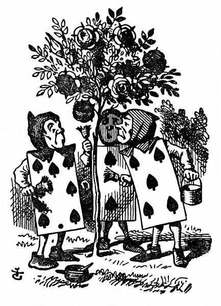

<section>

U vchodu do zahrady stál velký růžový štěp. Rostly na něm bílé růže, ale tři zahradníci je usilovně přetírali na červeno. Alence to bylo velmi divné, šla se tedy na ně podívat zblízka, a když k nim došla, zaslechla: „Dávej pozor, Pětko! Nestříkej po mně pořád barvou.“

</section>

<section>

„Já za to nemohu,“ zavrčel Pětka, „Sedmička mě šťouchl do lokte.“ Sedmička hned zdvihl hlavu a řekl: „Tak, tak, Pětko. Jen to vždycky svaluj na druhé.“

„Ty moc nemluv!“ řekl Pětka. „Zrovna včera jsem slyšel Královnu, jak říkala, že zasloužíš popravit.“

„A zač?“ ozval se ten, co promluvil první.

„Tobě, Dvojko, po tom nic není!“ řekl Sedmička.

„Jakpak ne, je!“ řekl Pětka. „Však já mu to povím za to, že místo cibule přinesl kuchaři tulipánové cibulky.“

Sedmička praštil štětcem a spustil: „No ne, taková nespravedlnost –“ a tu zahlédl Alenku, jak tam stojí a kouká po nich, a hned se zarazil; také ti dva ostatní se ohlédli a všichni se hluboce uklonili.

„Povězte mi prosím,“ řekla Alenka nesměle, „proč ty růže přetíráte?“

Pětka a Sedmička neříkali nic, jenom hleděli na Dvojku. Dvojka tichounce vykládal: „Víte, slečinko, to máte tak, tohle měly být červené růže, a my jsme se spletli a zasadili jsme bílé; kdyby na to Královna přišla, hned by nám srazili hlavu, toť se ví. A tak než přijde, snažíme se, slečinko –“ Pětka zatím starostlivě napínal zrak přes celou zahradu a v tu chvíli vykřikl: „Královna! Královna!“ Všichni tři zahradníci se rázem vrhli tváří k zemi. Ozval se dupot a Alenka se ohlédla; nemohla se už Královny dočkat.

Napřed šlo deset křížových vojáků. Vzhled měli stejný jako ti tři zahradníci, byli podlouhlí a ploší a ruce a nohy měli v rozích. Za nimi šlo deset skvostně károvaných dvořanů. Stejně jako vojáci i oni pochodovali ve dvojstupu. Pak šly královské děti, bylo jich deset; vedly se po dvou za ruce a tak cupitala vesele ta drobotina, celá ozdobená srdci. Za nimi se hrnuli hosté, samí Králové a Královny, Alenka mezi nimi zahlédla také Bílého Králíka. Rozčileně drmolil, všemu se culil a tak prošel vedle Alenky a ani si jí nevšiml. Potom šel Srdcový Spodek a na podušce z nachového sametu nesl královskou korunu. Na samém konci tohoto nádherného průvodu kráčel pak Král s Královnou.

</section>

<section>

</section>

<section>

Alenka se rozmýšlela, nemá-li se taky vrhnout tváří k zemi jako ti tři zahradníci, ale na žádné takové pravidlo při průvodu si nevzpomínala; a nač by ostatně byl průvod, napadlo jí, kdyby kdekdo musil ležet tváří k zemi a nic by z něho neviděl? A tak tam bez hnutí stála a čekala.

Když došel průvod k Alence, všichni zůstali stát a koukali na ni a Královna se rozkřikla: „Kdo je to?“ To se osopila na Srdcového Spodka, ale ten se jen poklonil a usmál.

„Ty trulante!“ Královna trhla zlostně hlavou; potom spustila na Alenku: „Jakpak ti říkají, děvče?“

Alenka jí zdvořile odpověděla: „Vaše Veličenstvo, říkají mi Alenka.“ Ale v duchu si řekla: Vždyť jsou to vlastně jenom karty. Co bych se jich bála.

„A co tamhleti?“ Královna ukázala na tři zahradníky, natažené u růžového štěpu. Oni totiž leželi na tváři, a protože měli na hřbetě stejný vzorek jako ostatní karty, nevěděla, jsou-li to zahradníci, dvořané, nebo snad tři její děti.

„Jak já to mám vědět!“ Alenka sama užasla, že si tak troufá. „Mně po tom nic není.“

Královna zlostí až zbrunátněla, chvíli si Alenku měřila jako divoká šelma a nakonec zavřískla: „Hlavu jí srazit! Hlavu –“

„Povídali,“ odsekla Alenka silným hlasem a Královna ztichla.

Král položil Královně ruku na rameno a nesměle se ozval: „Pamatuj, má zlatá, vždyť je to pouhé děvče.“

Královna se mu vztekle vytrhla a kázala Spodkovi: „Převrať je!“ Spodek je jednou nohou opatrně převrátil.

„Vstát!“ rozkřikla se na ně zhurta Královna.

Zahradníci se rázem postavili na nohy a klaněli se Králi, Královně, královskému potomstvu a kdekomu.

„Přestaňte!“ zavřískla Královna. „Točí se mi z vás hlava.“ Potom se ohlédla po růžovém štěpu a vyzvídala: „Copak jste to tady tropili?“

„Vaše Veličenstvo,“ promluvil poníženě Dvojka a poklekl na jedno koleno, „my jsme se snažili –“

</section>

<section>

</section>

<section>

Královna si už zatím prohlédla růže a přerušila ho: „No bodejť! Hlavu jim srazit!“ Průvod se hnul kupředu, zůstali tam jen tři vojáci – měli popravit zahradníky, jenže ti se uchýlili pod Alenčinu ochranu.

„Oni vás nesmějí popravit!“ řekla Alenka a strčila je do velikánského květináče, který stál poblíž. Vojáci tam chvíli okouněli a slídili po nich a potom si klidně odpochodovali za ostatními.

„Už mají hlavy dole?“ křičela Královna.

„Vaše Veličenstvo, už mají hlavy pryč,“ zahulákali v odpověď vojáci.

„Dobře!“ křikla Královna. „Kdo hraje kroket?“

Vojáci ani nemukali a dívali se na Alenku, protože se Královna zřejmě ptala jí.

„Já,“ křikla Alenka.

„Tak pojď!“ zařvala na ni Královna; Alenka se přidala k průvodu a trnula, co bude dál.

„To je – to je dnes hezky,“ ozval se někdo nesměle vedle ní. Kráčela vedle Bílého Králíka a ten po ní úzkostlivě pokukoval.

„Moc hezky,“ řekla Alenka, „a kdepak je Vévodkyně?“

„Pst! Pst!“ vyhrkl tichounce Králík. Při řeči se starostlivě ohlédl, potom si stoupl na špičky, až dosáhl ústy k jejímu uchu, a zašeptal: „Má být popravena.“

„Její škoda,“ řekla Alenka.

„Říkáš, že je jí škoda?“ zeptal se Králík.

„Vůbec jí není škoda,“ odpověděla Alenka. „Řekla jsem, že to je její škoda, že má být popravena. A za co?“

„Dala pohlavek Královně –,“ spustil Králík. Alenka vyprskla smíchy. „Pst!“ zašeptal zděšeně Králík. „Ještě tě zaslechne Královna. Ona se totiž trochu opozdila a Královna jí řekla –“

„Na místa!“ zahřímala Královna a lidi se rozběhli na všechny strany, až do sebe vráželi; ale za chvilku se srovnali a začalo se hrát. Alenka si říkala, že tak prapodivné kroketové hřiště jakživa neviděla. Všude samý hrbol, samá rýha. Místo koulí živí ježci, místo palic živí plameňáci a branky tvořili vojáci, předklonění tak, že se rukama i nohama opírali o zem.

Zpočátku bylo pro Alenku nejtěžší poradit si s plameňákem. Jakžtakž si vmáčkla jeho trup pod paždí, takže nohy mu visely dolů, ale sotva mu pěkně narovnala krk a chystala se odpálit jeho hlavou ježka, plameňák se pokaždé stočil dozadu a tak vyjeveně se na ni zadíval, že se dala do smíchu; a když mu zase hlavu sklonila a zkoušela to poznovu, tuze ji zlobilo, že se jí zatím ježek rozvinul a šine se pryč. A ke všemu ještě ať chtěla prohnat ježka, kam chtěla, obyčejně jí to překazil hrbol nebo rýha, a protože také předklonění vojáci se stále narovnávali a odcházeli jinam na hřiště, Alenka záhy usoudila, že takhle hrát je náramně těžké.

Hráči hráli všichni najednou, nečekali na své pořadí a v jednom kuse se hádali a rvali o ježky; netrvalo to dlouho, a Královna se tak rozlítila, že každou chvilku dupla a křikla: „Srazte mu hlavu!“ nebo zas: „Srazte jí hlavu!“

Alence už z toho bylo úzko. Zatím se sice s Královnou nepoškorpila, ale co nevidět se jí to může stát; a co potom, řekla si. Nějak tuze rádi tu srážejí hlavu, to je div, že je tu vůbec ještě někdo naživu.

Umínila si odtamtud vyváznout a zrovna přemýšlela, jak by nepozorovaně zmizela, a tu spatřila v povětří podivné zjevení. Nejprve z toho byla celá zmatená, ale když se na to zahleděla, poznala, že se to někdo šklebí, a hned si řekla: „Vždyť je to Šklíba, aspoň si budu mít s kým popovídat.“

„Jak se máš?“ řekla Šklíba, jakmile jí přibylo úst, takže mohla mluvit.

Alenka čekala, až se objeví oči, a potom kývla hlavou. „Darmo s ní mluvit,“ řekla si, „dokud se nevynoří uši, nebo aspoň jedno.“ Za chvíli se objevila celá hlava a Alenka postavila plameňáka na zem a hned se rozhovořila o hře, tak byla ráda, že ji někdo poslouchá. Kočce se nejspíš zdálo, že je jí vidět dost velký kus, a už se jí víc neukázalo.

„Tohle mi není žádná hra,“ posteskla si Alenka, „a tolik se všichni hádají, že člověk neslyší vlastního slova – jak se zdá, nemají ani kloudná pravidla, nebo je aspoň nikdo nedodržuje – a nemáš tušení, co je to za zmatek, když kdeco je tady živé. Tak třeba tamhleta branka, kterou jsem měla prohnat příští kouli, prochází se po druhém konci hřiště – a zrovna jsem měla odpálit Královnina ježka, jenomže on před mým ježkem utekl.“

„Jak se ti líbí Královna?“ zeptala se tiše Šklíba.

</section>

<section>

</section>

<section>

„Vůbec se mi nelíbí,“ řekla Alenka, „ona je tak strašně –“ Tu si všimla, že Královna stojí přímo za ní a poslouchá, a tak dopověděla: „šikovná, že ani nestojí za to, hrát až do konce.“

Královna se usmála a šla dál.

„S kýmpak to mluvíš?“ Král přišel za Alenkou a zvědavě se zahleděl na kočičí hlavu.

„Je to moje známá – Šklíba,“ řekla Alenka, „dovolte, abych vám ji představila.“

„Ten její pohled se mi pranic nelíbí,“ řekl Král, „ale jestli chce, ať mi políbí ruku.“

„Radši ne,“ prohodila Šklíba.

„Nebuď drzá,“ řekl Král, „a nehleď tak na mě!“ Při těch slovech si stoupl za Alenku.

„I kočka smí hledět na Krále,“ řekla Alenka. „Četla jsem to v jedné knize, už si nevzpomínám, v které.“

„Musí se zkrátka odklidit,“ řekl rázně Král a zavolal na Královnu, která šla zrovna okolo. „Má zlatá, rád bych, abys tu kočku dala odklidit.“

Královna měla na všechny trampoty, ať už velké, nebo malé, jen jeden lék. „Hlavu jí srazit!“ řekla, ani se neohlédla.

„Já sám skočím pro kata,“ nabídl se horlivě Král a už uháněl.

Alence napadlo, že by se měla vrátit do hry a sledovat její průběh, protože zdálky bylo slyšet Královnu, jak vztekle vříská. Slyšela ji, jak odsoudila už tři hráče k smrti za to, že zmeškali pořadí, a nic se jí to nezamlouvalo. Hrálo se tak zmateně, že nikdy nevěděla, jestli je na řadě, nebo ne. A tak sháněla svého ježka.

Ježek se zatím pral s jiným ježkem a Alenka toho chtěla jaksepatří využít a odpálit oba ježky dvojitou ranou; jenže chyba lávky: plameňák jí zatím odešel až na konec zahrady a tam se, jak viděla, marně snažil vzlétnout na strom.

Když plameňáka polapila a přinesla zpátky, rvačka už dávno skončila a po obou ježcích nikde ani vidu. „To je jedno,“ řekla si Alenka, „však branky na téhle straně hřiště stejně zmizely.“ Vmáčkla si plameňáka pod paži, aby jí zase neutekl, a šla si ještě trochu popovídat se svou známou.

Došla ke Šklíbě a užasla nad tím, jaký dav se to kolem ní shlukl: kat, Král i Královna se hádali jeden přes druhého, ostatní ani nedutali, jenom se tvářili ustrašeně.

Sotva se tam Alenka objevila, hned se všichni tři doprošovali, aby jejich spor rozhodla, a oháněli se každý svými argumenty; ale protože všichni mluvili najednou, Alenka ne a ne přijít na to, co jí vlastně říkají.

Kat se oháněl tím, že hlava se dá srazit jenom tehdy, když sedí na nějakém těle; něco takového jaktěživ nedělal, a aby si s tím teď začínal, na to je už moc starý.

</section>

<section>

</section>

<section>

Král se oháněl tím, že to, co má hlavu, dá se taky o hlavu zkrátit, a nikdo ať mu nepovídá hlouposti.

Královna se oháněla tím, že když se v té věci bez prodlení něco nezařídí, dá všechny, jak tam kolem stojí, popravit. (Právě nad tímto výrokem se tvářilo shromáždění tak ustrašeně.)

Alence něco napadlo a hned vyhrkla: „Vždyť ta Šklíba patří Vévodkyni, jí se na ni zeptejte.“

„Vévodkyně je v žaláři.“ Královna řekla katovi: „Přiveď ji sem!“ Než bys řekl švec, kat byl v prachu.

Sotva kat odešel, začala se kočičí hlava rozplývat, a než se s Vévodkyní vrátil, byla tatam. Král s katem lítali jak splašení a hledali ji a ostatní se pustili znovu do hry.

</section>
