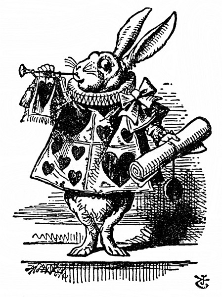
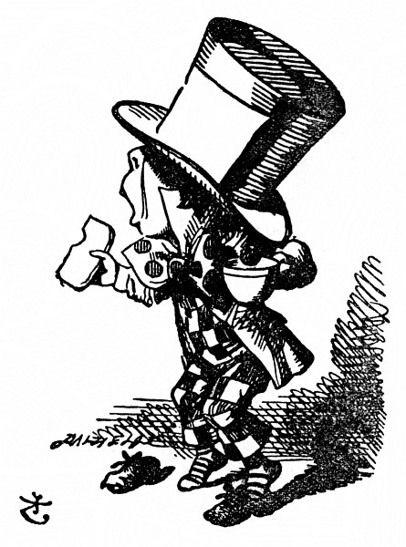

Když tam přišli, Srdcový Král s Královnou seděli na trůně a kolem nich se kupil hustý dav – všelijací ptáčci a zvířátka a k tomu všechny karty. Před nimi stál spoutaný Spodek, po boku střežený vojáky; poblíž Krále stál Bílý Králík, v jedné ruce trubku, v druhé pergamenový svitek. Uprostřed soudního dvora byl pak stůl a na něm velká mísa vdolků; vypadaly tak chutně, že při pohledu na ně dostala Alenka hlad. – Už aby bylo po přelíčení, napadlo ji, a podávaly se zákusky! Ale na to nebylo ani pomyšlení, a tak se rozhlížela kolem sebe, aby si ukrátila dlouhou chvíli.

  

U soudu Alenka dosud nebyla, jenom o něm čítala, nemálo se tedy zaradovala nad tím, že ví, jak se co jmenuje. „Tohle je soudce,“ řekla si, „protože má velkou paruku.“

Ten soudce byl ostatně Král, a protože na paruce měl nasazenou korunu (chcete-li vědět jak, podívejte se na obrázek v další kapitole), moc spokojeně nevypadal a taky mu to neslušelo.

A tamhle je lavice porotců, napadlo Alence, a těch dvanáct stvoření – (jinak než stvoření se to totiž nazvat nedalo, jednak to byla zvířátka, jednak ptáci) to budou porotci. To slovo si několikrát pro sebe zopakovala a nemálo se tím pyšnila; a právem, vždyť kolikpak děvčátek tak mladých jako ona ví, co to vlastně znamená. Ale stejně by se hodilo říct „členové poroty“.

Všech dvanáct porotců pilně psalo na břidlicové tabulky. „Copak to dělají?“ pošeptala Alenka Nohovi. „Vždyť přelíčení ještě nezačalo, a tak nemají co zapisovat.“

„Oni se podepisují,“ odpověděl šeptem Noh, „aby snad do konce přelíčení nezapomněli, jak se jmenují.“

„Pitomečci,“ vybuchla rozhorleně Alenka, ale hned zas zmlkla; Králík totiž křikl: „Ticho v soudní síni!“ a Král si nasadil brejle a pátral zrakem, kdo to mluví.

Jako by se jim přes rameno dívala, pozorovala Alenka, jak si porotci na tabulku šmahem zapisují „pitomečci!“, a dokonce si všimla, jak se jeden ptá souseda, píše-li se „pitomeček“ s měkkým, nebo s tvrdým i. „To budou mít do konce přelíčení tabulky počmárány, že se v tom nikdo nevyzná!“ řekla si Alenka.

Jednomu porotci skřípalo pisátko. Alenka to ovšem nestrpěla, obešla celou dvoranu, až se octla za ním, a než se nadál, pisátko mu sebrala. Šlo to raz dva a chudinka porotce (byl to Vilík Ještěřík) vůbec nechápal, kam se mu pisátko podělo; slídil po něm na všech stranách, ale nezbylo mu, než celý den psát prstem. Moc platné mu to nebylo, protože to na tabulce nebylo ani znát.

„Hlasateli, přečtěte obžalobu!“ řekl Král.

I zatroubil Bílý Králík třikrát na trubku, potom rozvinul pergamenový svitek a četl:

> _Srdcová Královna napekla vdolky  
>         jedenkrát o žních:  
> Srdcový Spodek jí ukradl vdolky,  
>         hned bylo po nich!_

„Poraďte se o rozsudku,“ řekl Král porotě.

„Ještě ne, ještě ne!“ skočil mu rázně do řeči Králík. „Napřed je hromada jiných věcí!“

„Předvolat prvního svědka,“ řekl Král. I zatroubil Bílý Králík třikrát na trubku a zvolal: „První svědek!“

Prvním svědkem byl Švec. Předstoupil, v jedné ruce šálek čaje a v druhé namazaný krajíc, a spustil: „Prosím Vaše Veličenstvo za prominutí, že si to nesu s sebou, ale když mě předvolali, ještě jsem neposvačil.“

„Měl jsi posvačit,“ řekl Král. „Odkdypak už svačíš?“

Švec koukl po Zajíci Březňákovi; ten zavěšen do Plcha přišel k soudu za ním. „Myslím, že od čtrnáctého března,“ řekl Švec.

„Od patnáctého,“ řekl Zajíc Březňák.

„Od šestnáctého,“ dodal Plch.

„Zapsat,“ řekl Král porotě a porotci si ta tři data horempádem zapsali na tabulku, potom je sečetli a výsledek převedli na šilinky a pence.

„Zuj ty své boty,“ poručil Král Ševci.

„Ony nejsou moje,“ řekl Švec.

_„Kradené!“_ houkl Král na porotce a ti si to hned zaznamenali.

„Já je prodávám,“ vysvětloval Švec, „svoje žádné nemám. Jsem Švec.“

Tu si Královna nasadila brejle, ostře si Ševce měřila a ten zbledl a znervózněl.

„Vydej svědectví,“ řekl Král, „a netřeš se, nebo tě dám na místě popravit.“

Svědek se tím zřejmě nijak nevzmužil: stále přešlapoval z nohy na nohu, úzkostlivě koukal po Královně a samým rozčilením místo krajíce ukousl kus šálku.

A tu pocítila Alenka něco prapodivného a hezkou chvíli jí vrtalo hlavou, co to vlastně je: už se zase zvětšovala a nejprve měla chuť vstát a odejít od soudu; ale potom se rozmyslila, že tam zůstane, dokud se tam vejde.

Plch seděl vedle ní a hned se ozval: „Netlačte se tak na mě. Sotva dýchám.“

„Já za to nemohu,“ chlácholila ho Alenka. „Já rostu.“

„Co tady máte co růst,“ řekl Plch.

„Nemluvte hlouposti,“ spustila zostra Alenka, „však vy rostete taky.“

„Ano, jenže já rostu přiměřeně,“ namítl Plch, „a ne tak bláznivě.“ Nevrle vstal a odešel na druhou stranu dvorany.

Královna si pořád Ševce přísně měřila, a když pak procházel Plch soudní dvoranou, poručila jednomu soudnímu zřízenci: „Přines mi seznam zpěváků na posledním koncertě!“ a nešťastný Švec se nad tím tak roztřásl, až ze sebe boty sklepal.

„Vydej svědectví,“ opakoval zlostně Král, „jinak tě dám popravit, ať máš strach, nebo ne.“

„Jsem já to bídný tvor, Vaše Veličenstvo,“ spustil třaslavým hlasem Švec, „dal jsem se do svačiny – je to sotva týden – namazaný krajíček je čím dál tenčí – a svačina sviští –“

„Cože sviští?“ řekl Král.

„Tak začínala svačina,“ hovořil Švec.

„Toť se ví, že svačina začíná stejně jako sviští,“ obořil se na něho Král. „Copak jsem ťululum? Mluv!“

„Jsem bídný tvor,“ hovořil Švec, „a potom svištělo kdeco – jenže Zajíc Březňák tvrdil –“

„Netvrdil!“ skočil mu prudce do řeči Zajíc Březňák.

„A tvrdil!“ řekl Švec.

„To popírám!“ řekl Zajíc Březňák.

„On to popírá,“ řekl Král, „tak to místo vynechte.“

„No tak aspoň Plch tvrdil –,“ řekl Švec a bázlivě se ohlédl po Plchovi, jestli to taky popře, jenže Plch nic nepopřel, spal jako zabitý.

„A potom jsem si namazal ještě jeden krajíček –,“ hovořil Švec.

„Ale co tedy tvrdil Plch?“ zeptal se jeden porotce.

„Na to si už nevzpomínám,“ řekl Švec.

„Jen si vzpomeň,“ prohodil Král, „nebo tě dám popravit.“

Nešťastný Švec upustil šálek i krajíc, svezl se na koleno a spustil: „Jsem bídný tvor, Vaše Veličenstvo –“

„A taky bídný řečník,“ řekl Král.

Jedno morče křiklo: „Výborně,“ a soudní zřízenci je rázem zlikvidovali. (Protože to slovo je neobvyklé, hned vysvětlím, co s ním udělali. Měli plátěný pytel, který se zavazoval na šňůrku; morče do něho po hlavě strčili a sedli si na ně.)

„To jsem ráda, že jsem to viděla,“ řekla si Alenka. „Kolikrát jsem už v novinách četla, jak po přelíčení, zřízenci okamžitě zlikvidovali pokus o potlesk, a nevěděla jsem, co to znamená; teď to vím.“

„Jestli toho už víc nevíš, tak poklekni,“ hovořil Král.

„Dál už to nejde,“ bránil se Švec, „už klečím.“

„Tak se posaď,“ odsekl Král. A tu zas druhé morče křiklo: „Výborně,“ a hned je zlikvidovali.

„Hele, morčata už dorazili!“ řekla Alenka. „Teď už to půjde hladce.“

„Radši bych dorazil svačinu,“ Švec pohlédl úkosem na Královnu, zabranou do seznamu zpěváků.

„Můžeš jít,“ řekl Král; a Švec pelášil od soudu, že si ani boty neobul.

„– a venku mu rovnou srazte hlavu,“ prohodila Královna k jednomu zřízenci; ale než došel zřízenec ke dveřím, byl Švec tentam.

„Předvolat dalšího svědka!“ řekl Král.

Dalším svědkem byla Vévodkynina kuchařka. V ruce držela pepřenku a podle toho, jak se lidé u dveří rozkýchali, uhodla Alenka, kdo to je, ještě než předstoupila před soud.

„Vydejte svědectví,“ řekl Král.

„Nevydám,“ řekla kuchařka.

Král se tázavě ohlédl po Bílém Králíkovi a ten mu pošeptal: „Vaše Veličenstvo musí tuto svědkyni podrobit křížovému výslechu.“

„Inu, mus je mus,“ pronesl zachmuřeně Král, založil ruce, zamračil se na kuchařku, až mu oči do důlků zalezly, a potom zahučel: „Z čeho se dělají vdolky?“

„Hlavně z pepře,“ řekla kuchařka.

„Ze sirupu,“ ozval se někdo za ní ospale.

„Popadněte Plcha za límec,“ zavřískla Královna. „Srazte Plchovi hlavu! Vyhoďte Plcha od soudu! Zlikvidujte ho! Uštípejte ho! Vyškubejte mu vousy!“

Jak Plcha vyhazovali, na soudu zavládl zmatek, a když se zas utišil, kuchařka byla pryč.

„Nevadí,“ řekl Král, jako by se mu ulevilo. „Předvolat dalšího svědka.“ A potichu řekl Královně: „Má zlatá, dalšího svědka musíte podrobit křížovému výslechu sama. Mě z toho bolí hlava!“

Alenka pozorovala Bílého Králíka, jak šmátrá v seznamu, a byla zvědava, kdo asi bude další svědek, „ – valné svědectví zatím neslyšeli,“ řekla si. Jaké překvapení, když Bílý Králík vysokým tenkým hláskem přečetl jméno:

„Alenka!“

