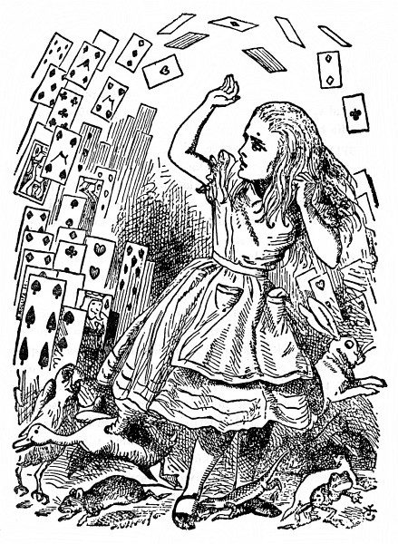

<section>

„Zde!“ vykřikla Alenka; v tom rozčilení nadobro zapomněla, jak za tu chvilku vyrostla, a vylítla tak prudce, že obrubou sukně převrátila lavici porotců a porotce vyklopila divákům na hlavu; jak se tam rozplácli, připomínali jí akvárium se zlatými rybkami, které zrovna před týdnem nedopatřením převrhla.

</section>

<section>

„Prosím za prominutí!“ vyhrkla celá zdrcená a honem honem je sbírala; pořád ještě měla v hlavě tu nehodu se zlatými rybkami a tak nějak se jí zdálo, že je musí rychle posbírat a strčit zpátky do lavice, jinak že zahynou.

„Přelíčení nemůže pokračovat,“ řekl přísně Král, „dokud všichni porotci nebudou na svém místě – ale všichni,“ opakoval důrazně a vrhl nevlídný pohled na Alenku.

Alenka pohlédla na lavici porotců a zjistila, že v tom chvatu tam strčila Ještěříka po hlavě a že on, chudinka, mrská smutně ocáskem a nemůže se hnout. Hned ho zas vyndala a posadila jaksepatří. „Ostatně na tom nesejde,“ řekla si, „ať sedí tak či onak, na přelíčení stejně není nic platný.“

Sotva se porotci trochu vzpamatovali z leknutí a zřízenci poshledávali a vrátili jim tabulky a pisátka, hned se jali horlivě popisovat celou tu nehodu; jenom Ještěříka to tak zdolalo, že s otevřenými ústy civěl do stropu.

„Co ty o té věci víš?“ řekl Král Alence.

„Nic,“ řekla Alenka.

„Vůbec nic?“ nedal se odbýt Král.

„Vůbec nic,“ řekla Alenka.

„To je významné,“ řekl Král porotcům. Už už si to zapisovali na tabulky, a tu mu vpadl Bílý Králík do řeči: „Snad bezvýznamné myslí Vaše Veličenstvo,“ řekl uctivě, ale přitom se na něho mračil a šklebil.

</section>

<section>

</section>

<section>

„Toť se ví, že bezvýznamné,“ vyhrkl Král a potichu si pak odříkával „významné – bezvýznamné – bezvýznamné – významné –“, jako by zkoušel, co zní lépe.

Někteří porotci si zapsali „významné“, druzí zas „bezvýznamné“. Alenka to pozorovala, protože jim zblízka viděla na tabulky, ale řekla si: „Vždyť na tom nesejde.“

Král si už chvíli něco zapisoval do notýsku a tu zvolal: „Ticho!“ a přečetl z notýsku: „Paragraf čtyřicátý druhý. Každý, kdo měří přes míli, nechť opustí soudní síň.“

Všichni pohlédli na Alenku.

„Ale já neměřím míli,“ řekla Alenka.

„Měříš,“ řekl Král.

„Skoro dvě míle,“ podotkla Královna.

„A stejně nepůjdu,“ řekla Alenka, „a vůbec to není žádný platný paragraf – zrovna jste si ho vymyslel.“

„Je to nejstarší paragraf z celého zákoníku,“ řekl Král.

„Tak by to měl být paragraf první,“ řekla Alenka.

Král zbledl a rázem sklapl notes. „Poraďte se o rozsudku,“ řekl slabým třaslavým hlasem porotcům.

„Prosím, Vaše Veličenstvo, tady je ještě jeden doličný předmět,“ vylítl prudce Bílý Králík. „Zrovna sebrali ze země tenhle papír.“

„Co v něm stojí?“ řekla Královna.

„Ještě jsem ho neotevřel,“ řekl Bílý Králík, „bude to asi dopis zatčeného psaný – někomu.“

„Nejspíš,“ řekl Král, „ledaže by byl psaný nikomu, což není zvykem.“

„Jaká je adresa?“ zeptal se jeden porotce.

„Žádná,“ řekl Bílý Králík, „na obálce nic nestojí.“ Při těch slovech papír rozevřel a dodal: „Přece jen to není dopis, jsou to verše.“

„Je to rukopis zatčeného?“ zeptal se jiný porotce.

„Ne, není,“ řekl Bílý Králík, „a to je na tom nejpodivnější.“ (Porotci zkoprněli.)

„Napodobil asi cizí rukopis,“ řekl Král. (Porotci se zas uklidnili.)

„Prosím, Vaše Veličenstvo,“ řekl Spodek, „já jsem to nepsal a nikdo mi to nedokáže. Na konci není žádný podpis.“

„Jestli jsi to nepodepsal,“ řekl Král, „tím hůř. Jistě jsi něco nekalého obmýšlel, jinak by ses byl poctivě podepsal.“

Ze všech stran se ozval potlesk; byla to první moudrá věc, kterou Král ten den řekl.

„To dokazuje, že je vinen,“ řekla Královna.

„To vůbec nic nedokazuje,“ řekla Alenka, „vždyť ani nevíte, co těch verších je!“

„Přečíst,“ řekl Král.

Bílý Králík si nasadil brejle. „Kde mám prosím, Vaše Veličenstvo, začít?“ zeptal se.

„Začni od začátku,“ řekl Král, „a čti až do konce; potom přestaň.“ A Bílý Králík četl:

> _Má příznivkyně veliká  
>         slovem mě nehaní,  
> jen jednu věc mi vytýká:  
>         nejde mi plavání._

> _Prý nezmizel jsem do dáli  
>          (to není, chlapče, lež).  
> Co když se ona dopálí,  
>         kam před ní utečeš?_

> _Já jeden dal jí, oni pár  
>         zas jemu, ty nám víc.  
> Tak obdržel jsi vzácný dar  
>         a mně nezbývá nic._

> _Když do té věci nešťastné  
>         pak spadnem, útěcha  
> nám v hloubi srdce nezhasne:  
>         on nás v tom nenechá._

> _Říct, proč jsme se tak zlobili,  
>         je tuze nesnadné.  
> Marné je všechno úsilí,  
>         jak ji to popadne._

> _Slovem se před ním nezmiňuj  
>         pod trestem záhuby,  
> jak chutnaly jí. Milý můj,  
>         drž jazyk za zuby._

„Z toho, co jsme vyslechli, tohle je nejpádnější důkaz,“ řekl Král a zamnul si ruce. „Tak a teď ať porotci –“

„Jestli mi to některý z nich vysvětlí,“ řekla Alenka (v poslední chvíli o tolik vyrostla, že se už ani trochu nebála skočit mu do řeči), „dám mu šesták. Já v tom aspoň kouska smyslu nevidím.“

Porotci si zapsali na tabulky: „Ona v tom kouska smyslu nevidí“, ale aby jí to vysvětlili, k tomu se žádný neměl.

„Když v tom žádný smysl není,“ řekl Král, „nemusíme ho v tom hledat, a tak si ušetříme fůru práce. A přece jenom nevím, nevím,“ rozložil si verše na koleně a po očku do nich nahlížel. „Snad v nich nějaký smysl bude – ‚nejde mi plavání –‘, umíš ty plavat, nebo ne?“ obořil se na Spodka.

Spodek zavrtěl smutně hlavou. „Copak na to vypadám?“ řekl. (To rozhodně nevypadal, protože byl z lepenky.)

„Dobrá,“ řekl Král a brumlal si další verše: „‚– to není, chlapče, lež –‘, to ať posoudí porotci – ‚já jeden dal jí, oni pár zas jemu –‘, to mluví zřejmě o těch vdolcích, bodejť.“

„Ale dál tam stojí, ‚tak obdržel jsi vzácný dar‘,“ řekla Alenka.

„Už to máme!“ Král ukázal vítězoslavně na vdolky stojící na stole. „To je nad slunce jasnější… A dále – ‚jak ji to popadne –‘ Copak tě, má zlatá, někdy něco popadne?“ oslovil Královnu.

„Nikdy!“ rozlítila se Královna a při těch slovech mrštila po Ještěříkovi kalamářem. (Nešťastný Vilík přestal totiž předtím psát po tabulce prstem, protože to na ní nebylo vidět; ale teď honem zase psal. Dokud to šlo, namáčel do inkoustu, který mu stékal po tváři.) „Na tebe to tedy vůbec nepadne,“ řekl Král a s úsměvem se rozhlédl po soudě. Zavládlo hrobové ticho.

„To je slovní hříčka,“ dodal uraženě Král a všichni se zasmáli.

„Nechť se porota poradí o rozsudku,“ řekl Král ten den snad už podvacáté.

„Kdepak! Kdepak!“ řekla Královna. „Nejprve ortel – potom, rozsudek.“

„Pitomost!“ pronesla hlasitě Alenka. „Nejprve ortel, to je mi nápad!“

„Budeš mlčet!“ okřikla ji Královna a celá zbrunátněla.

</section>

<section>

</section>

<section>

„A nebudu!“ řekla Alenka.

„Srazte jí hlavu!“ Královna se rozkřikla, co jí hrdlo stačilo. Nikdo se nehnul.

„Kdopak si z vás něco dělá?“ řekla Alenka (zatím už dorostla do své velikosti). „Vždyť jste pouhé karty.“

Tu se všechny karty vznesly do vzduchu a potom se zase na ni snášely – leknutím i zlostí zavřískla a střásla je ze sebe, a tu shledala, že leží na břehu s hlavou opřenou o sestřin klín a sestra jí opatrně smetá z obličeje suché listí, které jí tam ze stromů napadalo.

„Probuď se, Alenko!“ řekla sestra. „Ty ses ale prospala!“

„Ach, to ti byl divný sen!“ řekla Alenka, a pokud si vzpomínala, vypověděla sestře všechna ta podivná dobrodružství, o nichž jste právě četli; když domluvila, sestra ji políbila a řekla: „To byl, děvenko, opravdu divný sen. Ale teď běž na svačinu; hnedle se bude stmívat.“ A tak Alenka vstala a rozběhla se, a jak horempádem utíkala, pořád si říkala, jaký to byl báječný sen.

Po jejím odchodu zůstala však sestra sedět, podepřela si hlavu, hleděla na západ slunce a myslela na Alenku i na její báječná dobrodružství, až se z toho taky rozesnila a měla tento sen:

Nejprve se jí zdálo o Alence, jak jí zase ručkama obmyká koleno a dychtivě na ni upírá bystrá očka – slyšela znovu zvuk jejího hlasu a viděla ji před sebou, jak tak zvláštně pohazuje hlavou a střásá dozadu tu neposlušnou kadeř, která jí pořád a pořád padá do očí – a jak ji tak poslouchala nebo se domnívala, že ji poslouchá, kolem dokola se to zahemžilo podivnými tvory ze snu její sestřičky.

U nohou jí zašustila vysoká tráva, jak se tamtudy hnal Bílý Králík – poblíž v tůňce zašplíchala na útěku polekaná Myš – zařinčely šálky na nekonečné svačině Zajíce Březňáka a jeho přátel a Královna vřískavým hlasem posílala své hosty na popravu – znovu se Vévodkyni na klíně rozkýchalo prasátko a kolem něho třískaly mísy a talíře – znovu se rozléhal Nohův skřek a skřípání Ještěříkova pisátka a chroptění likvidovaných morčat a zdálky do toho zalétaly vzlyky nešťastného Paželva.

</section>

<section>

</section>

<section>

A tak tam seděla se zavřenýma očima a namlouvala si, že je v Kraji divů, a přece věděla, že jakmile je otevře, všechno se promění v šedou skutečnost – tráva bude šustit jenom větrem a tůňka šplouchat od rozevlátého rákosí – řinkot šálků se promění v cinkání ovčích zvonců a Královnino vřískání v ovčákův pokřik – a kýchání prasátka, Nohův skřek a všechny ty ostatní podivné zvuky se promění (to věděla) v zmatený halas na statku – a Paželvovy usedavé vzlyky budou jen vzdálené bučení dobytka.

Nakonec si ještě představila, jak jednou po letech bude její sestřička dospělá; a jak si i v zralém věku uchová z dětství prosté vroucí srdce – jak se za ní potáhnou zase jiné děti a jak se jim oči rozzáří a rozdychtí nad leckterým jejím úžasným příběhem a třeba také nad jejím dávným snem o Kraji divů – jak se bude vžívat do jejich prostých žalů, těšit se z jejich prostých radostí při vzpomínce na své dětství a na blahé letní dny.

</section>

<section>

</section>
