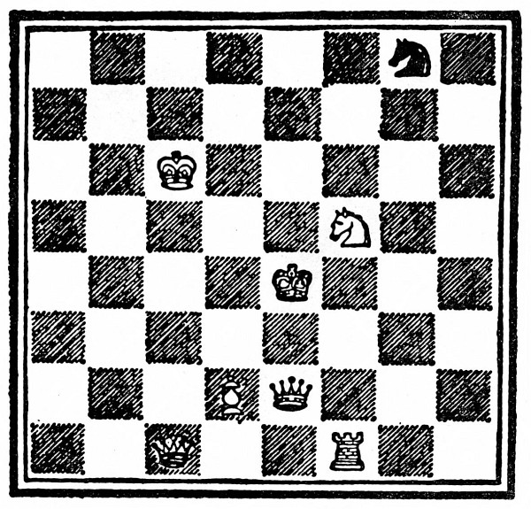

<section>

   

Bílý Pěšec (Alenka) táhne a vyhraje v jedenácti tazích.

</section>

<section>

1\. Alenka potká Č. K.

1\. Č. K. na h5

2\. Alenka projde d3 (vlakem)  
na d4 (Tydliták a Tydlitek)

2\. B. K. na c4 (za šálou)

3\. Alenka potká B. K. (s šálou)

3\. B. K. na c5 (promění se v ovci)

4\. Alenka na d5 (krám, řeka, krám)

4\. B. K. na f8 (postaví vejce na pult)

5\. Alenka na d6 (Valihrach)

5\. B. K. na c8 (utíká před Č. J.)

6\. Alenka na d7 (les)

6\. Č. J. na e7 (šach)

7\. B. J. bere Č. J.

7\. B. J. na f5

8\. Alenka na d8 (korunovace)

8\. Č. K. na e8 (zkouška)

9\. Alenka Královnou

9\. Královny dělají rošádu

10\. Alenka dělá rošádu (hostina)

10\. B. K. na a6 (polévka)

11\. Alenka bere Č. K. a vyhraje

</section>
