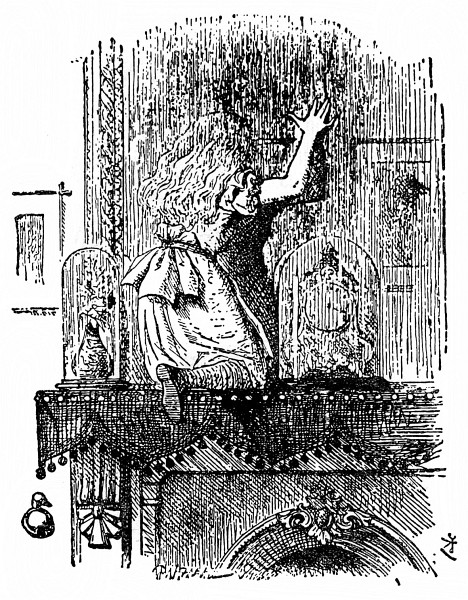
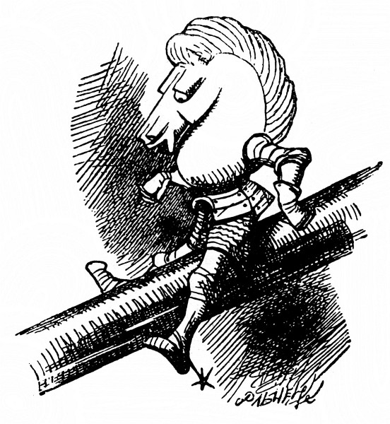

<section>

Tolik je jisté, že bílé kotě za to vůbec nemohlo; – jen a jen černé to mělo na svědomí. Bílé kotě si totiž už dobré čtvrt hodiny dalo od staré kočky umývat obličej (a celkem dobře to snášelo); tu nezbednost tedy ztropit nemohlo, to je jasné.

</section>

<section>

Takto umývala Micka dětem obličej: popadla drobečka prackou za uši a druhou prackou mu od čumáčku počínajíc proti srsti drbala celý obličej; a jak už jsem řekl, zrovna měla v prádle bílé kotě. To si klidně leželo, a pokud to šlo, vrnělo – nejspíš si myslelo, že mu to jen prospěje.

Černé kotě si už brzy odpoledne mytí odbylo, a jak si tam Alenka schoulená v koutku lenošky trochu broukala a trochu podřimovala, vesele skotačilo s jejím klubkem vlny a tak dlouho si s ním sem tam kutálelo, až je celé rozmotalo; zmuchlaná a zauzlovaná vlna byla roztahaná po rohožce a uprostřed se kotě honilo za svým ocáskem.

„Ach ty nezbedo,“ spustila na ně Alenka, popadla je, a aby vědělo, že je u ní v nemilosti, vlepila mu hubičku.

</section>

<section>

</section>

<section>

„Micka by tě věru měla naučit způsobům. To bys měla, Micko, však ty víš!“ Zahleděla se káravě na starou kočku a mluvila tak rozezleně, jak to jen dovedla – potom si vlezla zpátky do lenošky i s kotětem a s vlnou a znovu navíjela klubko. Ale moc rychle jí to nešlo, protože přitom pořád mluvila buď s kotětem, nebo sama se sebou. Katka jí způsobně seděla na koleně, naoko sledovala navíjení a občas vystrčila pracku a zlehka chňapla po klubku, jako by měla chuť pomáhat.

„Víš ty, Katko, co je zítra?“ spustila Alenka. „Mělas být se mnou u okna, hned bys to uhodla – jenže to nešlo, Micka tě zrovna upravovala. Dívala jsem se na kluky, snášeli polínka na ohníček a ten, Katko, spotřebuje nějakých polínek. Ale byla taková zima a taková chumelenice, že toho museli nechat. Nic si z toho, Katko, nedělej, však se zítra na ohníček podíváme.“ A tu Alenka omotala kotěti vlnu párkrát kolem krku, jak mu to bude slušet. Nastala tahanice, klubko se skutálelo na zem a sáhodlouhý kus se zas rozmotal.

„Když jsem, Katko, viděla, co jsi natropila, měla jsem ti takovou zlost,“ zvolala Alenka, jakmile se zas uvelebily, „že jsem málem otevřela okno a vystrčila tě na sníh! Však bys to zasloužila, ty lumpíku. Jakou máš omluvu? Neskákej mi do řeči!“ Alenka zvedla prst. „Povím ti, čím ses provinila. Za prvé: když ti dnes ráno Micka umývala obličej, dvakrát jsi zapištěla. Jen, Katko, nezapírej, sama jsem to slyšela! Co to říkáš?“ (Alenka dělala, jako že kotě mluví.) „Že ti prackou zajela do oka? Za to si můžeš sama, žes měla oči otevřené. Kdybys je byla pevně zavřela, tak se ti to nestalo. Už se nevymlouvej a poslouchej. Za druhé: jen jsem přistrčila Sněhulce misku s mlíkem, hned jsi ji od misky odtáhla za ocas! Cože, ty jsi měla žízeň? A víš ty, jestli neměla ona taky žízeň? A za třetí: když jsem nekoukala, rozmotala jsi mi všechnu vlnu!

To jsou, Katko, tři provinění a ani za jedno jsem tě ještě nepotrestala. Všechny ty tvé tresty si schovávám na příští středu – a co kdyby si tak oni schovávali moje tresty!“ Alenka mluvila spíš k sobě než ke kotěti. „Co by mi tak na konci roku udělali? V tu hodinu by mě snad uvrhli do vězení. Nebo by mi třeba za každé provinění nedali jíst a v tu nešťastnou hodinu by mi pak nedali jíst padesátkrát za sebou. Ale to by mi vůbec nevadilo. Lepší, než kdyby mi tolikrát jíst dali.

Slyšíš, Katko, jak mete sníh do oken! Ozývá se to tak hezky a tak tlumeně! Jako by někdo zvenku celé okno líbal. Má snad sníh stromy a pole tak rád, že je tak něžně líbá? A bílou peřinou je celé přikrývá a snad jim říká: ‚Spěte, miláčci, až do léta.‘ Když se potom, Katko, v létě probudí, obléknou si zelené šaty, a když zafouká vítr, hned se roztancují, ach, to je ti krásné!“ Alenka zatleskala a přitom upustila klubko. „Kdyby to tak byla pravda! Vždyť na podzim, když listí zhnědne, stromy vypadají ospale.

</section>

<section>

</section>

<section>

Umíš hrát, Katko, šachy? Nic se nesměj, milánku, ptám se tě docela vážně. Jak jsme teď hráli, ty ses dívala, jako bys tomu rozuměla, a když jsem řekla ‚šach‘, tak jsi zavrněla! Byl to, Katko, pěkný šach, a nebýt toho zlého jezdce, který se vetřel mezi mé figurky, tak jsem to jistě vyhrála. Víš co, Katko budeme jako –“ Kdybych vám tak mohl vypočítat aspoň polovinu všeho toho, co u Alenky začínalo jejím oblíbeným: „Budeme jako.“ Zrovna den předtím se dostaly se sestrou do hádky, a to jen proto, že Alenka zas spustila: „Budeme jako králové a královny,“ a sestra, která si potrpěla na přesnost, jí dokazovala, to že být nemohou, protože jsou jen dvě, až nakonec Alenka slevila: „Dobře, ty budeš dělat jednu a já ty ostatní.“ A jednou k smrti vylekala starou chůvu, když jí houkla do ucha: „Náno! Já budu jako hladová hyena a ty budeš kost!“

Ale tím odbočujeme od toho, co Alenka říkala kotěti. „Ty budeš, Katko, jako Černá Královna! Tak si myslím, kdyby ses rovně posadila a založila ruce, vypadala bys docela jako ona. Zkus to, buď tak hodná!“ Alenka sebrala ze stolu Černou Královnu a postavila ji jako předlohu před kotě, ale nepovedlo se to, podle Alenky hlavně proto, že kotě nezaložilo pořádně ruce. Za trest je zvedla k zrcadlu, aby se na sebe podívalo, jak trucuje. – „Jestli hned neposlechneš,“ dodala, „strčím tě do domu za zrcadlem. Co bys tomu řekla!

Tak dávej, Katko, pozor a nemluv tolik, a já ti povím, co všecko si o tom domě za zrcadlem myslím. Předně je tam pokoj, který je vidět za sklem – je zrovna takový jako náš salón, jenže je tam všecko naopak. Když si stoupnu na židli, vidím ho celičký, až na ten kousek za krbem. Ach! Kdybych tak i ten kousek mohla uvidět! Tak ráda bych věděla, jestli tam v zimě taky topí: to se neví, až když se kouří z našeho krbu, a pak se kouř valí i v jejich pokoji – ale možná, že jen tak dělají, jako by se i u nich topilo. Knihy mají skoro jako my, jenže slova jdou opačným směrem. Vím to, protože jsem jednou naši knihu podržela před zrcadlem a oni zas v tom druhém pokoji podrželi svou.

Jakpak by se ti, Katko, líbilo v domě za zrcadlem! Jestlipak by ti tam dávali mlíčko! Třeba se to mlíčko v domě za zrcadlem nedá ani pít – Ach Katko! Ale teď jsme až u chodby. Když necháš v salónku dveře dokořán, je té chodby v domě za zrcadlem vidět jenom kousíček; co je vidět, vypadá zrovna jako naše chodba, jenže tam dál je třeba docela jiná. Ach Katko, kdybychom se tak dostaly do domu za zrcadlem, to by bylo hezké! Nějak se tam, Katko, jako dostaneme. Zrcadlo je jako z poddajného gázu a my jím projdeme. Opravdu! Teď se nějak zamžilo. Projdeme jím jako nic –“ Jen to dořekla, už stála na krbové římse, ani nevěděla, jak se tam octla. A zrcadlo se opravdu rozplývalo jako stříbřitá mlha.

</section>

<section>

</section>

<section>

Vzápětí byla Alenka za zrcadlem a lehce seskočila do pokoje za ním. Nejprve se koukla, hoří-li v krbu oheň, a nemálo ji potěšilo, že tam plápolá právě tak jasný oheň jako v pokoji, ze kterého odešla. „Bude mi tu tak teplo jako v tamtom pokoji,“ řekla si Alenka, „ba ještě tepleji, protože mě nikdo nebude honit od krbu. To bude legrace, až mě tady přes zrcadlo uvidí a nebudou na mě moct.“

</section>

<section>

</section>

<section>

Rozhlížela se kolem sebe a zjistila, že co je vidět z tamtoho pokoje, je obyčejné a nezajímavé, zato ostatek je docela jinačí. Tak hned obrázky na zdi krbu jako by ožily, a dokonce i hodiny na krbové římse (v zrcadle, jak víte, je z nich vidět jen zadní stranu) měly podobu stařečka, který se na ni vesele usmíval.

„V tomhle pokoji tak neuklízejí,“ řekla si Alenka, když zahlédla v krbu mezi škvárou několik šachových figurek. Ale vzápětí vyjekla samým překvapením, přidřepla k nim a prohlížela si je. Figurky se procházely v párech!

„Tady je Černý Král s Černou Královnou,“ řekla Alenka (ale šeptem, aby je nepolekala), „a tamhle sedí na lopatce Bílý Král s Bílou Královnou a tady se zas procházejí zavěšeny do sebe dvě Věže – myslím, že mě neslyší,“ sklonila hlavu až k nim, „a docela jistě mě nevidí. Připadám si neviditelná –“

</section>

<section>

</section>

<section>

Vtom na stole něco zapištělo, Alenka se otočila a ještě zahlédla, jak se jeden Bílý Pěšec svalil a jak kolem sebe kope. Zvědavě se dívala, co bude dál.

„To křičí mé dítě,“ zvolala Bílá Královna a tak prudce se rozběhla, až Krále porazila do popela. „Má zlatá Lilinko! Má královská kočičko!“ A o překot se šplhala po mřížce.

„Královské Tintilivantili,“ řekl Král a mnul si nos, při pádu si ho totiž odřel. Bodejť by se trochu nedurdil, byl od hlavy až k patě samý popel. Chudák Lilinka vřískala, jako by ji na nože bral. Alenka z upřímné touhy pomoci Královnu popadla a postavila ji na stůl vedle uřvané dcery.

Královna seděla a popadala dech. Po tom prudkém letu povětřím chvíli nemohla vydechnout a jen k sobě mlčky tiskla Lilinku; jakmile zas vydechla, křikla dolů na Bílého Krále, který seděl nadurděně v popelu: „Pozor na sopku!“

„Jakou sopku?“ Král se koukl starostlivě do ohně, tam že ji snad nejspíš uhlídá.

„Mě vymrštila nahoru!“ vyrážela zajíkavě Královna. „Hleď se dostat nahoru – obvyklou cestou – aby tě to taky nevymrštilo!“

Alenka se dívala, jak se Bílý Král drápe z jedné příčky na druhou, a nakonec řekla: „Takhle polezeš na stůl kolik hodin. Neměla bych ti raději pomoct?“ Král jí na to nic neříkal, bylo vidět, že ji neslyší a nevidí.

Alenka ho tedy šetrně sebrala a zdvihla ho nahoru pomaleji než Královnu, aby mu nevyrazila dech, ale než ho postavila na stůl, řekla si, že ho trochu opráší, byl celý od popela.

Tak se před ní jakživ nikdo netvářil, řekla si později kolikrát, jako Král, když ho neviditelná ruka držela v povětří a oprašovala. Byl tak užaslý, že ani nezaječel, jenom poulil oči a otvíral ústa víc a víc a víc, div ho nepustila na zem, jak se jí smíchem třásla ruka.

„Ale prosím tě, jen se tak neškleb!“ vyprskla Alenka a nadobro zapomněla, že ji Král neslyší. „Tak jsi mě rozesmál, že tě sotva udržím! A neotvírej ústa tak dokořán! Nalítá ti tam popel – tak teď už jsi zas čistý!“ přičísla mu vlasy a opatrně ho postavila na stůl ke Královně.

</section>

<section>

</section>

<section>

Král padl naznak a zůstal bez hnutí ležet. Alenka se lekla, co to udělala, a po celém pokoji hledala vodu, aby ho pokropila. Ale našla jenom lahvičku s inkoustem, a když se s ní vrátila, Král už přišel k sobě a zděšeně si s Královnou šeptal – jenže tak potichu, že Alenka skoro neslyšela, co si říkají.

Král zrovna říkal: „Ujišťuju tě, má zlatá, že mě mrazilo až do špiček knírů.“

Královna mu na to odsekla: „Vždyť žádné kníry nemáš.“

„Na ten strašidelný okamžik,“ hovořil Král, „nikdy, nikdy nezapomenu!“

„Ale zapomeneš,“ řekla Králova, „když si to nezapíšeš.“

Alenka se zájmem pozorovala, jak Král vytahuje z kapsy ohromný notes a píše. Najednou jí něco napadlo, popadla konec tužky, který mu čouhal přes rameno, a psala za něho.

</section>

<section>

</section>

<section>

Chudák Král byl celý zmatený a chvíli s tužkou zápolil a nic neříkal; jenže Alenka byla silnější než on, a tak nakonec zahekal: „Musím si, má zlatá, opatřit tenčí tužku. Tuhle už nezvládnu; píše všechno možné, co ani nechci –“

„A co všechno,“ řekla Královna a nakoukla do notesu (Alenka tam napsala: „Bílý Jezdec sjíždí po pohrabáči. Neudrží rovnováhu.“). „To není záznam toho, cos ty zažil.“

Na stole vedle Alenky ležela kniha, a jak tak pozorovala Bílého Krále (měla pořád ještě o něj strach a chystala se pokropit ho inkoustem, kdyby snad omdlel), listovala v knize, jestli se v ní dá něco přečíst, „– je to psáno řečí, kterou neznám,“ řekla si pro sebe.

Znělo to takto:

> _duopachalT  
> inelezej ínrepsyL .rečevčavs eJ  
> .ěvařkom v íječátrv ěnrív es  
> inelchurtzor uosj icšuordah ířachteV  
> .ěvarhuksonkset ítšys yvles a_

Chvíli nad tím hloubala, až najednou jí blesklo hlavou: Ale ovšem, je to zrcadlová kniha! Když ji přidržím u zrcadla, slova zas půjdou správným směrem.

Alenka četla tuto báseň:

> _Tlachapoud_

> _Je svačvečer. Lysperní jezeleni  
> se vírně vrtáčejí v mokřavě.  
> Vetchaří hadroušci jsou roztruchleni  
> a selvy syští tesknoskuhravě._

> _„Střež se, střež Tlachapouda, milý synu,  
> má tlamu zubatou a ostrý dráp.  
> Pták Zloškrv už se těší na hostinu,  
> vzteklitě číhá na tě Pentlochňap.“_

> _Meč Šaršoun vytrh, pevně sevřel v dlani  
> a v lese stopoval ty chvostnatce,  
> pak pod strom Tumtum used v zadumání  
> a hotovil se k divé šarvátce._

> _A když tak zachmurděně odpočíval,  
> tu z huňastého lesa Tlachapoud  
> tam vtrhl šumohvizdně jako příval  
> a s vrňoukáním chtěl ho napadnout._

> _Ráz naráz sekal, šmik! šmik! v stínu stromů  
> Šaršounem mával stále lítěji,  
> až hlavu uťal mu a potom domů  
> se harcoslavně vrátil s trofejí._

> _„Pojď na má prsa, však to byla túra  
> s tím Tlachapoudem, chlap jsi od kosti.  
> Oj nádhernajs, oj bašta. Hoja! hurá!“  
> a pochruchňával samou radostí._

> _Je svačvečer. Lysperní jezeleni  
> se vírně vrtáčejí v mokřavě.  
> Vetchaří hadroušci jsou roztruchleni  
> a selvy syští tesknoskuhravě._

„Velmi hezké,“ řekla si Alenka, když dočtla, „ale tak trochu nesrozumitelné!“ (Nechtěla si totiž přiznat, že se v tom vůbec nevyzná.) „Všelico mě sice napadá – ale nevím, co si z toho mám vybrat! _Někdo_ tam _něco_ zabil: to je jisté –“

„Ach jéje!“ Alenka sebou trhla. „Jestli si nepospíším, budu se musit vrátit zrcadlem a ostatek domu vůbec neuvidím! Koukněme se nejprve na zahradu!“ A už byla venku z pokoje a běžela po schodech – ale spíše než běh byl to, jak si Alenka řekla, nový způsob, jak se dostat snadno a rychle ze schodů. S konečky prstů na zábradlí, aniž se nohama dotýkala schodů, snesla se lehce dolů a dál chodbou, a kdyby se nebyla zachytila o veřeje, málem se octla venku ze dveří. Z toho vznášení se jí točila hlava a byla docela ráda, že zase jde po zemi jako jindy.

</section>

<section>

</section>