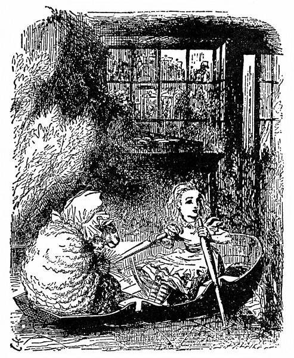

Při těch slovech šálu chytila; rozhlížela se, komu patří. Vzápětí se s rozpřaženýma rukama vyřítila z lesa Bílá Královna a Alenka jí šla s šálou zdvořile naproti.

  

„To jsem ráda, že jsem se tady nachomýtla,“ řekla Alenka, jak jí přehazovala šálu.

Bílá Královna na ni bezradně a zděšeně vejrala a šeptem si něco drmolila, znělo to jako „sakva s máslem, sakva s máslem“. Mají-li se spolu dohovořit, řekla si Alenka, pak musí sama načít. A tak nesměle spustila: „Jestli mě zrak nešálí, vy jste Bílá Královna.“

„Přijde na to, ale takhle mě dosud nikdo nešálil,“ řekla Královna. „Tomuhle se říká nasazovat šálu?“

Alenka si pomyslila, že dávat se rovnou do hádky nemá smysl; i usmála se a řekla: „Nejprve mi, Vaše Veličenstvo, povězte, jak na to, a já vám šálu nasadím jaksepatří.“

„Ale já nechci, aby mi ji někdo nasazoval!“ zaskuhrala nešťastná Královna. „Šálím se už dvě hodiny.“

Lépe by bylo, zdálo se Alence, kdyby tu cuchtu šálil někdo jiný. Všechno má nakřivo, pomyslila si, a je samý špendlík! – „Smím vám tu šálu trochu narovnat?“ pronesla nahlas.

„Nevím, co to s ní je!“ posteskla si Královna. „Snad se na mě zlobí. Špendlím ji tady a špendlím ji tam, a pořád jí to není vhod!“

„Špendlením na jedné straně se vám nenarovná,“ řekla Alenka a něžně jí šálu narovnala. „A jémine, co ty rozcuchané vlasy!“

„Zapletl se mi do nich kartáč,“ povzdychla Královna. „A včera jsem ztratila hřeben.“

Alenka jí opatrně kartáč vypletla a jakžtakž ji učesala. Vlásenky jí většinou vyměnila. „Hned vypadáte líp,“ řekla. „Měla byste mít komornou.“

„Mileráda si tě vezmu do služby,“ řekla Královna. „Dva krejcary týdně a obden marmeláda.“

Alenka se zasmála a řekla: „Já k vám sloužit nepůjdu a o marmeládu nestojím.“

„Ale je dobrá,“ řekla Královna.

„Dnes aspoň marmeládu nechci.“

„Však ji taky nedostaneš, i kdybys chtěla,“ řekla Královna. „Tady platí: marmeláda zítra a marmeláda včera – ale žádná marmeláda dnes.“

„Ale někdy snad na marmeládu dnes přece dojde,“ namítla Alenka. „Ne, nedojde,“ řekla Královna. „Marmeláda je obden. A dnes přece není obden.“

„Tomu nerozumím,“ řekla Alenka. „Kdo se v tom má vyznat!“

„Tak to je, když se žije pozpátku,“ řekla vlídně Královna, „zprvu se ti z toho točí hlava –“

„Žije pozpátku?“ opáčila užasle Alenka. „To jsem jakživa neslyšela!“

„– ale má to jednu velkou přednost, že ti paměť sahá dozadu i dopředu.“

„Moje sahá rozhodně jenom jedním směrem,“ podotkla Alenka. „Já si na něco vzpomínám, až když se to stane.“

„Paměť, která sahá jen dozadu, je paměť chatrná,“ podotkla Královna.

„A co vy si nejlíp pamatujete?“ osmělila se zeptat Alenka.

„No, co se stalo ode dneška za čtrnáct dní,“ řekla Královna, jako by se nechumelilo. „Tak třeba,“ při těch slovech si přilepila na prst důkladnou náplast, „takový královský kurýr. Zrovna si odpykává trest v žaláři, soud nad ním bude ve středu a zločin spáchá až nakonec.“

„A co když zločin nespáchá?“ řekla Alenka.

„Tak to bude pro něho štěstí, ne?“ řekla Královna a šňůrkou si přitáhla náplast na prst.

To se nedalo popřít. „Toť se ví, že to pro něho bude štěstí,“ řekla Alenka, „ale žádné štěstí pro něho nebude, že si odpyká trest.“

„To se mýlíš,“ řekla Královna. „Jestlipak sis taky někdy odpykala trest?“

„Jenom za nějaký poklesek,“ řekla Alenka.

„A přece to bylo pro tebe štěstí,“ zajásala Královna.

„Jenže jsem pykala za to, že jsem něco provedla,“ řekla Alenka, „a to je něco jiného.“

„Ale kdybys to nebyla provedla,“ řekla Královna, „tak to pro tebe bylo ještě větší štěstí; štěstí, štěstí, štěstí!“ při každém štěstí stoupla hlasem, až nakonec vřískala.

Alenka se jí chystala namítnout: „Ale to bude nějaká chyba –“, ale nedopověděla to, protože se Královna rozječela. „Ach, ach, ach!“ pištěla Královna a mrskala rukou, jako by ji chtěla střást. „Krvácím z prstu! Ach, ach, ach, ach!“

Ječela, jako když píská lokomotiva; Alenka si zacpala uši.

Až když se jí zdálo, že ji překřičí, řekla: „Copak se vám stalo? Píchla jste se do prstu?“

„Ještě jsem se nepíchla,“ řekla Královna, „ale brzo se už píchnu – ach, ach, ach!“

„A kdy myslíte, že to bude?“ Alenka se div nedala do smíchu.

„Jen co si sepnu šálu,“ zaskuhrala nešťastná Královna, „hned se zas spínadlo rozevře. Ach, ach.“ Sotva to dořekla, spínadlo se rozlítlo a Královna po něm nerozvážně hmátla, aby je zas zavřela.

„Pozor!“ křikla Alenka. „Špatně je držíte!“ sáhla po spínadle, jenže pozdě. Špendlík se svezl a píchl Královnu do prstu.

„Vidíš, proto krvácím,“ usmála se Královna. „Teď chápeš, jak to u nás chodí.“

„Ale proč teď nevřískáte,“ řekla Alenka a znovu se chystala, že si zacpe uši.

„Vřískání jsem si už odbyla,“ řekla Královna. „Nač vřískat ještě jednou.“

Zatím se vyjasnilo. „Vrána asi ulítla,“ řekla Alenka, „to jsem ráda, že je pryč. Vypadalo to, že bude noc.“

„Kdybych já tak dovedla být ráda!“ řekla Královna. „Jenže nevím, jak na to. To se ti tady v lese krásně žije, jsi ráda, kdy se ti zachce.“

„Jenže se mi tady stýská!“ řekla smutně Alenka; tak se roztesknila, až jí po lících skanuly dvě slzy jako hráchy.

„Prosím tě, přestaň!“ Královna zalomila rukama. „Pamatuj, že jsi velká. Pamatuj, jaký kus jsi dnes ušla. Pamatuj, kolik je hodin. Pamatuj na co chceš, jenom neplač!“

Alenka se z pláče dala do smíchu a zeptala se: „Copak tím pamatováním člověk přestane plakat?“

„Ano, tak je to,“ usadila ji Královna. „Vždyť dvojí věc se najednou dělat nedá. Nejprve tedy pamatujme, jak jsi stará – kolikpak je ti let?“

„Rovných sedm a půl.“

„Neříkej rovných,“ odsekla Královna, „i tak tomu věřím. Já ti taky něco předložím k věření. Je mi právě sto jeden rok, pět měsíců a den.“

„Tomu nevěřím!“ řekla Alenka.

„Nevěříš?“ řekla soucitně Královna. „Jen to zkus. Vdechni zhluboka a zavři oči.“

Alenka se zasmála. „Darmo zkoušet,“ řekla, „v nemožnosti se věřit nedá.“

„Moc zkušeností věru nemáš,“ řekla Královna. „Když jsem byla tak stará jako ty, dělala jsem to každý den půl hodiny. A tak jsem někdy do snídaně uvěřila třeba v šest nemožností. Už zas mi ulítla šála!“

Při řeči se jí rozevřelo spínadlo, a jak zadul vítr, odfoukl jí šálu až za potůček. Královna znovu rozpřáhla ruce, letem se hnala za šálou a tentokrát ji šťastně chytila sama. „Už ji mám!“ zajásala. „Teď uvidíš, jak si ji sama připnu!“

„A co vaše bebé, už je lepší?“ řekla zdvořile Alenka, když za Královnou překročila potůček.

„Moje bebé,“ zaječela Královna. „Moje bebéé. Bebééé! Bebéééé! Bééé!“ Alenka se zarazila. Poslední slovo zaznělo ovčím bekotem.

Koukla po Královně a ta jako by se zčistajasna obalila vlnou. Alenka si protřela oči a znovu koukla. Ne a ne pochopit, co se to stalo. Je v krámě? A tam za pultem – opravdu tam sedí ovce? Ať si mnula oči, jak chtěla, nic nevybádala. Lokty opřené o pult, stojí v tmavém krámě a proti ní v lenošce sedí stará Ovce a plete, občas přestane a přes mohutné okuláry na ni zamžourá.

„Co si koupíš?“ Ovce zanechala na chvilku pletení a zdvihla k ní hlavu.

„Já ještě nevím,“ udrobila Alenka. „Jestli je to možné, ráda bych se nejprve rozhlédla kolem dokola.“

„Hledět můžeš před sebe, na jednu nebo na druhou stranu, jak je ti libo,“ řekla Ovce, „ale kolem dokola se rozhlédnout nemůžeš – ledaže bys měla oči vzadu na hlavě.“

To Alenka neměla, a tak chodila od jedné police k druhé a otáčela se po nich.

V krámě bylo plno všelijakých zvláštností – ale nejpodivnější bylo, že jakmile se na nějakou polici zahleděla a pátrala, co v ní je, police zela prázdnotou, ačkoliv sousední police byly napěchovány vším možným.

„Všechno tu nějak uniká,“ posteskla si. Chvíli totiž marně pásla po jakémsi pestrém lesklém kousku zboží, který hned vypadal jako panenka, hned zas jako šitíčko a byl vždycky v hořejší polici nad tou, kterou si zrovna prohlížela. „Člověk by nad tím z kůže vylítl – ale já mu ukážu,“ blesklo jí hlavou, „budu ho sledovat až na nejhořejší polici. Však se mu odnechce vylítnout stropem!“

Ale ani to se jí nepovedlo. Kousek prošel klidně stropem, jako by to dělal napořád.

„Jsi ty děvče, nebo káča?“ řekla Ovce a přibrala další jehlice. „Z toho tvého otáčení se mi motá hlava.“ Pletla už čtrnácti páry jehlic najednou a Alenka byla nad ní celá zkoprnělá. „Pomalu vypadá jako dikobraz.“

„Umíš veslovat?“ zeptala se jí Ovce a podala jí dvě jehlice.

„Trochu – ale ne na souši – a ne jehlicemi –,“ soukala ze sebe Alenka, ale najednou se jí jehlice proměnily ve vesla a už byly v loďce, plynoucí mezi břehy. A tak se činila, co mohla.

„Brčko!“ křikla Ovce a přibrala další jehlice.

Co se taky dalo na to odpovědět, a tak Alenka nic neříkala a pilně zabírala vesly. Voda jí připadala prapodivná, co chvíli v ní zůstala vesla trčet a skoro se nedala vytáhnout.

„Brčko! Brčko!“ křikla Ovce a znovu přibrala jehlice. „Tím krabatým veslováním ulovíš kraba.“

Miloučkého kraba! pomyslila si Alenka. To bych byla ráda.

„Neslyšíš, že říkám ‚Brčko!‘?“ osopila se na ni Ovce a přibrala celý chumáč jehlic.

„Slyším,“ řekla Alenka, „říkáte to v jednom kuse – a hodně nahlas. A kde jsou prosím krabi?“

„No, ve vodě, kde jinde!“ řekla Ovce, a protože měla plné ruce, nastrkala si pár jehlic do vlasů. „Jářku, Brčko!“

„Proč mi pořád říkáte Brčko,“ vyjela Alenka. „Nejsem opeřenec!“

„A jsi,“ řekla Ovce, „jsi husička.“

Alenky se to nelibě dotklo, a tak delší chvíli spolu nemluvily; loďka lehounce plynula, hned mezi trsy puškvorce (vesla tam zůstávala trčet ještě víc), hned zas pod stromy, ale nad hlavou se jim stále chmuřily vysoké břehy.

„Ach, prosím pěkně! Ten puškvorec voní!“ zaradovala se Alenka. „Ano voní – a jak je krásný.“

„Pročpak mě o něj prosíš?“ řekla Ovce, aniž zdvihla hlavu od pletení. „Já jsem ho nesázela a nebudu ho odtud brát.“

„Tak jsem to nemyslila – prosím pěkně, nemohly bychom počkat a natrhat si ho?“ žadonila Alenka. „Zastavila byste na chvilku loďku?“

„Co já bych zastavovala?“ řekla Ovce. „Přestaň veslovat, a zastaví se sama.“

I šinula se loďka po řece, až lehounce vplynula do rozkomíhaného puškvorce. S pečlivě vyhrnutými rukávy nořily se potom paže až po loket do tmy a hmataly hezky hluboko, než puškvorec ulomily – nakloněná přes okraj loďky, až se jí smáčely konečky rozcuchaných kadeří, chvilku zapomněla Alenka na Ovci i pletení – a jasnýma rozdychtěnýma očima pátrala po chumáčích voňavého puškvorce.

„Jen aby se loďka nepřevrhla!“ řekla si. „Ach, to je hezounké! Jenže jsem na něj nedosáhla.“ A opravdu mohla z kůže vyletět (je to jako naschvál, pomyslila si), jak se s loďkou šinula vpřed, krásného puškvorce natrhala sice hromadu, ale ten ještě hezčí nedostala.

„Ten nejpěknější bývá vždycky nejdále,“ vzdychla nad tím, jak daleko si puškvorec umanul růst, a celá rozpálená v obličeji a zmáchaná na rukou i ve vlasech uvelebila se pak zase v loďce a rovnala ty objevené poklady.

Co na tom, že sotva puškvorec utrhla, hned zvadl a vůně i krása z něho vyprchaly? Vždyť i skutečný puškvorec vydrží jen chvíli, a tento snový puškvorec, který se jí kupil u nohou, tál jako sníh – ale Alenka si toho nevšímala, protože byla zaujata tolika jinými zvláštnostmi.

Popojely kousek dál a tu veslo zůstalo trčet lopatkou ve vodě a (jak o tom Alenka později vyprávěla) vytáhnout se nedalo; a tak se stalo, že ji držadlo podchytilo pod bradou, a třebaže vřískala, jako by ji na nože bral, vymrštilo ji ze sedátka na kupu puškvorce. Ani trošinku si neublížila a hned byla na nohou. Ovce přitom klidně pletla, jako by se nic nestalo. Alenka, celá šťastná, že je pořád ještě v loďce, uvelebila se zase na sedátku. „Pěkného kraba jsi ulovila!“ podotkla Ovce.

„Jak to, ulovila? Vždyť ho nevidím.“ Alenka přes okraj loďky opatrně nakoukla do tmavé hlubiny. „Škoda že mi upláchl – tolik jsem toužila odnést si ho domů!“ Ovce se opovržlivě zachechtala a pletla dál. „Je tady hodně krabů?“ řekla Alenka.

„Krabů a všeho možného hojnost,“ řekla Ovce, „jen si vybrat. Tak co si koupíš?“

„Koupím!“ opáčila Alenka napůl užasle, napůl zděšeně – naráz totiž zmizela vesla, loďka, řeka, a Alenka se znovu octla v tmavém krámku.

„Jedno vejce prosím,“ řekla nesměle. „Po čempak jsou?“

„Po pěti a půl krejcaru jedno – po dvou krejcarech dvě,“ odvětila Ovce.

„To jsou dvě levnější než jedno?“ divila se Alenka a vytáhla z kapsy peněženku.

„Zato když koupíš dvě, musíš je obě sníst,“ řekla Ovce.

„Prosila bych jedno,“ Alenka položila peníze na pult. „Kdoví,“ řekla si, „třeba nebudou všechny dobré.“

Ovce shrábla peníze, vložila je do pokladničky a řekla: „Do ruky nikomu nic nedávám – to se nedělá – vezmi si sama.“ Odešla až na konec krámu a vejce postavila rovně na pult.

Jen bych ráda věděla, proč se to nedělá? přemýšlela Alenka, jak tápala mezi stoly a židlemi; na konci krámu byla totiž úplná tma. Čím blíž jdu k vejci, tím víc se vzdaluje. Co to, je to židle? Namouduši, vždyť to má větve. To je divné, že tady rostou stromy! A tady je dokonce potůček. Takový roztodivný krám jsem jakživa neviděla!

A tak kráčela dál a na každém kroku stále víc žasla; jakmile totiž k něčemu přistoupila, hned z toho byl strom; kdoví, řekla si, nebude-li strom i z toho vejce.
