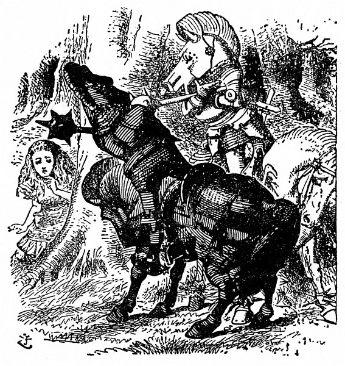
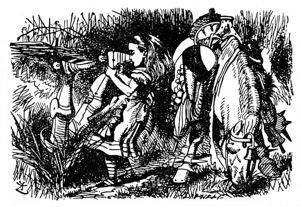

<section>

Ponenáhlu hřmot slábl, až nastalo hrobové ticho; Alenka znepokojeně zdvihla hlavu. Nikde nikdo, i napadlo ji, že se jí o Lvu a Jednorožci a těch podivných anglosaských kurýrech jenom zdálo. Jenže u nohou jí dosud ležela velká mísa, na které předtím krájela koláč. „Přece jen se mi to nezdálo,“ řekla si, „nebo snad všichni sníme jeden jediný sen. Ale je to doufám sen můj, a ne sen Černého Krále! Do cizího snu patřit nechci,“ reptala. „Mám chuť vzbudit ho a přesvědčit se, co se stane.“

</section>

<section>

Z těch myšlenek ji vytrhlo zahulákání: „Hola! Hola! Šach!“ A tu k ní přiklusal Jezdec v černém brnění a rozháněl se palicí. Jak k ní dojel, kůň se naráz zastavil a Jezdec se svalil na zem a křikl: „Už jsem tě zajal.“

Alenka celá zaražená trnula v tu chvíli strachem spíš o něho než o sebe a starostlivě ho pozorovala, jak zase nasedá. Usadil se v sedle a znovu křikl: „Už jsem tě –“, ale tu mu do toho někdo vpadl: „Hola! Hola! Šach!“ Alenka se překvapeně ohlédla, kde se tam vzal druhý nepřítel.

Byl to Bílý Jezdec. Zarazil před samou Alenkou a stejně jako předtím Černý Jezdec i on se svalil na zem. Potom vylezl na koně a oba Jezdci se mlčky měřili pohledem. Alenka hleděla zmateně z jednoho na druhého.

„Já jsem ji zajal,“ promluvil posléze Černý Jezdec.

„Jenže já jsem ji potom vysvobodil!“ odsekl Bílý Jezdec.

„Tak nám nezbývá než o ni bojovat,“ řekl Černý Jezdec, uchopil přílbu (v podobě jakési koňské hlavy mu visela na sedle) a hned si ji nasadil.

„Bitevní Pravidla budete jistě zachovávat,“ prohodil Bílý Jezdec a také si nasadil přílbu.

„Já je zachovávám vždycky,“ řekl Černý Jezdec; potom počali do sebe mlátit tak zuřivě, že si Alenka stoupla za strom, aby taky něco neslízla.

Opatrně z úkrytu vykukovala, pozorovala jejich boj a říkala si: „Jakápak asi jsou ta Bitevní Pravidla – jak se zdá, jedno zní, že když Jezdec zasáhne druhého, srazí ho z koně, a když ho mine, sám se svalí na zem. Jako když upadne na mřížku u krbu pohrabáč! A koně jsou tak klidní! Nechávají je nasedat a padat, jako by byli ze dřeva!“

Podle dalšího Bitevního Pravidla, které Alenka zprvu nepostřehla, zřejmě padali vždycky na hlavu, a boj skončil tím, že tak spadli oba bok po boku. Potom vstali, podali si ruce a Černý Jezdec nasedl a odcválal.

„To jsem slavně zvítězil, viď,“ přistoupil Bílý Jezdec celý udýchaný k Alence.

</section>

<section>

</section>

<section>

„Ani bych neřekla,“ zapochybovala Alenka. „Nechci být nikým zajata. Chci být Královnou.“

„Však jí budeš, jen co přeskočíš další potůček,“ řekl Bílý Jezdec. „Doprovodím tě až na kraj lesa – potom se musím vrátit. Tam končí můj tah.“

„Mockrát děkuju,“ řekla Alenka. „Smím vám sundat přílbu?“ Zřejmě to sám nedokázal; Alenka ho z ní nakonec vytřepala.

„Hned se člověku líp dýchá,“ řekl Jezdec, oběma rukama si prohrábl rozcuchané vlasy a jemnou tváří s velkýma mírnýma očima se otočil k Alence. Takového divného vojáka jakživa neviděla.

Na sobě měl plechové brnění, které mu vůbec nepadlo, a přes ramena mu vzhůru nohama visela prapodivná dřevěná bedýnka s otevřeným víkem. Alenka si ji zvědavě prohlížela.

„Má bedýnka ti nějak učarovala,“ řekl vlídně Bílý Jezdec. „Je to můj vynález – dávám do ní šaty a svačinu. Jak vidíš, nosím ji vzhůru nohama, aby do ní nepršelo.“

„Jenže takhle vám z ní všechny věci vypadnou,“ upozornila ho šetrně Alenka. „Víte, že máte víko otevřené?“

„To jsem nevěděl,“ zatvářil se Jezdec mrzutě. „To mi tedy všechny věci vypadly! A bez nich není bedýnka k ničemu.“ Při těch slovech si ji odvázal a užuž by ji byl zahodil do křoví, ale najednou mu něco napadlo a pověsil ji opatrně na strom. „Jestlipak uhodneš, proč to dělám?“ řekl Alence.

Alenka zavrtěla hlavou.

„Třeba si tam udělají hnízdo včely – a já si pak vyberu med.“

„Vždyť úl – nebo něco takového – vám visí u sedla,“ řekla Alenka.

„Ano, je to znamenitý úl,“ řekl zklamaně Jezdec, „lepší se ani nenajde. Ale jediná včela ještě o něj nezavadila. To druhé je past na myši. Buďto plaší myši včely – nebo včely myši, tak nevím.“

„Však jsem si říkala, k čemu je ta past na myši,“ řekla Alenka. „Že by se na koni objevily myši, to je dost nepravděpodobné.“

„Nepravděpodobné snad,“ řekl Jezdec, „ale co kdyby, přece je tam nenechám běhat.“

Odmlčel se a potom řekl: „To víš, na všechno se musí pamatovat. Proto taky má můj kůň na nohou kroužky.“

„A nač?“ vyzvídala užasle Alenka.

„Aby ho žraloci nepokousali,“ odvětil Jezdec. „Je to můj vynález. A teď mě vysaď. Pojedu s tebou až na kraj lesa – Načpak je ta mísa?“

„Na koláč,“ řekla Alenka.

„Tak to si ji vezmem,“ řekl Jezdec. „Když najdeme koláč, přijde nám vhod. Pomoz mi ji vpravit do pytle.“

Alenka sice držela pytel jaksepatří otevřený, ale přece jen to dlouho trvalo, protože Jezdec tam strkal mísu velmi nešikovně. Jak to zkoušel, třikrát přitom spadl do pytle sám. „Těžko se tam něco vejde,“ řekl, když ji tam šťastně dostal, „ono je v pytli tolik svícnů.“ Pytel přivázal k sedlu, obloženému otýpkami mrkve, pohrabáči a všelijakými jinými krámy.

„Vlasy ti doufám drží dobře,“ řekl, když vyrazili.

„Jako jindy,“ usmála se Alenka.

„To nestačí,“ staral se jezdec. „Tady totiž fouká silný vítr. Silný jako polévka.“

„Už jste něco vynalezl, aby vítr vlasy neodfoukl?“ zeptala se Alenka.

„Ještě ne,“ řekl Jezdec. „Ale vynalezl jsem něco, aby nepadaly.“

„To bych ráda věděla, co.“

„Vezmi nejprve rovnou hůl,“ řekl Jezdec. „Potom ať se vlasy pnou po ní nahoru jako štěp. Vlasy padají jen proto, že visí _dolů – nahoru_ nic nepadá. Je to můj vynález. Chceš-li, vyzkoušej si ho.“

Alenku ten vynález nijak nepotěšil; chvíli kráčela mlčky a hloubala nad tím nápadem, jen chvílemi se zastavovala a vysazovala Jezdce na koně; jezdit opravdu moc neuměl.

Jakmile se kůň zastavil (a zastavoval se často), spadl Jezdec dopředu; a když se kůň rozjel (a rozjížděl se dost prudce), spadl Jezdec dozadu. Jinak mu to celkem šlo, až na to, že co chvíli padal na jednu nebo na druhou stranu; a protože většinou padal na tu stranu, kudy kráčela Alenka, lepší bylo, jak brzy Alenka zjistila, kráčet ne tak blízko vedle koně.

</section>

<section>

</section>

<section>

Skutálel se už popáté, Alenka ho zase vysadila a osmělila se prohodit: „Moc zkušeností v ježdění asi nemáte.“

Jezdec se nad tím zatvářil překvapeně a dotčeně: „Jak jsi na to přišla?“ Jednou rukou se držel Alenky za vlasy, aby nepřepadl na druhou stranu, a tak se drápal do sedla.

„Protože kdo má zkušenosti, ten tak často z koně nepadá.“

„Zkušenosti, těch já mám,“ řekl vážně Jezdec, „těch já mám!“

„Opravdu?“ Na víc se Alenka nezmohla, ale řekla to co nejupřímněji. Potom se chvíli ubírali mlčky dál, Jezdec si se zavřenýma očima něco broukal a Alenka čekala úzkostlivě, kdy se zas skutálí.

„Pravé jezdecké umění,“ zahlaholil náhle Jezdec a mávl pravou rukou, „záleží v tom, zachovat –“ A tady jako by uťal, Jezdec žuchl po hlavě na cestičku, po které kráčela Alenka. Tentokrát se notně polekala, a jak ho sbírala ze země, starostlivě se zeptala: „Nepolámal jste si kosti?“

„Nestojí to za řeč,“ řekl Jezdec, jako by mu na nějaké té zlámané kosti nezáleželo. „Jak jsem říkal, pravé jezdecké umění záleží v tom – udržet rovnováhu. Takhle –“

Pustil uzdu a rozpřaženýma rukama ukazoval Alence, jak to myslí; tentokrát spadl naznak rovnou koni pod nohy.

„Zkušeností, těch já mám,“ vedl svou, jak mu Alenka pomáhala ze země. „Těch já mám!“

Alenka se neudržela a křikla: „To je k smíchu! Pro vás by tak byl dřevěný kůň na kolečkách.“

„A ten jede klidně?“ zajímal se hned Jezdec; nebýt toho, že se chytil koně kolem krku, málem se z něho znovu skutálel.

Alenka se neudržela smíchy a vyprskla: „O moc klidněji než živý.“

„Jednoho si opatřím,“ řekl zamyšleně Jezdec. „Jednoho nebo dva – možná i víc.“

Rozhostilo se ticho a potom Jezdec promluvil. „Vynálezy, to je moje. Když jsi mě naposled sbírala ze země, jistě sis všimla, jak jsem zamyšlený.“

„Trochu vážný jste byl,“ řekla Alenka.

„Zrovna jsem vynalézal nový způsob, jak se dostat přes branku. – Chtěla bys to vědět?“

„Moc ráda,“ řekla zdvořile Alenka.

„Povím ti, jak jsem na to přišel,“ řekl Jezdec. „Řekl jsem si: ‚Potíž je jenom s nohama, hlava je už dost vysoko.‘ Nejprve si položím hlavu na branku – potom je hlava dost vysoko – potom se postavím na hlavu – potom jsou i nohy dost vysoko – a potom se přehoupnu a je to.“

„Když to takhle všechno uděláte, snad se přehoupnete,“ dumala Alenka, „ale nezdá se vám to trochu těžké?“

„Ještě jsem to nezkoušel,“ řekl vážně Jezdec, „tak to s určitostí nevím – ale trochu těžké to asi bude.“

Tak ho to pomyšlení znepokojilo, že Alenka honem zavedla řeč jinam a spustila zvesela: „Vy máte ale podivnou přílbu! Je to taky váš vynález?“

Jezdec pyšně pohlédl na přílbu zavěšenou u sedla. „Ano,“ řekl, „ale vynalezl jsem ještě lepší – ta je jako homole cukru. Kdysi jsem ji nosil, a jakmile jsem spadl z koně, přílba se hned zaryla do země. Daleko jsem tedy nespadl – ale hrozilo mi ovšem, že spadnu do ní. Jednou se mi to dokonce stalo – a nejhorší na tom bylo, že než jsem se z ní dostal, přijel druhý Bílý Jezdec a nasadil si ji. On si myslil, že je to přílba.“

</section>

<section>

</section>

<section>

Jezdec se zatvářil smrtelně vážně, až Alenku přešel smích. „To jste mu snad ublížil,“ řekla rozechvěně, „když jste mu seděl na hlavě.“

„Musel jsem ho samozřejmě kopnout,“ řekl ve vší vážnosti Jezdec. „Přílbu z hlavy sundal – ale trvalo to kolik hodin, než mě z ní dostali. Byl jsem hrozně zaražený.“

„To z toho leknutí?“ řekla Alenka. Jezdec zavrtěl hlavou. „Ale ne, zaražený jako skoba, to mi věř!“ Rozčileně máchl rukama a už se kutálel ze sedla rovnou do hlubokého příkopu.

Alenka běžela k příkopu podívat se po něm. Polekala se toho pádu, protože předtím už mu to docela šlo, a bála se, že si tentokrát opravdu ublížil. Čouhaly mu sice jenom podešve, ale hlas měl jako jindy; Alence se ulevilo.

„Zaražený jako skoba,“ vedl svou Jezdec. „Byla to od něho lehkomyslnost, nasadit si cizí přílbu – když v ní ještě ke všemu někdo je.“

„Jak můžete takhle s hlavou dolů klidně povídat?“ Alenka ho vytáhla za nohy a složila ho na kraji příkopu.

Jezdce ta otázka překvapila. „Co na tom, kde mám tělo?“ řekl. „Duch se tím nedá vyrušit. Čím níž mám hlavu, tím líp se mi vynalézá.“

„To nejchytřejší, co jsem dokázal,“ dodal po chvíli, „bylo, že jsem při mase vynalezl nový pudink.“

„Takže se dal uvařit na další chod?“ řekla Alenka. „To byla ale rychlost.“

„Na další chod ne,“ unyle soukal ze sebe Jezdec, „na příští chod rozhodně ne.“

„Tak na příští den. Při jednom jídle si přece nedáte dva pudinky.“

„Na příští den ne,“ opakoval Jezdec, „na příští den taky ne.“ Sklopil hlavu a mluvil tišším hlasem: „Ten totiž vůbec neuvařili! Ten pudink totiž vůbec neuvaří! Ale vynalezen byl důmyslně.“

„A z čeho měl být?“ zeptala se Alenka, aby ho potěšila, protože vypadal sklíčeně.

„Předně z pijáku,“ zachroptěl Jezdec.

„To asi moc dobré nebylo –“

„Jenom z pijáku ne,“ skočil jí nedočkavě do řeči, „ale nemáš tušení, jak je to hned docela jiné, když k tomu ještě něco přidáš – třeba střelný prach a pečetní vosk. Já už musím jít.“ Zrovna došli na pokraj lesa.

Alenka nevycházela z údivu; myslila na pudink.

„Jsi smutná,“ řekl starostlivě Jezdec. „Pro útěchu ti zazpívám písničku.“

„Je dlouhá?“ zeptala se Alenka; ten den slyšela básniček dost a dost.

„Dlouhá je,“ řekl Jezdec, „ale krásná, překrásná. Když ji někomu zpívám, buď mu vyhrknou slzy, nebo –“

„Nebo co?“ zeptala se Alenka, protože se Jezdec odmlčel.

„Nebo nevyhrknou. Názvu té písničky se říká _Tresčí oči_.“

„To je název té písničky, ne?“ Alenka dělala, že ji to zajímá.

„Ty mi nerozumíš,“ řekl rozmrzele Jezdec. „Tak se tomu názvu říká. Název vlastně je _Stařeček_.“

„To jsem tedy měla říct: ‚Tak se té písničce říká?‘“ opravila se Alenka.

„Ne, neměla. To je něco jiného. Písničce se říká _Návod, jak zbohatnout_, ale to se jí jenom tak říká.“

„Tak jaká je ta písnička,“ Alenka už z toho byla nadobro popletená.

„Už jsem u toho,“ řekl Jezdec. „Ta písnička je vlastně _Seděl na brance._ Nápěv je taky můj vynález.“

Po těch slovech zarazil koně a spustil mu otěže na šíji. Jednou rukou si zvolna taktoval, po ušlechtilém bláhovém obličeji mu pohrával úsměv a tak začal zpívat.

Ze všech těch zvláštností, které Alenka při putování za zrcadlem spatřila, si nejjasněji pamatovala právě tuto. Ještě po letech se jí tento výjev vybavoval, jako by to bylo včera – Jezdcův bledě modrý zrak a vlídný úsměv – zapadající slunce mu prozařuje vlasy a oslnivou záplavou světla mu zalévá brnění – kůň s otěžemi svěšenými na šíji si klidně chodí a okusuje jí trávu u nohou – vzadu se rýsuje tmavý stín lesa – to všechno vnímala jako obrázek, když tak se zacloněnýma očima opřena o strom pozorovala tu podivnou dvojici (Jezdce a koně) a v polosnění naslouchala truchlivé hudbě písničky.

</section>

<section>

</section>

<section>

„Ale ten nápěv není jeho vynález,“ řekla si, „je to jako _Co ten ptáček povídá_.“ Stála a napjatě poslouchala, ale slzy jí nevyhrkly.

> _Povím všechno, co bych já  
> vám to nepověděl:  
> jak jsem kolem branky šel,  
> stařeček tam seděl.  
> „Viďte,“ pravím, „stařečku,  
> pěkně žije se to.“  
> Odpověď mi procedil  
> jako přes řešeto._

> _„Motýly,“ děl stařeček,  
> „v žitě pilně chytám,  
> vyrábím z nich paštiku,  
> po ulicích ji tam  
> rozprodávám matrózům.  
> Tak a nejináče  
> ve světě se protloukám –  
> dejte na tabáček.“_

> _Dumal jsem, jak licousy  
> barvit do zelena,  
> aby barva vějířem  
> byla pozastřena.  
> „Co vy máte, stařečku,  
> vlastně tady za cíl?“  
> Pro jistotu po hlavě  
> pěstí jsem ho bacil._

> _„Cíl mám,“ pravil stařeček,  
> „ten a žádný jiný:  
> spadeno mám na horách  
> všude na bystřiny.  
> Pálím je a potom z nich  
> stáčím jedlý olej,  
> však mě z této roboty  
> ruce věčně bolej.“_

> _Poslouchat, co povídá,  
> dávno jsem už přestal,  
> přemýšlel jsem, jak bych ztloust  
> z šlehaného těsta.  
> Řádně jsem jím zatřásl,  
> až byl v tváři sivý,  
> ať mi tedy prozradí,  
> čím se vlastně živí._

> _„Tresčí oči stopuju  
> tam na vřesovišti,  
> vyrábím z nich knoflíky  
> k vestě, jen se blyští.  
> Stříbro, zlato nežádám,  
> jen ty kupce hledám,  
> co mi krejcar zaplatí,  
> jinému je nedám._

> _Někdy kopu žemličky,  
> kraby chytám v křoví,  
> nebo kola z fiakru  
> v husté trávě lovím.  
> Při takovém řemesle  
> mám se dobře nýčko.  
> Nemoh bych vám, vašnosti,  
> připít na zdravíčko?“_

> _Vyvařit most ve víně,  
> řekl jsem si právě,  
> to je způsob nejlepší,  
> aby nezrezavěl.  
> Díky vzdal jsem za zprávu  
> o tom blahobytě,  
> za přípitek děkoval  
> jsem mu jmenovitě._

> _Když si někdy přilepím  
> prsty plné klihu,  
> když si rovnou na palec  
> pustím notnou tíhu,  
> levou botu na pravou  
> když cpu – mi to nedá,  
> pláči nad stařečkem, kterého jsem kdysi znal,  
> který se tak vlídně usmíval,  
> jemuž snížek hlavu pokrýval,  
> který hned jak vrána hlavou pokýval,  
> hned zas v rozpacích se ošíval,  
> jemuž v očích oheň hoříval,  
> který žalem tolik trpíval,  
> až se nad tím celý zachvíval,  
> jemuž z hloubi prsou vzlyk se ozýval,  
> který jako buvol funíval,  
> který na růžích ustláno nemíval  
> – a na brance sedal._

Jezdec dozpíval baladu, přitáhl otěže a stočil koně na silnici, po které přijeli. „Už ti zbývá,“ řekl, „jen několik yardů z kopce a přes potůček, a bude z tebe Královna –“ Alenka se nedočkavě ohlédla tím směrem, kam ji ukazoval, a Jezdec hned dodal: „Ale napřed se se mnou rozloučíš. Dlouho to nepotrvá. Počkáš a zamáváš mi šátkem, až dojedu tamhle k té zatáčce? Snad mi tím dodáš odvahy.“

„Toť se ví, že počkám,“ řekla Alenka. „Děkuji vám za váš doprovod – i za tu písničku – moc se mi líbila.“

„To jsem rád,“ řekl nejistě Jezdec, „ale že budeš tak málo plakat, to jsem se nenadál.“

Podali si ruce a Jezdec zvolna zamířil do lesa. Alenka stála a hleděla za ním. „Doufám, že to loučení nebude dlouhé. Hele ho! Už zase na hlavě! Ale už to jde zase pěkně kupředu – to je tím, že toho má na koni tolik navěšeno –“

Tak si povídala a dívala se za koněm, jak si zvolna vykračuje po silnici a Jezdec z něho padá, hned na tu, hned na onu stranu. Skutálel se na zem čtyřikrát nebo pětkrát a už byl v zatáčce; Alenka mu zamávala šátkem a počkala, až zmizel z dohledu.

„Doufám, že jsem mu dodala odvahy,“ řekla a rozběhla se dolů z kopce. „Ještě poslední potůček, a bude ze mne Královna! To je báječné!“ Udělala pár kroků a octla se u potůčku, už chtěla potok přeskočit, vtom zaslechla hluboký vzdech, jako by přicházel z lesa za ní.

Někdo je tam asi _moc_ nešťastný, pomyslila si a starostlivě se ohlédla, co se to děje. Nějaký staroušek (jenže tvář měl spíš vosí) seděl na zemi, celý schoulený se opíral o strom a zimomřivě se třásl.

Tomu já sotva nějak pomohu, napadlo Alence, jak se chystala přeskočit potok: – ale na samém kraji se zarazila: „Zeptám se ho aspoň, co mu je. Jakmile přeskočím, všechno se změní a už mu nepomohu.“

Vrátila se tedy k Vosákovi – dost nerada, vždyť se už nemohla dočkat, až bude Královnou.

„Ach, mé staré kosti, mé staré kosti!“ stále bědoval, jen k němu Alenka docházela.

„Má asi revma,“ řekla si Alenka, naklonila se k němu a vlídně řekla: „Doufám, že vás to moc nebolí.“

Vosák jen pokrčil rameny a odvrátil hlavu: „Ach jemináčku!“ řekl si.

„Mohu vám nějak posloužit?“ zeptala se Alenka. „Není vám tu zima?“

„Co ty toho namluvíš!“ utrhl se Vosák. „Třesky plesky! Takové děvče svět neviděl.“

Byla tou odpovědí trochu dotčena a málem od něho odešla, ale tu ji napadlo: Snad je jenom z té bolesti nevrlý, a znovu to zkusila.

„Smím vám pomoci na druhou stranu? Nebude tam na vás studeně foukat.“

Vosák ji vzal pod paží a dal si od ní pomoci za strom, když se však usadil, řekl zas jako dřív: „Třesky plesky! Proč nedáš pokoj?“

„Mám vám kousek přečíst?“ vedla svou Alenka a zdvihla noviny, které jí ležely u nohou.

„Jestli máš chuť, přečti,“ zabručel Vosák. „Co já vím, nikdo ti nebrání.“

Alenka usedla vedle něho, prostřela si noviny na kolena a spustila:

„Poslední zprávy. Výzkumníci prohlédli znovu Spižírnu a našli pět kostek bílého cukru, nových a zachovalých. Když se pak vraceli –“

„A co javorový cukr?“ skočil jí do řeči Vosák.

Alenka přelétla zrakem noviny a řekla: „Ne, o javorovém tu nic není.“

„O javorovém nic,“ zabručel Vosák. „Pěkní výzkumníci.“

„Když se pak vraceli,“ četla dále Alenka, „našli Sirupové jezero. Břehy jezera byly modré a vypadaly jak z porcelánu. Při ochutnávání sirupu je stihla smutná nehoda: oba výzkumníky zhltla –“

„Cože?“ zeptal se zlostně Vosák.

„Zhlt – la,“ odpověděla dvouslabičně Alenka.

„Takové slovo v jazyce není,“ řekl Vosák.

„Vždyť je v novinách,“ špitla Alenka.

„Tady přestaňme!“ řekl Vosák a mrzutě se odvrátil.

Alenka odložila noviny. „Mám strach, že vám něco je,“ řekla konejšivě. „Mohu vám nějak posloužit?“

„Je to kvůli paruce,“ ozval se už vlídněji Vosák.

„Kvůli paruce?“ opakovala po něm Alenka, potěšena tím, že se mu vrací nálada.

„Mít takovou paruku jako já, to by ses taky zlobila,“ hovořil Vosák. „Dobírají si mě. Dělají si ze mne šoufky. Já se pak rozzlobím. A zarputím. A vlezu pod strom. A vezmu si žlutý šátek. A zavážu si obličej – jako třeba teď.“

Alenka na něj soucitně pohlédla. „Zavázat si obličej pomáhá proti bolení zubů,“ řekla.

„Taky proti marnivosti pomáhá,“ podotkl Vosák.

Alenka to slovo přesně nepochytla. „Je to nějaké bolení zubů?“

Vosák se zamyslil. „To ne,“ řekl. „Je to když – takhle – zdvihneš hlavu – a neohneš krk.“

„Aha, to jako strnutí šíje,“ řekla Alenka.

Vosák na to: „Nějaké módní slovo. Za mých časů tomu říkali marnivost.“

„Marnivost není žádná nemoc,“ podotkla Alenka.

„A je,“ řekl Vosák, „jen počkej, až ji dostaneš, uvidíš. Až ji chytneš, zavaž si obličej žlutým šátkem. Hned se ti vyléčí!“

Při řeči si šátek odvázal a Alenka si s úžasem prohlížela jeho paruku. Byla světle žlutá jako šátek a celá zmotaná a zmuchlaná jako chumáč chaluh.

„Měl byste paruku mnohem pěknější,“ řekla, „kdybyste si ji učesal.“

„Cože, ty jsi včela?“ řekl Vosák a pozorně si ji prohlédl. „A máš česno? A co med?“

„Česnem se nečeše,“ honem vysvětlovala Alenka. „Vlasy se češou hřebenem – paruku máte velmi rozcuchanou!“

„Povím ti, jak to, že ji nosím,“ řekl Vosák. „Zamlada jsem totiž nosil dlouhé kučery –“

Alenka dostala zvláštní nápad. Kdekdo jí na potkání odříkával básně, co kdyby zkusila, jestli to Vosák taky dokáže. „Pověděl byste mi to rýmovaně?“ zeptala se velmi zdvořile.

„Nemám v tom cvik,“ řekl Vosák, „ale zkusím to: počkej chvilku.“ Na chvíli se odmlčel a pak spustil **–**

> _Kučery dlouhé, vlnité  
>        já pyšně nosil zamlada.  
> „Paruku když si koupíte,  
>        budete lépe vypadat.“_

> _Dal jsem se tedy ostříhat,  
>        v té situaci bezradné.  
> Začali mi zas nadávat,  
>        že paruka mi nepadne._

> _Připraven o svou ozdobu,  
>        nad ztrátou vlasů zoufalý,  
> dostal jsem horší podobu.  
>        Vlasy mi růsti přestaly._

> _Vlasy mi válem šediví,  
>        co horšího, že řidnou též.  
> Je ze mne dědek plesnivý,  
>        parukou zakrývám si pleš._

> _Všude mi „Čuně“ spílají,  
>        běda, to mám vždy na krku,  
> pokoj mi chvíli nedají  
>        pro moji žlutou paruku._

„Moc je mi vás líto,“ řekla vřele Alenka; „kdyby vám paruka trochu líp padla, myslím, že by vás tolik neškádlili.“

„Tobě paruka padne,“ řekl Vosák a s obdivem na ni pohlédl, „napomáhá tomu tvar hlavy. Ale čelisti nemají správný tvar – jistě se ti špatně kouše.“

Alenka vyprskla smíchy a z toho potom jakžtakž přešla do zakašlání. Nakonec ze sebe vážně vypravila: „Co chci, všechno pokoušu.“

„Tak malou pusou snad ne,“ stál na svém Vosák. „Kdybys tak s někým zápasila – popadla bys ho v zátylku?“

„Myslím, že ne.“

„To proto, že máš tak krátké čelisti,“ hovořil Vosák. „Zato máš pěkné oblé temeno.“ Při řeči si sundal paruku a drápek napřáhl po Alence, jako by jí chtěl taky paruku sundat, ale ona ucouvla a nic na to nedala. A tak ji tupil dál.

„A co oči? – Rozhodně je máš moc vpředu. Jedno by vydalo za dvě, když už je máš tak blízko.“

Alence se ty osobní narážky nelíbily, a protože už Vosák přišel k sobě a nějak moc se rozpovídal, řekla si, že od něho může klidně odejít. „Už budu muset jít,“ řekla. „Sbohem.“

„Sbohem, a děkuju,“ řekl Vosák a už Alenka cupitala z kopce; byla ráda, že se vrátila a na několik minut chudáka starouška uchlácholila.

„Konečně osmé políčko!“ zvolala a přeskočila potůček a svalila se na trávník hebký jako mech, kolem dokola posetý květinovými záhonky. „To jsem ráda, že už jsem tady! A co to mám na hlavě?“ polekala se, když si na ni sáhla – pevně jí tam sedělo něco těžkého.

</section>

<section>

„Jak se to tam dostalo, že o tom ani nevím?“ sundala si to a položila na klín, aby si to prohlídla.

Byla to zlatá koruna.

</section>

<section>

</section>