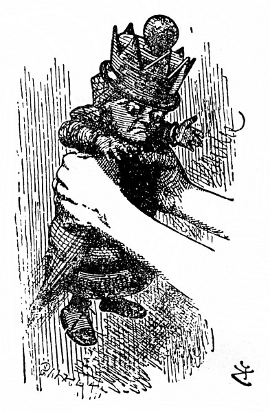

Po těch slovech ji sundala ze stolu a vší silou jí třásla. Černá Královna se vůbec nebránila, jenom obličej se jí zmenšil a oči se jí zvětšily a zezelenaly, a jak s ní Alenka třásla dál, byla stále menší – a zavalitější – a hebčí – a kulatější – a –

